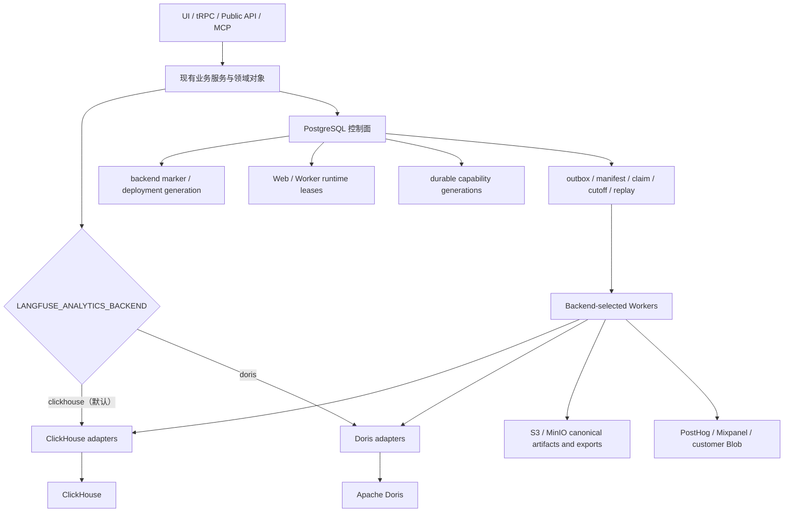
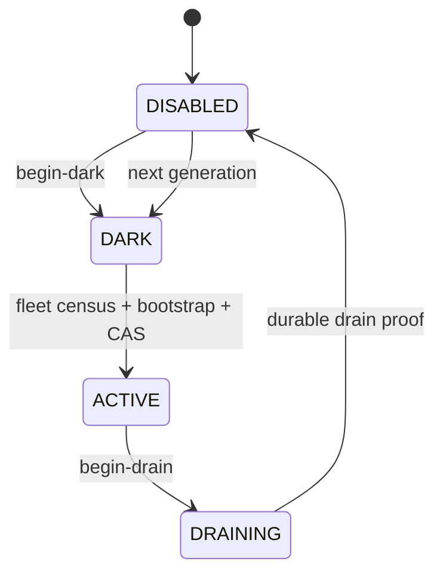
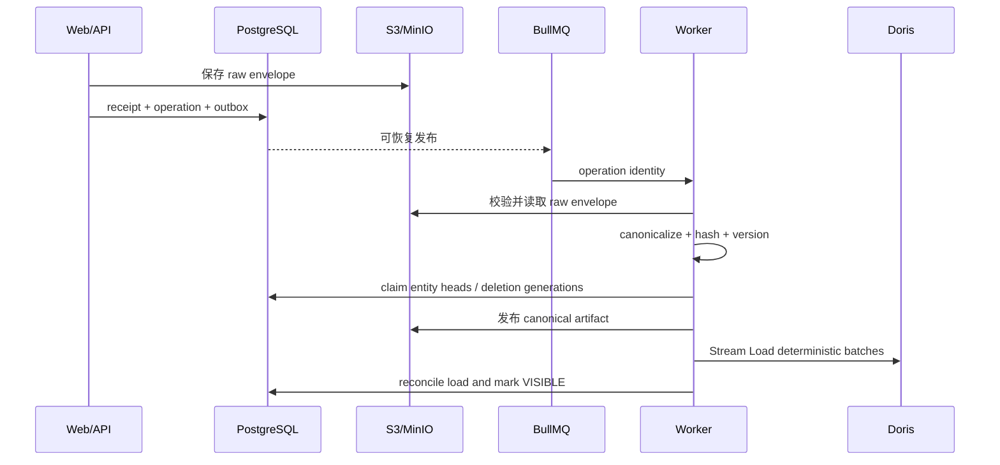

# ClickHouse / Doris 双后端改造说明

本文说明这次 Langfuse Community analytics storage 改造从开始到完成做了什么、为什么这样做、对原有 ClickHouse 有什么影响，以及 Doris 如何获得与 Community ClickHouse 基线一致的产品能力。

本文面向维护这个 fork 的开发者和部署者。它是架构与实现总览，不替代具体操作手册：

- 后端选择、采用和切换：[Analytics Backend Selection](./analytics-backend-selection.md)
- 能力基线：[Analytics Backend Capability Baseline](./analytics-backend-capabilities.md)
- Doris 安全边界：[Doris Runtime Security](./doris-security.md)
- 评估器运维：[Doris Evaluator Operations](./doris-evaluations.md)
- 实验和数据集运行：[Doris Experiments and Dataset Runs](./doris-experiments.md)
- 第三方分析集成：[Doris Analytics Integration Operations](./doris-analytics-integrations.md)
- 实施与验证证据：[Doris Community Parity Progress](../plans/2026-07-21-001-feat-doris-community-parity-loop-progress.md)

## 结论

这次改造没有用 Doris 替换或删除 ClickHouse，而是把 analytics storage 变成部署级二选一：

```text
LANGFUSE_ANALYTICS_BACKEND=clickhouse  # 默认
LANGFUSE_ANALYTICS_BACKEND=doris
```

最终行为是：

1. ClickHouse 仍是默认值，原有查询、写入、迁移、Worker、删除、导出、评估、实验和 integration 路径继续保留。
2. Doris 是第二套完整 analytics backend，通过 feature-owned adapter 接入现有上层服务。
3. 一个部署中的所有 Web 和 Worker 必须选择同一个 backend。
4. 不支持运行时热切换、按 project 选择、双写或自动搬迁历史数据。
5. Doris 不会在缺少实现或能力未激活时回退到 ClickHouse。
6. 需要异步生产者和消费者协作的 Doris 功能默认关闭，通过 PostgreSQL 中的 durable capability generation 显式激活。

这保证了“用户可以选择 ClickHouse 或 Doris”，同时避免把两个存储混在同一条请求链路里。

## 为什么不能只替换数据库连接

Langfuse 上层操作的是 trace、observation、score、dataset run、experiment 和 evaluation 等业务对象，但存储语义并不只存在于 repository 查询中。

原有 ClickHouse 行为还分布在：

- ingestion queue 和批量 writer；
- ClickHouse table engine、latest-row 和 deletion 语义；
- query builder、filter、search、排序和聚合；
- batch export 的游标、快照和文件生成；
- evaluator 的调度、目标读取和 score 回写；
- experiment/dataset-run 的 analytics projection；
- PostHog、Mixpanel 和 Blob export 的数据源；
- Worker 注册、恢复任务、retention 和 shutdown；
- readiness、migration、凭据和滚动发布过程。

因此，正确实现不是把 `clickhouseClient` 替换成 `dorisClient`，而是先抽出稳定的业务语义边界，再为两个 backend 保留各自实现。PostgreSQL 继续作为控制面，选中的 analytics backend 作为数据面。

## 最终架构



### 数据面和控制面

| 层                | 责任                                                                                                                                      |
| ----------------- | ----------------------------------------------------------------------------------------------------------------------------------------- |
| PostgreSQL 控制面 | backend marker、deployment generation、runtime lease、capability activation、outbox、claim、manifest、删除 barrier、checkpoint 和恢复状态 |
| ClickHouse 数据面 | 选择 ClickHouse 时保存并查询 analytics 数据，继续使用原有 ClickHouse 语义                                                                 |
| Doris 数据面      | 选择 Doris 时保存并查询 canonical analytics projection                                                                                    |
| Redis / BullMQ    | 携带可重试的工作通知，不作为任务归属、generation 或完成状态的唯一事实来源                                                                 |
| S3 / MinIO        | raw/canonical ingestion artifact、batch-export manifest/file 和 Blob integration 输出                                                     |

队列消息只负责唤醒 Worker。真正决定一项工作是否仍然有效的是 PostgreSQL 中的 backend、deployment generation、capability generation、claim 和 durable record。这样即使发生进程崩溃、重复投递或旧 Worker 延迟执行，也不会跨 backend 或跨 generation 继续工作。

### Backend selector

`resolveAnalyticsBackend` 在进程启动时解析 `LANGFUSE_ANALYTICS_BACKEND`：

- 未设置时返回 `clickhouse`；
- 只接受 `clickhouse` 或 `doris`；
- 其他值直接使启动失败；
- 选择结果在进程生命周期内固定。

Web 和 Worker 只初始化被选中的 analytics runtime。Doris 查询不隐式调用 ClickHouse，ClickHouse 查询也不经过 Doris。

### Deployment marker 和 runtime fencing

受管部署在 PostgreSQL 保存一个权威 marker，至少包含：

- analytics backend；
- deployment generation；
- foundation contract version；
- workload epoch fingerprint。

每个 Web 和 Worker 注册有时效的 runtime lease。请求或 Worker 在 analytics I/O 前校验：

- 当前 backend 是否匹配；
- deployment generation 是否匹配；
- workload epoch 是否匹配；
- runtime lease 是否仍然有效；
- 如果属于 durable capability，activation generation 是否匹配。

不匹配时会 fail closed。旧进程不能因为 Redis 中还有任务，就继续读写旧 backend。

### Durable capability

以下六项 Doris 功能需要 Web 生产者、Worker 消费者和恢复任务协同，因此使用独立 activation：

1. `coreBatchExports`
2. `evaluations`
3. `experiments`
4. `datasetRunExports`
5. `datasetRunIngestion`
6. `analyticsIntegrations`

状态机为：



- `DISABLED`：拒绝新工作。
- `DARK`：允许安装、扫描或本地 capture，但不开放产品 mutation；integration DARK 不允许外发。
- `ACTIVE`：相同 deployment/capability generation 的生产者和消费者可以工作。
- `DRAINING`：停止新外部工作，允许相同 generation 的已接受工作恢复并完成。

ClickHouse 不读取这些 Doris activation rows。它继续使用原有启用逻辑。

## 对原有 ClickHouse 的影响

### 保留的行为

ClickHouse 仍然保留：

- 默认 backend；
- ClickHouse migrations 和 MergeTree 表；
- 原有 ingestion 和 ClickHouse writer；
- 原生 query builder、filter 和 event query 语义；
- trace、observation、score、session、metrics 和 analytics 查询；
- deletion、retention 和 legacy cleanup；
- batch export，包括原生 streaming/progress 行为；
- evaluator 和 experiment 的现有执行路径；
- PostHog、Mixpanel 和 Blob integration 的原有 scheduler、source 和 client；
- 原有 Community UI、tRPC、Public API 和 MCP 产品入口。

这次没有把 ClickHouse 表转换成 Doris 表，也没有让 ClickHouse 请求先经过 Doris。

### 新增但不改变产品语义的部分

为了支持双后端，ClickHouse 路径增加或共享了以下安全边界：

- 部署级 backend selector；
- backend-aware Worker topology；
- queue/durable-work provenance；
- storage-neutral repository interface；
- PostgreSQL deployment/runtime control state；
- cross-backend capability manifest 和回归测试。

这些改动的目标是标记“这项工作属于哪个 backend 和 generation”，不是改变 ClickHouse 返回的数据模型。

### ClickHouse 与 Doris 的明确差异

| 行为                             | ClickHouse                       | Doris                                           |
| -------------------------------- | -------------------------------- | ----------------------------------------------- |
| 默认选择                         | 是                               | 否                                              |
| Backend-specific activation rows | 不读取                           | 六项 durable capability 使用                    |
| Ingestion writer                 | 原有 ClickHouse writer           | canonical artifact + Stream Load                |
| Latest-row 语义                  | 原有 ClickHouse table/query 语义 | Unique Key Merge-on-Write + `version_token`     |
| 删除                             | 原有 mutation/cleanup            | tombstone、generation barrier 和 fenced cleanup |
| Batch export                     | 原有 native path                 | durable ID manifest + exact read                |
| Query progress                   | 原有 ClickHouse progress         | bounded query 完成后返回 rows                   |
| 未实现查询                       | 维持原行为                       | 明确失败，不回退 ClickHouse                     |

### 如何证明 ClickHouse 没有被破坏

完成 Doris 验证后重新启动真实 ClickHouse，并执行：

- shared backend/query/adapter/trace 回归；
- Worker topology/runtime/routing/export/evaluation 回归；
- 真实 ClickHouse Parquet 和 score deletion；
- 完整 `IngestionService.integration.test.ts`。

最终分别通过 13、26、4 和 57 个测试。ClickHouse 仍被实际选择和访问，不是只通过 mock 验证。

## Doris 是怎样接入的

### 1. Doris 物理模型

Doris 使用 4.0.7 的 Unique Key Merge-on-Write 模型。核心 projection 包括：

- `events_current`
- `scores_current`
- `dataset_run_items_current`
- Blob/file artifact ledger
- trace、project、dataset 和 dataset-run tombstone/barrier 表
- checksummed schema migration ledger

事件唯一键包含 project、partition、trace 和 span identity。`version_token` 提供确定性的 latest-wins；终态删除使用最大 sequence 和 Doris delete sign，低版本延迟写入不能复活已删除实体。

`partition_date` 来自 canonical `start_time` 的 UTC 日期。AUTO PARTITION 允许历史数据写入，不再通过动态分区隐式删除旧数据。

### 2. Canonical ingestion

Doris ingestion 不是把 ClickHouse insert SQL 改写成 Doris SQL，而是建立可恢复的 canonical pipeline：



支持的来源包括：

- OTLP；
- v4 trace/observation ingestion；
- score 和 annotation score；
- legacy trace/observation/score child；
- dataset-run item；
- internal analytics event。

Raw envelope、receipt、canonicalizer version、schema version、hash 和 durable provenance 被保存下来。Worker crash 后可以从 durable operation 恢复，而不是依赖内存或一次性的 queue payload。

### 3. Stream Load

Doris Writer 实现了生产边界所需的 Stream Load 行为：

- `Expect: 100-continue`；
- FE 到 BE 的单次 `307`；
- FE/BE origin 和解析 IP allowlist；
- 禁止 TLS downgrade；
- 丢弃 redirect URL 中的 userinfo；
- 使用配置的 Worker load credential；
- deterministic label 和 duplicate-label reconciliation；
- `max_filter_ratio=0`；
- query、load、migration 三套分离凭据。

Web 只持有 SELECT 身份。Worker 持有独立的 SELECT 和 table-scoped LOAD 身份。Migrator credential 只进入 one-shot migration job。

### 4. Query 和 repository

上层继续调用 trace、observation、score、session、dataset-run 和 experiment repository。Backend-selected adapter 决定实际 SQL。

Doris 实现包括：

- list/detail/bulk detail；
- trace 和 observation metrics；
- session/user/environment 派生视图；
- score list、analytics、dataset/experiment filter；
- stable null-last ordering；
- metadata、usage 和 cost 维度；
- position、array、negative predicate；
- bounded search；
- project isolation；
- query timeout、cancel、row/cell/group budget；
- exact-ID reads；
- monitor、custom dashboard 和 widget QueryEngine。

Doris query compiler 对 value 使用参数绑定。未知维度、filter/operator 组合或超出预算的查询明确失败，不会偷偷改查 ClickHouse。

### 5. 删除、retention 和反复活

删除不是只在 Doris 执行一条 `DELETE`。实现使用：

- PostgreSQL deletion intent/outbox；
- project/trace/dataset/run deletion generation；
- backend/deployment provenance；
- Worker claim 和 I/O fencing；
- Doris tombstone/visibility barrier；
- physical cleanup；
- replay 前 generation recheck。

因此晚到 ingestion、重复 queue delivery 或旧 Worker 不能让已删除的 trace、score 或 dataset-run association 再次出现。

可选的 Doris global retention 默认关闭。它先在 PostgreSQL 固化 cutoff，等待旧 load settle，再分批删除 entity heads。Checkpoint control-state cleaner 也默认关闭，只能清理已被签名 sealed checkpoint 覆盖且超过 replay safety delay 的 child ledgers。

### 6. Batch export

Doris batch export 使用 durable manifest，而不是 ClickHouse 的原生 offset/cursor 路径：

1. Web 在 PostgreSQL 同一事务中创建 export intent、backend/generation provenance 和 dispatch outbox。
2. Worker 获取 fenced manifest claim。
3. 对 Doris 执行一次 project-scoped、稳定排序的 identity statement。
4. 将压缩的 ID-only manifest 写入 S3/MinIO。
5. seal 前校验 generation、checksum、row count、encoded bytes 和 metadata。
6. execution 按 exact ID 分批读取当前 payload 并生成输出文件。
7. crash、lease expiry 和 queue publish failure 由 recovery runner 接管。
8. stale Worker 不能 seal、fail 或 complete 新 generation。

这是 identity-set snapshot，不是跨 Doris 和对象存储的 payload transaction。身份集合 seal 后，fetch 前更新的实体导出当前值；fetch 前删除的实体被省略。

### 7. Evaluator

Doris evaluator 支持 trace、observation、dataset-associated 和 historical target，以及 LLM-as-judge、code evaluator 和 batch evaluation。

当 canonical operation 变为 `VISIBLE` 时，evaluation target 和 provenance 在同一 PostgreSQL 状态转换中写入 durable dispatch。Publisher 使用确定性 job ID。Worker 校验 dispatch、activation、claim 和 target 后执行，生成的 score 再进入选中的 canonical ingestion。

`JobExecution` 只有在 score 可见后才完成。崩溃发生在 LLM 调用、score 写入或 job completion 之间时，恢复路径重用 durable identity，不重复接受另一份不确定输出。

Experiment batch evaluation 还会：

- 持久化 `sourceTable`；
- 同时锁定 `evaluations` 和 `experiments` capability；
- 保留旧 queue payload 缺少 `sourceTable` 时的 `events` 默认；
- 强制非 event 请求带上 `isExperimentItemRootSpan = true`，防止直接 tRPC caller 扫描所有 observation。

### 8. Experiments 和 dataset runs

PostgreSQL 保留 dataset、item、run、configuration、dispatch intent、claim 和 terminal state。Doris 保存 analytics projection。

实现覆盖：

- dataset-run child canonical ingestion；
- prompt/remote experiment execution；
- item success、partial failure、terminal failure 和 retry；
- run list/detail/metrics/filter/compare；
- score 与 `datasetRunId`、`executionTraceId` 的关联；
- Public API、tRPC、MCP；
- dataset/run/trace/project deletion；
- dataset-run-item batch export；
- durable execution dispatch 和 crash recovery。

`datasetRunIngestion`、`experiments` 和 `datasetRunExports` 分别激活。依赖顺序为：

1. `datasetRunIngestion`
2. `experiments`
3. 在 `coreBatchExports` 已 active 后激活 `datasetRunExports`

### 9. PostHog、Mixpanel 和 Blob integrations

Doris integration 不直接把 Doris row 或 SQL 发给第三方。

Canonical operation `VISIBLE` 时，PostgreSQL capture 需要投递的稳定 identity。Scheduler seal immutable execution manifest，Worker 通过 backend-selected semantic source exact-read 当前实体，再生成现有 allowlist event。

实现覆盖：

- PostHog；
- Mixpanel；
- Blob JSON、CSV、JSONL 和 Parquet；
- initial full-history bootstrap；
- incremental delivery；
- at-least-once retry；
- cutoff/replay；
- pending-ledger capacity；
- connection-time DNS/IP/redirect validation；
- credential redaction；
- private Parquet scratch、quota、lease 和 orphan cleanup。

`DARK` 只允许本地 manifest/capture，不允许 HTTP 或 S3 side effect。Doris 不会把 integration 工作回退给 ClickHouse scheduler。

### 10. Monitors、dashboards 和 score analytics

Monitors、custom dashboards、widgets、核心 query 和核心 ingestion 不需要额外 durable activation，因为它们没有“一个进程接受、另一个进程稍后消费”的跨进程 opening race。

它们通过 shared QueryEngine 和 backend-selected query adapter 工作。Score analytics 还补齐了 dataset-run object type、dataset/experiment filter、直接和批量删除，以及 Doris 路由在查询前不初始化 ClickHouse。

## 实施过程

改造按 U0 到 U8 推进。每个 unit 先冻结行为和失败边界，再实现并执行真实 backend 回归。

| Unit | 做了什么                                                                                                                                                          | 结果                               |
| ---- | ----------------------------------------------------------------------------------------------------------------------------------------------------------------- | ---------------------------------- |
| U0   | 冻结 Community capability corpus；建立 selector、deployment marker、workload epoch、runtime lease、readiness、migration、安全 harness 和 capability state machine | 双后端拓扑和 fail-closed 基础完成  |
| U1   | trace metrics、bulk detail、exact-ID read 和 export source                                                                                                        | 核心 trace 查询与导出数据源补齐    |
| U2   | durable batch-export intent、manifest、claim、recovery、MinIO 输出                                                                                                | Doris core batch export 可恢复     |
| U3   | QueryEngine、filter、search、order、score reads、monitor/dashboard                                                                                                | 同一产品查询模型可选两个 backend   |
| U4   | experiment/dataset-run schema、canonical round trip、deletion generation、least privilege                                                                         | 复杂产品能力的存储基础完成         |
| U5   | evaluator capture、dispatch、execution、score visibility、cutoff/replay                                                                                           | Doris evaluator 全链路完成         |
| U6   | experiment execution、dataset-run UI/API/MCP/query/export/delete                                                                                                  | experiment/dataset-run 能力完成    |
| U7   | PostHog、Mixpanel、Blob delivery、bootstrap、retry、security、Parquet                                                                                             | 第三方 analytics integrations 完成 |
| U8   | score analytics/delete、experiment batch eval、control-state cleaner、能力审计和完整验证                                                                          | 本地 Community parity 收口         |

“最初显示 501”的功能并不是 Doris 永远做不到。它们当时缺少 producer、consumer、recovery 或 durable activation 的完整链路，所以先显式拒绝，避免接受任务后丢失。U5–U8 完成后，能力清单已经改为 available；Doris 部署仍需把对应 generation 激活才开放。

## 如何选择和运行

### 继续使用 ClickHouse

不设置 selector，或显式设置：

```text
LANGFUSE_ANALYTICS_BACKEND=clickhouse
```

继续配置现有 `CLICKHOUSE_*`。这是默认和向后兼容路径。

### 使用 Doris

部署至少需要：

1. Doris 4.0.7 目标集群；
2. Web SELECT、Worker SELECT、Worker LOAD 和 migrator 四个独立身份；
3. 配置 `DORIS_QUERY_*`、`DORIS_STREAM_LOAD_*` 和 one-shot `DORIS_MIGRATION_*`；
4. 执行 Doris migrations；
5. 所有 Web 和 Worker 设置相同的 backend selector 和 workload epoch；
6. readiness 通过；
7. 按功能需要依次执行 capability DARK、fleet census 和 activation。

迁移命令：

```bash
pnpm --filter @langfuse/shared run doris:migrate
```

本地开发基础设施：

```bash
docker compose -f docker-compose.dev.yml --profile doris up -d
```

具体变量以 [`.env.dev.example`](../../.env.dev.example) 和 [`.env.prod.example`](../../.env.prod.example) 为准，不要把生产凭据写入仓库或共享 dotenv。

### 切换 backend

Backend switch 是冷切换，不是修改变量后直接重启：

1. 停止新流量；
2. 将 durable capabilities 进入 `DRAINING` 并完成 owning drain proof；
3. 确认所有 durable registry 和 claim 已清空；
4. 停止旧 Web/Worker；
5. 轮换 workload/credential epoch；
6. 验证 source 和 target backend 都为空；
7. 使用 operator command CAS 更新 marker；
8. 只启动新 backend 的 Web/Worker；
9. 重新执行 readiness、ingestion、query、delete 和 capability activation 验证。

Selector 不迁移历史数据。如果 ClickHouse 有历史数据而 Doris 为空，直接切到 Doris 会看到空 analytics view，这不属于支持的切换流程。

## 验证结果

最终本地验证包括：

| 验证                               | 结果                                                                                |
| ---------------------------------- | ----------------------------------------------------------------------------------- |
| 完整 real-Doris harness            | 20 个隔离套件，共 135 个测试，通过并精确清理 Doris/PostgreSQL/shadow/MinIO 测试资源 |
| Shared broad regression            | 72 tests passed                                                                     |
| Worker broad regression            | 37 tests passed                                                                     |
| Web broad regression               | 119 tests passed                                                                    |
| Real MinIO scores tRPC             | 13 tests passed                                                                     |
| ClickHouse shared preservation     | 13 tests passed                                                                     |
| ClickHouse Worker preservation     | 26 tests passed                                                                     |
| Real ClickHouse Parquet / deletion | 4 tests passed                                                                      |
| Real ClickHouse ingestion service  | 57 tests passed                                                                     |
| Prisma generation                  | `Tasks: 1 successful, 1 total`                                                      |
| Full typecheck                     | `Tasks: 7 successful, 7 total`                                                      |
| Full lint                          | `Tasks: 7 successful, 7 total`                                                      |
| Production build                   | `Tasks: 7 successful, 7 total`                                                      |
| Client bundle scan                 | 648 files scanned, clean                                                            |
| Formatting                         | Prettier passed；`git diff --check` exited 0                                        |

完整测试命令和每个 unit 的证据见 [progress ledger](../plans/2026-07-21-001-feat-doris-community-parity-loop-progress.md)。

## 当前边界

### 已完成

- ClickHouse/Doris 部署级选择；
- Doris schema、migration、readiness 和 least-privilege runtime；
- core ingestion/read/query/score/monitor/dashboard；
- deletion、retention barrier 和 recovery；
- batch export；
- evaluator；
- experiments 和 dataset runs；
- PostHog、Mixpanel 和 Blob integrations；
- capability activation、mixed-version fencing、drain 和 replay；
- 本地真实 Doris、ClickHouse、PostgreSQL、Redis 和 MinIO 验证。

### 不在当前支持范围

- 双写；
- 运行时热切换；
- 按 project 选择 backend；
- ClickHouse 与 Doris 之间的历史数据自动迁移；
- 把本地 `1 FE + 1 BE` 当作生产 HA；
- Langfuse Cloud/Enterprise 专用 operational export 和 billing workflow；
- 撤回已经发送到第三方系统的数据。

### 仍需真实环境证明

代码和本地验收已经完成，但单机不能证明以下生产条件：

- 多副本 Web/Worker inventory 与 lease census；
- 旧 ingress、PostgreSQL、Redis、backend 和 object-store credential 已失效；
- 切换前所有 unstamped durable work 和 in-flight claim 已 drain；
- generation-1 adoption 后，旧 binary/credential rollback 被拒绝；
- 真实 Doris FE/BE topology、replication、capacity、backup、RPO 和 RTO。

这些是 deployment evidence，不是尚未实现的 Community 功能。

## 主要代码位置

| 领域                            | 位置                                                                                                                  |
| ------------------------------- | --------------------------------------------------------------------------------------------------------------------- |
| Backend selector                | `packages/shared/src/server/analytics-persistence/analyticsBackend.ts`                                                |
| Runtime marker/lease/fence      | `packages/shared/src/server/analytics-persistence/`                                                                   |
| Capability catalog              | `packages/shared/src/server/analytics-persistence/analyticsCapabilities.ts`                                           |
| PostgreSQL control schema       | `packages/shared/prisma/schema.prisma`                                                                                |
| Doris client/readiness/security | `packages/shared/src/server/doris/`                                                                                   |
| Doris migrations                | `packages/shared/doris/migrations/`                                                                                   |
| Canonical ingestion             | `packages/shared/src/server/analytics-persistence/`、`worker/src/services/AnalyticsWriter/`                           |
| Doris repositories              | `packages/shared/src/server/repositories/telemetry/doris/`                                                            |
| Doris SQL compiler              | `packages/shared/src/server/queries/doris-sql/`                                                                       |
| Web runtime and gates           | `web/src/server/analyticsRuntime.ts`、`web/src/features/capabilities/`                                                |
| Worker topology                 | `worker/src/analyticsBackendTopology.ts`、`worker/src/app.ts`                                                         |
| Batch export                    | `packages/shared/src/server/repositories/batchExportManifests.ts`、`worker/src/features/batchExport/`                 |
| Evaluator                       | `worker/src/features/evaluation/`、`worker/src/features/analytics-evaluation-dispatch-runner/`                        |
| Experiments                     | `packages/shared/src/server/repositories/experiments.ts`、`worker/src/features/experiment-execution-dispatch-runner/` |
| Analytics integrations          | `packages/shared/src/server/analytics-integrations/`、`worker/src/features/analytics-integrations/`                   |
| Operator docs                   | `docs/operations/`                                                                                                    |
| 实施计划和证据                  | `docs/plans/2026-07-21-001-feat-doris-community-parity-loop-*.md`                                                     |
