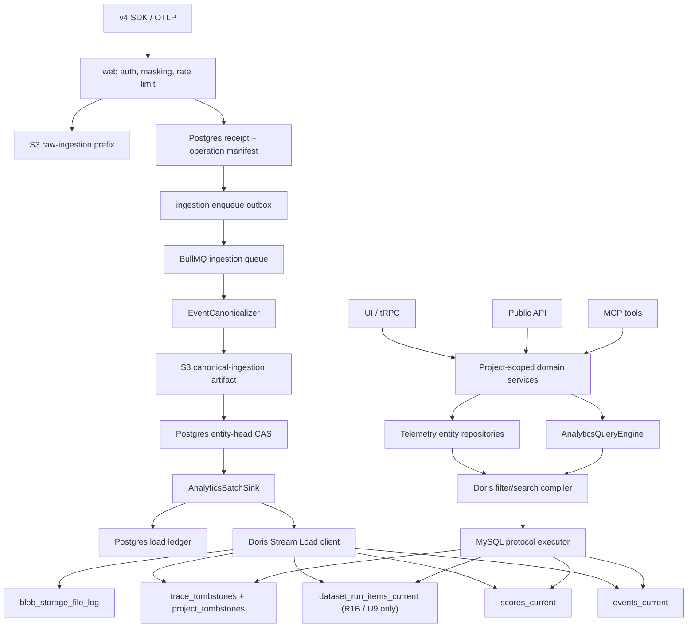
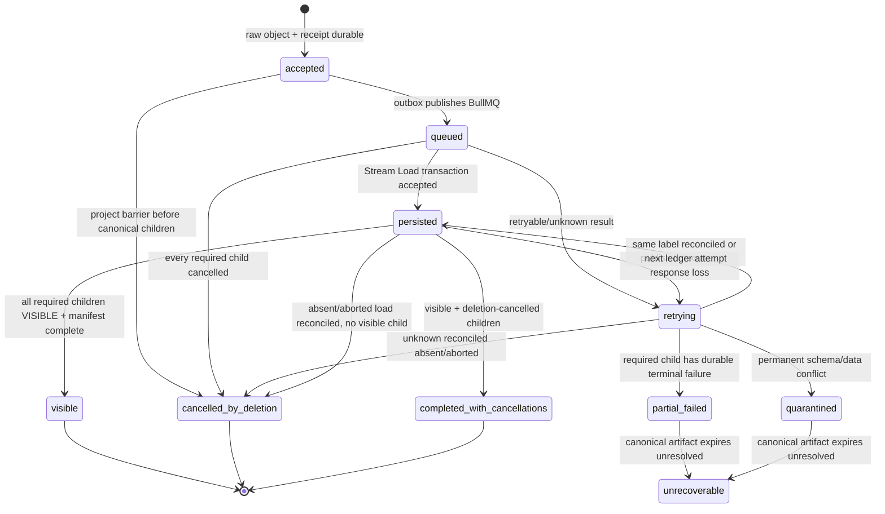

# Langfuse Community Doris Analytics Storage Refactor - Plan

## Goal Capsule

| Field | Contract |
|---|---|
| Objective | Deliver an internal, self-hosted Langfuse Community fork whose analytics runtime uses Apache Doris instead of ClickHouse. R1A preserves core ingest/observe/debug/score, home-dashboard, prompt/dataset regression, Public API/MCP, deletion, and recovery; R1B adds evaluator/experiment and global retention only after adoption evidence. |
| Product authority | The Product Contract in this file and `docs/product/2026-07-17-langfuse-doris-storage-prd.md`; where they differ, stop and reconcile the PRD before implementation. |
| Engineering authority | This plan's KTDs and U-IDs, then repository `AGENTS.md` and scoped instructions, then existing code patterns. |
| Execution profile | Deep, cross-package storage rewrite; characterization-first and PoC-gated; no production dual-write or historical ClickHouse migration. |
| Active delivery boundary | R1A is the launch boundary and must not wait for R1B. R1B is a separately gated extension unit in this program. R2 legacy ingestion, custom dashboards, product monitors, batch export, strict per-trace raw erasure, and future upstream parity require separate follow-up plans. |
| Tail ownership | The implementation executor owns code, migrations, tests, operational docs, browser verification, and final ClickHouse-runtime removal. Product-scope changes remain user-owned. |
| Stop conditions | Stop if Doris cannot pass correctness/durability gates; a required solution needs Enterprise-licensed code; an implementation would reintroduce v3 storage or production ClickHouse; or real scale/compliance requirements invalidate the declared assumptions. |

---

## Product Contract

### Summary

Replace only Langfuse's ClickHouse analytics data plane with Doris for a fresh internal deployment. Keep Postgres as the control plane, Redis/Valkey for queues and cache, and S3-compatible storage for raw/canonical ingestion and media. Preserve selected Community behavior across UI, Public API, and MCP; do not recreate Cloud/Enterprise or a generic multi-database platform. Compatibility is frozen to `langfuse@3.218.0` / commit `85d233edc65ed65d2f0949ec86766aeac3deb719`; later upstream behavior is opt-in through internal demand review and corpus updates.

### Problem Frame

The current analytics implementation is coupled to ClickHouse beyond connection setup. ClickHouse-specific latest-row, map/array, full-text, aggregation, time-bucketing, streaming, deletion, and migration semantics appear across `packages/shared`, `worker`, and `web`. A direct SQL translation would retain those semantics as leaks and create three divergent implementations for UI, API, and MCP.

The target is therefore a behavioral migration with a new canonical persistence/query boundary, not a driver swap. A fresh deployment removes historical backfill requirements but does not remove the need to prove idempotency, ordering, query semantics, failure propagation, deletion safety, and recovery.

### Actors

- A1. Platform operator — deploys, migrates, monitors, backs up, restores, and replays the internal service.
- A2. AI application engineer — sends v4 SDK/OTLP telemetry and investigates traces, observations, usage, cost, and latency.
- A3. Evaluator/annotator — creates or reviews scores, runs evaluations, compares dataset experiment results, and comments on shared objects.
- A4. Project administrator/member — manages Community project resources and permissions within existing role limits.
- A5. Public API/MCP client — accesses the same project-scoped durable objects and query semantics as the UI.

### Requirements

**Storage and licensing**

- R1. Postgres remains the control plane, including payload-free ingestion/load/entity-head/tombstone and R1B-retention durability metadata; Redis/Valkey remains the queue/cache plane, S3-compatible storage remains the raw/canonical/media plane, and Doris becomes the analytics telemetry/query plane.
- R2. Every analytics read/write/delete repository requires a trusted `projectId`; UI session, API key, or MCP `ServerContext` supplies it, never an untrusted tool/query argument.
- R3. Community authorization behavior and tenant isolation remain unchanged across UI, Public API, and MCP.
- R4. No implementation change may modify, copy, or depend on Enterprise behavior in `ee/`, `web/src/ee/`, or `worker/src/ee/`.

**Canonical ingestion and durability**

- R5. OTLP JSON/protobuf/gzip and pinned-baseline v4 SDK telemetry write one canonical event model; R1A creates no v3 trace/observation/staging tables or propagation runtime.
- R6. Ingestion exposes `accepted → queued → persisted → visible`, with `retrying`, `partial_failed`, `quarantined`, `unrecoverable`, `cancelled_by_deletion`, and mixed terminal `completed_with_cancellations` states. Every accepted request returns an unguessable project-scoped `operationId`: v4 uses its compatible response body and OTLP uses `x-langfuse-ingestion-operation-id`. `GET /api/public/ingestion-operations/{operationId}` returns safe operation/child states, expiry, visible links, cancellation reason code, and recovery guidance; terminal status remains queryable for at least 30 days. Accepted means raw payload plus a durable receipt exist; an ingestion-specific outbox/reconciler closes the S3-to-BullMQ gap and accepted never claims Doris visibility.
- R7. An accepted receipt starts with `manifest=pending`. Before any Stream Load, every source operation atomically publishes source checksum/canonicalizer/schema plus a canonical candidate manifest, then freezes the complete post-entity-CAS child disposition/load manifest (`load_required`/`noop`/`quarantined`/`cancelled_by_deletion` and stable batches). `visible` means every required non-noop child committed without cancellation; an operation with no visible child and only deletion-cancelled work is `cancelled_by_deletion`, while visible and deletion-cancelled children produce `completed_with_cancellations`. Deletion cancellation never overwrites an already-visible or independently failed/quarantined child, and a load-unknown child is reconciled before classification. A BullMQ job leaves retry only after all required loads are `VISIBLE` with zero filtered rows or every nonvisible child has a durable terminal disposition.
- R8. Delivery is at-least-once and idempotent across duplicate batches, response loss, process crash, retry, and S3 replay. Ordering tokens and system timestamps come only from the source or the first durable receipt, never a replay processing clock.
- R9. An atomic entity-head compare-and-set claims one canonical payload hash and immutable partition identity for each version eligible to become current under the fixed Source Version Contract below; a concurrent same-version/different-payload source is quarantined rather than resolved by arrival order or a read-before-write race. Versions already superseded by a higher head may be ignored idempotently.
- R10. Canonicalization preserves prompt/model/cost enrichment, masking, rate limiting, and failure tracking outside storage transport. The first enrichment published by the crash-safe canonical protocol defines history: before entity-head CAS, complete canonical children/hash/resolved prompt-model-price IDs are conditionally written to the seven-day S3 prefix and the pointer/candidate manifest is atomically published in Postgres. Retry/restore replays it instead of mutable current enrichment. R1A-supported domain hooks use stable operation/entity idempotency and never fire per Doris callback/retry; evaluator/experiment producers, schedulers, queue instantiation, consumers, and ClickHouse services are centrally disabled/removed in R1A and ingestion enqueues zero such jobs. No generalized side-effect framework is added.

**Source Version Contract**

| Entity | Logical version / sequence | Conflict and time rule |
|---|---|---|
| Pinned v4 observation mutation | Mandatory top-level ingestion-envelope `timestamp` | The body `startTime`/`endTime` may be absent. Missing canonical `start_time` is derived deterministically from that same envelope timestamp, never receipt/processing time; body `endTime` stays nullable. Multiple updates may share `endTime` and still order by envelope timestamp. Same token/hash is a no-op, same token/different hash quarantines, later token wins; the first canonical start fixes immutable UTC `partition_date`, and a cross-day mutation quarantines. |
| OTLP span snapshot | Valid source span `end_time`, falling back to valid source `start_time` only for a protocol-valid incomplete snapshot | The adapter validates the frozen OTLP contract; a snapshot without the source time required by that contract is durable validation/quarantine and never receives receipt/processing time. Same token/hash is a no-op, same token/different hash quarantines, later token wins; first source start fixes immutable UTC `partition_date`. |
| Score | Source `updated_at`, falling back to source score `timestamp` | Missing token is invalid; same token/different hash quarantines; score name is data, not identity. `score_date` is the immutable UTC date of the first valid source score timestamp; a cross-day timestamp mutation quarantines. |
| Dataset run item projection | Postgres control-row `updated_at` or declared version captured in the receipt | Replay uses the captured token and never rereads current control state; immutable run date comes from the first captured control-row `created_at`. |
| Blob/file reference | Parent logical version/partition plus stable file ID | Parent conflict/delete fence applies to the reference. |
| Trace/project tombstone | Monotonic Postgres deletion generation | Terminal sequence is above every ordinary version and cannot be rolled back by replay. |

System `created_at`/`updated_at` without a source business timestamp reuse the first durable receipt's `accepted_at`; replay must not call `Date.now()` for persisted identity/order fields.

Timestamp tokens normalize to checked UTC Unix epoch nanoseconds stored/passed as signed `BIGINT`/decimal string; equivalent RFC3339/protobuf encodings must compare equal and TypeScript must never round them through `number`. Ordinary sequence is strictly below `INT64_MAX`; row-level terminal delete reserves `INT64_MAX`, while the Postgres deletion generation stays a separate field rather than being mixed with business time.

Entity identity is equally fixed: event/span uses a collision-free length-prefixed `(trace_id, span_id)` composite rather than OTLP `span_id` alone or ambiguous concatenation; score uses immutable `score_id`; R1B run item uses immutable run-item ID; file reference uses `(parent entity key, stable file ID)`. One typed encoder feeds both `analytics_entity_heads` and Doris keys and is tested with cross-project/cross-trace collisions.

`canonical_payload_hash` is SHA-256 over a domain-separated, length-prefixed tuple of canonicalizer/schema version, typed identity, normalized version token, and deterministic canonical child JSON. Object keys sort; timestamps/decimals/BigInt use canonical strings; child rows sort by typed identity; arrays and Unicode code points retain domain order/value. Raw-byte checksum remains a separate field, and resolved prompt/model-price enrichment is inside the canonical hash.

Canonical publication is a fixed protocol: Postgres CAS first records `canonicalization_fence`, a predeclared fence-specific object key, and `manifest=pending`; the worker enriches and conditionally PUTs one immutable artifact; a Postgres transaction, only while the fence is current, publishes pointer/artifact checksum/candidate manifest. A crash or lease takeover must HEAD/GET and verify that reserved key before stealing: publish/reuse it if present, and only after confirmed absence may a new fence re-enrich. An object from a stale fence is an unpublishable orphan handled by the seven-day lifecycle. After entity-head CAS, one further transaction freezes every candidate disposition and complete stable load-batch manifest before any Stream Load.

**Observability and query semantics**

- R11. R1A supports deterministic list/detail for traces, observations, sessions, and users, with stable pagination and no cross-page duplicates or omissions.
- R12. A trace exists when at least one current non-deleted event exists; a real root span supplies trace attributes, otherwise a deterministic incomplete-trace fallback is computed without writing synthetic roots.
- R13. Sessions/users derive from canonical events while a new Postgres `TraceControlState` holds bookmark/public-style sparse control attributes without reusing legacy trace tables. Ingestion may only initialize-if-absent by stable operation ID; UI/API mutations increment a durable revision and always outrank replay. Central public-trace authorization and every read service share this rule; telemetry environment remains separate.
- R14. Existing `FilterState`, search grammar, Public API filter schema, and MCP schema remain the behavioral contracts, including high-risk null, metadata, array, score, Unicode, and content-search cases. Full-content search requires an explicit UTC range capped at 30 days per request; point detail is exempt. UI blocks invalid dispatch while preserving/focusing the query and date control; REST/MCP return the same structured `InvalidTimeRange` with accepted range and `maxDays=30`.
- R15. Time ranges use UTC `[from, to)` and every telemetry scan carries trusted project scope plus a date/partition bound. ID-only detail derives the bound from `analytics_entity_heads` or the single U1-frozen bounded strategy; stable ID tie-breakers complete every pageable order.
- R16. Doris failures become sanitized domain/transport errors; no caller receives empty-success fallback or internal SQL, topology, credential, or retry detail.

**Metrics and dashboards**

- R17. Counts, token totals, and fixed-precision cost totals are exact; model price enrichment still uses Postgres definitions before analytics persistence.
- R18. Latency is `end_time - start_time`, TTFT is `completion_start_time - start_time`, and missing endpoints remain null rather than zero.
- R19. Trace totals sum current billable observations; a real root is billed only as its own observation and the root fallback creates no additional billable row.
- R20. Declared approximate percentile/histogram/distinct metrics retain stable result shapes and stay within 1% on the compatibility corpus.
- R21. R1A preserves the pinned-baseline home preset dashboard set; custom dashboard/widget authoring is deferred.

**Scores, evaluations, and experiments**

- R22. Numeric, boolean, and categorical scores persist independently by immutable score identity and sequence; an early/orphan score is retained for later association.
- R23. **R1B only.** The experiment loop covers dataset/item → run → trace association → evaluation → idempotent score → visible result, including bounded retry and partial failure. It requires a named internal owner, current usage signal, and acceptance owner before implementation/activation. One central capability gate covers navigation/direct routes/REST/MCP/tRPC/server actions plus every evaluator/experiment producer, scheduler, queue registration, and consumer; U9 may activate a capability only after its Doris implementation and backlog policy pass together.
- R24. Postgres-backed prompts, model connections, playground, dataset definitions, comments, and annotations remain available and receive regression coverage against Doris-backed telemetry.
- R25. UI, Public API, and MCP share the same service/repository semantics, durable IDs, projections, pagination, totals, and error behavior; MCP names, schemas, annotations, and project context do not change. For inactive R1B/R2 surfaces, normal UI navigation is hidden and direct URLs render an unavailable page with a stable capability code plus recovery/enablement guidance; existing REST routes stay registered and return structured `UnsupportedFeature` (HTTP 501 for wholly unsupported endpoints, per-child error for mixed batches); existing MCP tools stay registered with unchanged schema/annotations and return sanitized `UnsupportedFeature`; tRPC/server actions fail before mutation/enqueue and their schedulers/queues/consumers are unregistered. No channel returns empty success, dead 404, partial behavior, or orphan background work.

**Lifecycle and operations**

- R26. Trace deletion first persists a Postgres authoritative tombstone and makes a Doris trace-level visibility barrier visible, then idempotently removes events, trace-bound scores, Doris dataset-run analytics links, trace control state, and safely attributable media/blob references. Postgres dataset/run definitions and audit/control history remain and report the result trace unavailable/deleted. Project deletion first persists a generation independent of the Project row plus a Doris `project_tombstones` barrier; every query/claim/seal/load/DLQ/replay checks it before the final scoped sweep and Project-row removal. The sweep excludes only an organization-scoped payload-free project-deletion status projection retained for 30 days and permanent generation/barrier evidence.
- R27. Entity-head claim and batch seal/load revalidate trace/project generations. Doris trace/project barriers plus terminal row sequences prevent an already in-flight unseen entity, delayed older work, or newer client retry from reviving deleted data; completion requires barrier visibility, all pre-barrier operations terminal, and all-surface query invisibility.
- R28. A delete idempotently returns an unguessable `deletionOperationId`. Trace operations are project-scoped. Project operations persist outside the deletable Project foreign-key scope with organization ID, deleted project ID, generation, requester audit principal, safe phase/status, and retention expiry. After Project/membership/API-key cleanup, only a current organization session that still passes the Community delete authorization may query the payload-free status through organization-scoped UI/tRPC; revoked keys, other organizations, and guessed IDs reveal no existence. `scheduled` is returned only after both Postgres tombstone and Doris visibility barrier are durable, and from then all surfaces are logically invisible. Barrier failure remains `retrying` with phase `visibility_barrier` and `logicallyInvisible=false`; later states are `scheduled`, `retrying`, `needs_attention`, and `completed`. Completed means promised Doris/attributable-media cleanup, not immediate per-trace erasure of a multi-trace raw object; confirmation copy distinguishes these stages and the seven-day object lifecycle.
- R29. Production configures the same maximum seven-day lifecycle for dedicated raw-ingestion and canonical-ingestion prefixes. Quarantine retains safe metadata/hash and pointers only; expired unresolved operations become explicit unrecoverable/data-loss and no longer block schema contract.
- R30. **R1B only.** Optional global Doris retention is disabled by default and is not a dependency of R1A cutover. When adoption-gated, each run persists one immutable generation/cutoff, per-table progress, and a monotonic `purged-before` watermark applied by replay; per-project Enterprise retention remains excluded.
- R31. Doris migrations are versioned, forward-only, repeatable, and readiness-gated against app/schema compatibility.
- R32. Adjacent application, queue payload, canonicalizer, and schema versions remain compatible during rolling deployment; destructive schema changes use expand/migrate/contract, and contract waits only for the oldest non-expired recoverable BullMQ/DLQ/quarantine/raw-or-canonical operation within the seven-day replay horizon. ClickHouse background scripts retire in two releases: Release A keeps scripts but adds a durable retirement fence, manager build heartbeat, and cooperative chunk-boundary abort/drain; the fence cannot advance until every pre-A worker is gone and each targeted active migration is drained/aborted. Only then may Release B fail on any still-active-TTL lock, terminalize stale rows, remove scripts/ClickHouse, and cut over. A database lock clear alone never stops an in-memory migration.
- R33. Rollback means returning to a prior Doris-compatible app/schema, not stock ClickHouse Langfuse.
- R34. Recovery uses a U8-owned checkpoint coordinator and a common manifest. Under one lease/fence it records generation plus operation/load high-watermarks; post-high-watermark ingestion remains durably accepted/queued but no new Doris load/delete/purge mutation crosses the fence. After all earlier dispatched mutations are `VISIBLE` or durable terminal, it records the Postgres exported-snapshot/backup identity and WAL LSN, trace/project generations, optional purge watermark, and Doris schema/snapshot ID. Only verified artifacts can seal the manifest. The signed envelope includes `keyId`, creation time, monotonic generation, predecessor-manifest hash, every artifact digest, and deletion/purge high-watermarks; old verification keys survive the complete backup horizon, while the latest accepted generation/hash is anchored in an append-only authority outside the backup repository. Default restore rejects an older-but-valid rollback, unknown key, broken predecessor chain, or unsealed/partial checkpoint before mutation. Restore order is verify → control/tombstone/purge gate → Doris restore/migrate → treat post-high-watermark ledger as unknown → reconciliation/canonical replay; raw is used only before a first canonical artifact exists. This is an explicit reconciliation cut, not a cross-database ACID claim; a missing valid point or expired replay window is an RPO breach.
- R35. Operational health covers Doris nodes/replicas/disk/compaction, load visibility/filter/retry, queue backlog/DLQ/quarantine expiry, Postgres receipt/ledger/control-row growth and cleanup watermark, query latency/error, connections, and backup/restore. Production uses a private network and explicit workload/port/credential matrix; web is query-only, worker has separate query/load identities, migrator/backup/restore are one-shot and absent from runtime images, local ports bind only loopback/private bridge, and rolling credential rotation ends by revoking the old identity.

### Key Flows

- F1. Ingest and observe
  - **Trigger:** A2 sends v4 SDK or OTLP telemetry.
  - **Actors:** A1, A2, A5.
  - **Steps:** API authenticates and persists raw input plus receipt, returns `operationId`, and ingestion outbox queues it; worker persists the enriched canonical artifact, claims the entity head, and Stream Loads; the status endpoint exposes operation/child progress; UI/API/MCP read the same current event.
  - **Outcome:** Telemetry is visible once, with queryable status and no silent drop.
  - **Covered by:** R1–R16, R25, R35.
- F2. Search and debug
  - **Trigger:** A2 filters or searches a time-bounded project dataset.
  - **Actors:** A2, A5.
  - **Steps:** UI validates the full-content date cap before dispatch; shared logical filter/search plan enforces project/date scope; Doris compiler binds parameters; repository decodes canonical rows; transport returns stable pagination or a common structured error.
  - **Outcome:** UI/API/MCP agree on IDs, fields, totals, and failure semantics.
  - **Covered by:** R11–R21, R25.
- F3. Evaluate an experiment (R1B)
  - **Trigger:** A3 starts or inspects a dataset run and evaluation.
  - **Actors:** A2, A3, A5.
  - **Steps:** Dataset/run control state stays in Postgres; trace/run links and scores persist in Doris; evaluator retries temporary invisibility; results surface consistently.
  - **Outcome:** The minimum experiment/evaluation loop completes idempotently and exposes partial failure.
  - **Covered by:** R23–R25.
- F4. Delete without resurrection
  - **Trigger:** An authorized project action requests trace deletion.
  - **Actors:** A1, A4.
  - **Steps:** Confirmation distinguishes logical, materialized/media, and raw/canonical lifecycle; durable trace/project tombstone precedes asynchronous cleanup; affected nonterminal ingestion children become `cancelled_by_deletion` only after unknown loads reconcile, without overwriting committed/failed children; caller receives a deletion operation ID and consistent progress; ingestion/replay rejects stale data. Project deletion status survives under organization authorization after the Project row/API keys disappear.
  - **Outcome:** Barrier-pending state remains truthful; after `scheduled`, deleted data remains invisible, status does not overclaim physical erasure, accepted operations reach a truthful terminal outcome, and delayed work cannot revive it.
  - **Covered by:** R26–R29, R34.
- F5. Recover service
  - **Trigger:** Doris load/query failure, node loss, failed deployment, or disaster restore.
  - **Actors:** A1.
  - **Steps:** Readiness/backpressure prevent false success; checkpoint coordinator fences post-high-watermark Doris mutations while accepted ingestion queues, drains earlier work, captures Postgres/WAL and Doris snapshot identities, verifies artifacts, seals/signs the chained manifest, and anchors its latest generation externally. Restore verifies key lifecycle/chain/anti-rollback before compatible snapshots; post-high-watermark ledger is reconciled and replay rechecks lifecycle gates.
  - **Outcome:** Current state converges without data loss or deleted-data resurrection.
  - **Covered by:** R31–R35.
- F6. Prove producer readiness and launch R1A
  - **Trigger:** The team schedules the Doris-only cutover.
  - **Actors:** A1, A2, A4.
  - **Steps:** Reconcile the manual inventory against U1-frozen service/config ownership sources and observed authenticated principal/endpoint traffic over a declared window; record owner/current endpoint/target protocol/date; run one real project-scoped accepted→visible E2E per producer; block unknown, omitted, legacy, unowned, or unexplained-delta producers; freeze the baseline/corpus evidence.
  - **Outcome:** A fresh database is not mistaken for an application migration; only proven v4 SDK/OTLP producers receive R1A traffic.
  - **Covered by:** R5–R6, R31–R35.

### Acceptance Examples

- AE1. Repeating one OTLP batch after a lost response produces one correct current row per entity and acknowledges the queue job only after visibility.
- AE2. An older entity source-version token arriving after a newer token never wins, before or after Doris compaction.
- AE3. A trace without an explicit root is visible through a deterministic fallback and paginates without duplication.
- AE4. Chinese, Korean, Arabic, emoji, raw JSON, escaped Unicode, metadata, and long content match the frozen search/filter corpus.
- AE5. Doris timeout returns explicit REST 5xx/503 and sanitized MCP internal error, not empty success or NotFound.
- AE6. A Project A identity cannot infer or retrieve a Project B object through UI, REST, MCP, logs, counts, or timing-sensitive result details.
- AE7. A score arriving before its observation later attaches correctly; duplicate score delivery does not duplicate current state. An adopted R1B evaluator reuses the same guarantee.
- AE8. Trace deletion racing delayed ingestion remains complete; materialized data stays invisible and raw/canonical objects follow the seven-day lifecycle contract.
- AE9. A declared failure of the U1-frozen topology causes explicit retry/backpressure but no silent drop; HA passes FE/BE failover while non-HA proves restart/restore within its accepted RTO without claiming failover.
- AE10. Ingestion accepted while the checkpoint fence is held remains queued; a sealed high-watermark restore reconciles later ledger without reviving trace/project-tombstoned or R1B-purged data. Partial checkpoints, unknown/rotated-away keys, broken predecessor chains, and an older validly signed manifest below the external latest anchor fail before mutation.
- AE11. Home dashboard, Public metrics, and MCP metrics return exact matching count/token/cost and compatible approximate aggregates.
- AE12. Final runtime/dependencies/compose/env contain no ClickHouse analytics client or service while unrelated `AUTH_CLICKHOUSE_CLOUD_*` identity-provider names remain intact.
- AE13. Two workers concurrently processing the same eligible entity/source-version token with different canonical payloads produce exactly one atomic entity-head winner and one durable quarantine, with the same result after restart and compaction.
- AE14. The same raw object processed across UTC midnight, an adjacent app version, and restore/replay reconstructs identical immutable partition keys and winners. Pinned v4 create/update bodies may omit both body times and multiple updates may share `endTime`: their mandatory envelope timestamps deterministically derive missing starts and order mutations. Invalid OTLP source time and cross-day partition mutation quarantine rather than using processing time or creating a second current row.
- AE15. Project deletion racing an accepted-but-not-loaded operation leaves a durable project generation and visible Doris barrier; manifest-pending/post-CAS/sealed/load-unknown children converge to visible, prior failure, or `cancelled_by_deletion` after reconciliation, claim/load/DLQ/replay cannot recreate scoped data, and the final sweep retains only the 30-day organization status plus permanent barrier evidence.
- AE16. Changing model price/prompt after first canonicalization does not alter a retry/restore row because replay uses the persisted canonical artifact; expiry becomes an explicit RPO breach.
- AE17. An accepted OTLP request exposes a project-scoped status ID via response header; same-project status shows children/expiry/visible links while cross-project or guessed access reveals neither existence nor payload.
- AE18. Full-content search without a range or over 30 days is blocked in UI with the query preserved and date control focused; REST/MCP return matching `InvalidTimeRange` metadata.
- AE19. Barrier failure reports retrying with `logicallyInvisible=false`; after scheduled, partial trace/project cleanup keeps data invisible while status progresses consistently and never overclaims raw/canonical erasure. Project-row/API-key removal does not break same-organization authorized status polling and does not enable key/ID-only access.
- AE20. R1A cutover fails while any producer present in the authoritative service/config census or declared authenticated-traffic window is missing from the manual inventory, or while any required producer lacks owner/migration date/Doris-only E2E evidence or still uses a legacy write path; exclusions carry owner, reason, and expiry.
- AE21. Release A proves no pre-fence worker remains and drains/aborts a migration already loaded in memory; Release B refuses an active-TTL lock, then terminalizes every ClickHouse-only background-migration row before script removal so `BackgroundMigrationManager` has no runnable missing script.
- AE22. A modified backup artifact or manifest fails digest/authentication before any restore mutation.

### Scope Boundaries

**In R1A launch**

- Modern v4 SDK/OTLP ingestion, canonical events, scores, and blob reference lifecycle; dataset-run analytics remains R1B-only.
- Trace/observation/session/user reads, search/filter, costs, tokens, latency, Public API, MCP, and current home presets.
- Basic scores plus regression of Postgres-backed prompts/datasets/comments/annotations; evaluator/experiment execution remains unavailable until R1B.
- Manual trace/project deletion, anti-resurrection, Doris operational health, authenticated common-checkpoint backup/restore/replay.
- Complete removal of ClickHouse analytics runtime, dependency, compose service, storage env, queues, and dormant mode switches.

**R1B adoption-gated extension**

- Evaluator/basic experiment execution and experiment MCP/UI/API surfaces.
- Optional deployment-wide global retention with monotonic purge watermark.
- Each capability requires a named internal owner, current usage signal, acceptance owner, and its own enablement evidence; neither is a dependency of R1A cutover.

**Deferred to follow-up work**

- Legacy trace/observation batch and REST write adapters, future upstream-version parity, and new producer protocols.
- Custom dashboard/widget authoring, Community product monitors, batch export, analytics integrations, and new MCP workflow tools.
- Per-trace immediate physical deletion of multi-trace raw OTLP objects.
- Performance projections such as Doris-managed `trace_summaries` unless U1 demonstrates they are required.

**Outside this product**

- Historical ClickHouse data migration, production ClickHouse dual-write/fallback, and generic pluggable analytics backends.
- Enterprise/Cloud features, code, licensing bypasses, or feature-gate circumvention.
- Understand Anything / Ask Anything local plugin integration or agent-only data models.

---

## Planning Contract

### Product Contract Preservation

The Product Contract above matches the companion PRD's R1A/R1B scope. Planning adds implementation boundaries and verification but does not make R1B a launch dependency or expand the program into deferred legacy APIs, custom dashboards, monitors, exports, Enterprise behavior, future upstream parity, or historical migration.

### Assumptions

- This is a fresh internal deployment; no production ClickHouse rows require migration.
- Internal applications can upgrade to pinned-baseline v4 SDK/OTLP for R1A. Unsupported legacy trace/observation writes return stable actionable errors.
- The query/storage baseline is 10M current events retained for 30 days. Separately, the minimum ingestion-capacity test is 100 events/s for 60 minutes and 500 events/s for 10 minutes; these are not a claim that 100 events/s runs continuously for 30 days. U1 replaces retained rows/bytes, steady-state rate, duty cycle, and burst with measured internal demand; a true continuous 100 events/s target requires roughly 259M events/30 days and a new corpus decision.
- Raw-ingestion objects may contain multiple traces. R1A accepts lifecycle-based raw/canonical deletion with a maximum seven-day window and makes no immediate-erasure compliance claim.
- R1A has no custom global retention scheduler; raw/canonical lifecycle is sufficient for launch. Global retention is R1B-only, while per-project retention remains excluded because the current implementation is Enterprise-licensed and partition TTL cannot reproduce it safely.
- Local development uses a minimal Doris composition. Before U1 benchmarks, the operator must freeze one production topology, resource budget, RPO, and RTO; U1–U8 make production claims only for that target.
- Existing tests at the pinned upstream baseline define compatibility when the PRD does not explicitly redefine an edge case. Later upstream tests do not silently expand this plan.

### Key Technical Decisions

- KTD1. Doris replaces ClickHouse only in the analytics plane; Postgres, Redis/Valkey, and S3 retain their current responsibilities. `(session-settled: user-directed — chosen over keeping ClickHouse or moving all storage into Doris: the internal team explicitly requires Doris but wants the rest of Langfuse preserved.)`
- KTD2. The implementation uses only Community/MIT code paths and independently added core code. `(session-settled: user-directed — chosen over purchasing or modifying Enterprise features: the team cannot buy the commercial version.)`
- KTD3. R1A is a fresh `events-only` topology with no runtime dual-write. Existing ClickHouse may be used only as an offline characterization oracle before final fixture freeze. This intentionally departs from the repository's historical `legacy → dual → events_only` rollout because a fresh deployment has no live migration source and the user rejects a production ClickHouse dependency.
- KTD4. Preserve a semantic storage boundary, not a generic `query(sql)` or multi-provider framework. One `AnalyticsBatchSink`, one lifecycle store, concrete shared semantic entity repositories, and one analytics query engine own domain semantics; MySQL/HTTP clients own only transport. Do not add one provider interface per entity.
- KTD5. `events_current` is the only application-written event fact table. There are no synthetic-root rows and no application-written full/core pair. U1 must freeze, before U2 production DDL, whether base-table queries pass or require Doris-managed trace summaries and/or dashboard rollups; any selected projection gets explicit freshness/update/delete/restore gates and becomes part of U2–U8.
- KTD6. S3 raw objects support first canonicalization/re-canonicalization only until a canonical artifact exists. The enriched canonical child artifact is the retry/restore source after enrichment, and Doris stores current analytical state. Raw and canonical prefixes share the seven-day lifecycle; no second Doris append-only raw table is created.
- KTD7. Use Unique Key Merge-on-Write with a `BIGINT` sequence column and full-row upserts. Normalized epoch-nanosecond tokens remain BigInt/decimal strings in TypeScript; `INT64_MAX` is reserved for row-level terminal delete and ordinary tokens are range-checked below it. Flexible partial update and Group Commit are deferred because they complicate deterministic retries and stable labels.
- KTD8. Stream Load idempotency uses deterministic Doris labels plus Postgres durable ingestion receipts, parent operation/child-load manifests, fenced load attempts, and a persistent ledger; label history alone is insufficient because Doris may expire it. One ingestion-specific outbox closes the S3-write/BullMQ-enqueue gap and powers operation status; this is not a general side-effect framework.
- KTD9. Query/DDL use the Doris MySQL protocol through `mysql2`; Stream Load uses a dedicated Node HTTP(S) client that explicitly handles `Expect: 100-continue`, `307` body-preserving redirect, response-loss reconciliation, and load-state polling.
- KTD10. At plan time, pin official Stable `4.0.7` for the production PoC and R1A. Revalidate its official support status at implementation start; cross-version 4.1.x canary/soak belongs to the post-cutover upgrade workflow and R1A cannot depend on a 4.1-only feature.
- KTD11. Manual deletion writes Postgres authoritative trace/project generations and makes Doris `trace_tombstones` / `project_tombstones` visibility barriers `VISIBLE` before cleanup convergence. Every entity/metric/score query and every claim/seal/load/replay enforces the relevant barrier; row-level terminal sequences clean known keys. Batch-seal fencing closes the check-then-load race.
- KTD12. UI, Public API, and MCP call the same project-scoped services/repositories. MCP receives no agent-only projection or project selector, and Doris failure never becomes an empty-success tool result.
- KTD13. U4–U7 implement and test R1A Doris paths without activating a mismatched read/write backend in a released deployment. U8 performs one atomic composition-root cutover after core reads, writes, analytics, deletion, and recovery are complete; once R1A accepts traffic, rollback stays inside Doris-compatible app/schema versions with no ClickHouse fallback. R1B U9 is post-cutover and never blocks U8.
- KTD14. Each versioned analytical entity has a payload-free Postgres `analytics_entity_head` used for atomic current-version/hash claim, fencing generation, owning trace ID, and immutable partition locator. Event partition date is the UTC date of canonical `start_time`; pinned v4 may derive that start from its source envelope timestamp, while OTLP never uses receipt/processing time. A later version that changes the date is quarantined. Trace point-read/delete enumerates heads through the indexed owning trace ID; a plain read-before-write check is forbidden.
- KTD15. Disaster recovery selects a Postgres/Doris pair only through the checkpoint coordinator's sealed high-watermark manifest. Artifact digests, `keyId`, generation, predecessor hash, creation time, and deletion/purge watermarks are signed outside the backup repository; old verification keys outlive backup retention and an external append-only latest anchor prevents rollback to an older valid signature. Replay starts after trace/project tombstone and any enabled monotonic retention watermark restoration; post-cut ledger is reconciled, and missing/invalid common state or an expired canonical source is an RPO breach.
- KTD16. Doris endpoints and redirect targets are operator-controlled configuration, not request input. Stream Load follows only TLS-preserving `307` redirects whose resolved host/IP/port is in the frozen FE/BE cluster allowlist; it forwards body/load credentials only to those targets and never to an unallowlisted origin. Web gets query-only credentials; worker gets separate query/load credentials; migration/backup/restore credentials are one-shot and absent from runtime images; all rotate through overlap-and-revoke. Disks/backups use infrastructure encryption at rest.
- KTD17. Entity identity and logical version are source-contract specific. Event identity is a typed collision-free `(trace_id, span_id)` composite; pinned v4 observation mutations use mandatory ingestion-envelope `timestamp`, whereas a protocol-valid OTLP span snapshot uses source `end_time` then source `start_time`. Score identity is `score_id` and version `updated_at` else score timestamp; run-item identity/version comes from the captured control row; file identity combines parent key/stable file ID; tombstone version is deletion generation. Event/score/run-item/file partition comes from first canonical event start, score timestamp, run `created_at`, or parent and is immutable. Same token/different hash or partition-changing mutation quarantines; no receipt/processing clock, arrival order, span ID alone, or ambiguous concatenation can choose current state.
- KTD18. First enrichment writes a complete canonical S3 artifact before entity-head CAS. Normal retry, gap repair, and restore replay that artifact so mutable prompt/model-price definitions cannot change history; raw replay is permitted only before the canonical artifact exists under the pinned canonicalizer.
- KTD19. Compatibility is frozen to `langfuse@3.218.0` / `85d233edc65ed65d2f0949ec86766aeac3deb719`. Future upstream merges are explicit product changes that must update the producer inventory and compatibility corpus before implementation.
- KTD20. R1A core cutover and R1B adoption extensions have separate completion gates. U8 launches R1A with inactive R1B channels failing consistently; U9 implements evaluator/experiments/global retention only after each has named owner, usage evidence, and acceptance owner.

### High-Level Technical Design

The following diagrams describe boundaries and state transitions; they are not exact class or SQL definitions.

### Storage Model

| Store/table | Physical intent | Identity/order | Data rules |
|---|---|---|---|
| Postgres `analytics_ingestion_operations` | Durable receipt, accepted timestamp, raw pointer, canonicalization fence/reserved key/published pointer, ingestion outbox, safe status, expiry, candidate manifest, and frozen disposition/load manifest | Unique project + unguessable source operation; source checksum + canonicalizer/schema version | Accepted starts `manifest=pending`. Fence-aware publication makes an uploaded artifact discoverable after crash; no load starts before candidate dispositions and required batches are transactionally frozen. Manifest keeps `cancelled_by_deletion` distinct from no-op/failure/visible. Active rows never expire; terminal status remains at least 30 days. |
| Postgres `analytics_load_batches` | Fenced child-load attempt/transaction ledger and canonical replay pointer | Unique database/target/logical batch/attempt; globally collision-safe deterministic label and exact payload hash | CAS/fence generation owns transitions; unknown outcomes reconcile before a new attempt; history is not rewritten when Doris label history expires. |
| Postgres `analytics_entity_heads` | Atomic current-version/hash claim and partition locator | Unique project + entity type + typed collision-free entity key; indexed project + owning trace ID | The same encoder produces Doris identity (event key includes trace+span). Batch CAS stores owning trace, source-version/hash, immutable partition date, canonicalizer version, and trace/project fences; conflicts quarantine; trace detail/delete enumerates through the trace index. |
| Postgres `analytics_deletion_tombstones` | Authoritative trace anti-resurrection and multi-plane deletion progress | Project + trace/entity ID + monotonic generation | Written before delete dispatch; its generation is rechecked at claim/seal/load; retained according to the declared project lifecycle. |
| Postgres `analytics_project_deletion_generations` | Project barrier independent of the deletable Project row | Project ID + monotonic generation | Created before project cleanup, retained after Project-row deletion, and checked by claim/load/DLQ/replay/final sweep. |
| Postgres `analytics_deletion_operations` | Payload-free trace/project deletion status and authorization anchor outside Project cascade | Unguessable operation ID; operation type + organization ID + project ID value + generation + requester audit principal | Trace status uses live project authorization. Project status switches to current-organization delete authorization after Project removal; revoked project keys cannot query it. Active/retrying rows never expire and safe terminal projection remains at least 30 days. |
| Postgres `analytics_checkpoint_generations` | Checkpoint lease/fence, operation/load high-watermarks, snapshot identities, signed-chain metadata, and seal/abort outcome | Monotonic generation + predecessor hash; one active lease | Post-high-watermark ingestion may persist but Doris mutations wait. A checkpoint is restorable only when both artifact sets verify, the row is sealed, and its generation/hash matches the external latest anchor. |
| Postgres `analytics_background_migration_retirement` | Two-release retirement fence and manager build/active-migration heartbeat for ClickHouse-only scripts | One named fence generation plus worker build/lease identity | Release A owns heartbeat and cooperative drain/abort; Release B refuses pre-A/live-active evidence before terminalizing rows and removing scripts. |
| Postgres `analytics_retention_runs` (R1B) | Immutable global-retention generation and per-store progress | Monotonic generation + cutoff | Not created on the R1A path; when adopted, persists non-decreasing `purged-before` used by replay even if retention is later disabled or extended. |
| Postgres `TraceControlState` | Sparse bookmark/public-style trace control state | Unique project + trace ID + durable revision | New Community model; ingestion initialize-if-absent cannot overwrite a UI/API mutation; central public authorization uses the same revisioned state; telemetry environment remains in events. |
| Doris `events_current` | Full-fidelity current real trace/observation events | Unique `(project_id, partition_date, trace_id, span_id)`; application sequence; daily range partition; distribution/key order frozen by U1 | `partition_date = UTC date(canonical start_time)` and is immutable across versions. Hot identity/time/filter/group/order/billing/preview/search columns are typed; full input/output and long-tail metadata/model/tool data use dedicated text/VARIANT columns. No synthetic-root rows. |
| Doris `scores_current` | Current numeric/boolean/categorical scores | Unique `(project_id, score_date, score_id)` plus score sequence | `score_date` is fixed from first valid source score timestamp through the entity head; cross-day mutation quarantines. Score name is mutable data, not identity; typed value columns and target IDs remain explicit. |
| Doris `dataset_run_items_current` (R1B) | Analytics projection linking dataset run items to traces/observations | Unique project + immutable run date + run item identity plus captured sequence | Absent from R1A; U9 adds it only after experiment adoption. Postgres remains control source; first captured run `created_at` fixes partition date. |
| Doris `blob_storage_file_log` | Current file/entity reference lifecycle for media cleanup | Unique project + file date + entity type + entity ID + stable file ID plus sequence | Store path outside the key; raw multi-trace OTLP objects rely on prefix lifecycle, not false single-trace ownership. |
| Doris `trace_tombstones` | Query-visible trace-level deletion barrier | Unique project + trace ID; monotonic deletion generation | Must be `VISIBLE` before delete completes; all event/score/metric/experiment query paths enforce it so unseen in-flight keys cannot reappear. |
| Doris `project_tombstones` | Query-visible project-level deletion barrier | Unique project ID; monotonic deletion generation | Retained independently of ordinary project rows and enforced by every telemetry query/load/replay until final sweep proves empty. |
| S3 raw-ingestion prefix | First canonicalization input | Object key + checksum + project attribution | Maximum seven-day lifecycle; used for retry only before the first canonical artifact exists and always passes deletion/retention gates. |
| S3 canonical-ingestion prefix | Immutable post-enrichment retry/restore artifact plus unpublishable stale-fence orphans | Predeclared project/operation/canonicalization-fence object key; artifact header carries exact canonical hash, candidate manifest, and resolved enrichment IDs | Conditional PUT before entity-head CAS; Postgres fence CAS publishes the authoritative pointer. Takeover reconciles the reserved key first. Same seven-day lifecycle as raw; normal retry/recovery replays the published artifact without mutable enrichment reads. |

`events_current` uses explicit columns for every identity, partition, join, filter, group, order, list, billing, and SLO path. VARIANT is restricted to long-tail metadata and rapidly evolving model/tool parameters. Common usage/cost fields are typed; custom keys remain VARIANT until U1 evidence justifies normalized detail tables. If U1 selects Doris-managed trace summaries, dashboard rollups, or a payload/search split, the PoC report becomes an amendment to this table before U2 starts and must state freshness, rebuild, update, deletion, and restore semantics. R1B-marked tables/state are excluded from U1's launch DDL and U2 migrations; U9 must separately prove any adopted table/scheduler before its migration is applied.

### Security, Network, and Credential Matrix

The following is the R1A baseline for Doris default service ports. U1 records the exact `fe.conf`/`be.conf`, TLS endpoint or private TLS proxy, security-group rules, and any remap; changing it later reruns the network/failover gates. No Doris port has public ingress.

| Source workload | Allowed destination | Baseline port/protocol | Credential / restriction |
|---|---|---|---|
| `web` | FE query endpoint | `9030/TCP` MySQL protocol over verified TLS or the U1-frozen mTLS tunnel/proxy | `langfuse_web_query`, SELECT only; application repositories still enforce trusted project scope; no Stream Load/DDL/backup privilege |
| `worker` query path | FE query endpoint | `9030/TCP` over verified TLS or the same frozen private tunnel | `langfuse_worker_query`, SELECT needed for reconciliation/evaluation/lifecycle only |
| `worker` load path | FE Stream Load; allowlisted same-cluster BE redirect | operator-frozen HTTPS endpoint (Doris default service ports are FE `8030/TCP`, BE `8040/TCP`; direct cleartext is forbidden in production) | separate `langfuse_worker_load`; INSERT/LOAD only; reject downgrade or any host/IP/port outside the allowlist and never forward credentials/body there |
| one-shot migrator | FE query endpoint | `9030/TCP` with verified TLS | `langfuse_migrator`; DDL/schema-version rights; secret mounted only for the job and absent from web/worker images |
| one-shot backup / restore | FE query endpoint plus approved backup repository | `9030/TCP` with verified TLS plus repository TLS endpoint | distinct `langfuse_backup` / `langfuse_restore`; no runtime mount; restore requires authenticated manifest |
| monitoring | FE/BE metrics endpoints | private `8030/TCP` FE and `8040/TCP` BE read-only metrics paths | network allowlist or dedicated read-only metrics identity; never a query/load credential |
| Doris cluster members | selected FE/BE peers only | default FE edit-log/RPC `9010/9020`, BE heartbeat/BRPC `9050/8060`, plus selected topology's documented replication ports | cluster security group only; U1 freezes exact directions and denies application subnets |

Credentials arrive through runtime secret injection, never committed env values. Rotation creates the replacement identity/secret, deploys consumers with overlap, verifies readiness/query/load, then revokes the old identity and proves it can no longer connect. Backup manifest authentication keys live in a different key-management boundary from the backup repository and are not Doris user credentials; manifest `keyId` selects a verification key retained for the full backup horizon, and the latest generation/hash anchor uses a separate append-only authority.

### Control-State Lifecycle

- Active/retrying ingestion operations, child manifests, load attempts, quarantines, deletion operations, and outbox rows are never garbage-collected.
- A terminal ingestion/deletion operation keeps its safe status projection for at least 30 days. Project deletion status is explicitly exempt from the Project cascade and retains organization/requester authorization fields without payload; trace status stays project-scoped. Child load-attempt detail may be compacted after the operation is terminal, the raw/canonical seven-day replay horizon plus 24 hours has elapsed, and an authenticated common checkpoint includes the terminal outcome; the operation manifest retains aggregate child outcomes through the 30-day status window.
- `analytics_entity_heads` remain while the entity is current. A closed head is removable only after the relevant trace/project barrier is durable, every pre-barrier operation is terminal, the replay horizon has elapsed, and a common checkpoint records the closure.
- Trace tombstones remain until project deletion. Project deletion generations and Doris `project_tombstones` remain indefinitely for R1A, and project IDs are never reused. R1B retention state follows its monotonic watermark contract.
- The cleaner is low-priority, project-scoped, fenced, observable, and disabled if configured lifetimes are shorter than these minima. Cleanup failure alerts but never blocks ingestion by accumulating payload in process memory.

### Load State and Retry Contract

1. Persist a receipt with source checksum/raw pointer/project/one `accepted_at`/canonicalizer/schema/expiry and `manifest=pending`; enqueue via the ingestion-specific outbox so S3 success followed by BullMQ failure cannot orphan accepted data. Return its scoped operation ID.
2. CAS-reserve `canonicalization_fence` and its fence-specific object key before enrichment. On every start/takeover, HEAD/GET and verify the reserved key first. If valid, reuse it; if confirmed absent and the worker owns the fence, enrich under the pinned version and conditional PUT the complete immutable artifact. A stale fence may upload only an orphan and cannot publish.
3. In one Postgres transaction, verify the current fence and publish canonical pointer/artifact checksum/candidate manifest. Then batch-CAS `analytics_entity_heads` under the Source Version Contract and transactionally freeze each candidate disposition plus stable required `batch_id`, row count, payload checksum, target, trace/project locator, and fence before any Doris load.
4. For every `load_required` batch, create/reuse the fenced load-ledger row and globally collision-safe deterministic Doris label. `noop`, `quarantined`, and `cancelled_by_deletion` candidates remain explicit manifest outcomes rather than disappearing. A deletion barrier CAS-cancels only work proven not committed; unknown loads reconcile first, and visible/independently failed outcomes are immutable.
5. Send newline-delimited JSON with strict parsing, `read_json_by_line=true`, `max_filter_ratio=0`, and explicit `Expect: 100-continue` handling. Batch limits are by bytes, rows, partitions, latency, and global in-flight/buffered bytes—not row count alone.
6. Treat `Success`/`VISIBLE` with zero filtered rows as committed, CAS the fenced ledger transition, and mark the child complete. Resolve the source operation only when every required child is visible or explicitly durable terminal; compute `visible`, `cancelled_by_deletion`, or `completed_with_cancellations` from frozen child outcomes. Only R1A-supported domain side effects use their own stable entity/operation identity; evaluator/experiment hooks produce no job until U9 and nothing is generalized into this ledger.
7. Treat transport timeout, connection loss, 5xx, `Publish Timeout`, or redirect uncertainty as unknown. Poll the original label/transaction; never change labels while state is `PREPARE`/`COMMITTED`. Label expiry without independent proof becomes `needs_reconcile`, not “absent.”
8. Retry a new attempt only after an `ABORTED`/provably absent transaction and classified retryable failure. A stale worker without the current fence cannot advance state. Permanent conflicts retain safe metadata/hash plus raw/canonical pointers and alert before expiry; no longer-lived shadow payload is created. An unresolved operation becomes explicit unrecoverable/data-loss when its canonical source expires.
9. Recheck trace/project tombstone generations and any enabled R1B retention watermark immediately before freezing/sending a batch. A matching barrier moves absent/aborted nonterminal work to `cancelled_by_deletion`; an unknown transaction must reconcile, while a committed row remains physically committed but query-hidden. Completed deletion requires the Doris barrier plus every pre-barrier operation in one truthful terminal outcome, so a writer that passed an earlier check cannot make data query-visible or hang deletion forever.
10. When Doris is unavailable, unpersisted backlog stays in S3/BullMQ/ledger rather than Node heap. Global buffered bytes/in-flight loads hit backpressure before OOM; recovery gives bounded capacity to new traffic while draining backlog.
11. Shutdown stops accepting new rows, waits only to the declared drain deadline, then durably requeues unresolved operations and exits unhealthy rather than silently discarding them.

### Query Semantic Invariants

- Storage-neutral contracts remain `QueryType`, `FilterState`, `TracingSearchType`, canonical read schemas, pagination/sort inputs, and existing API/MCP schemas.
- The logical model contains field identity, logical type, nullability, legal relations/aggregations, unit, and cardinality. It contains no physical table, raw SQL, `FINAL`, `sumMap`, `argMaxIf`, or `ARRAY JOIN`.
- Doris compiler outputs parameterized SQL plus a row decoder. Callers never receive physical table names or driver settings.
- Latest-wins, delete visibility, null/empty, array any/none/all, negative score filters, metadata missing keys, map-like key/value expansion, `[from,to)`, UTC bucket anchors, stable pagination, and Unicode/full-content search are compatibility fixtures.
- Every telemetry query enforces both Doris project and applicable trace tombstone barriers. Point lookup without a caller date uses the Postgres entity-head locator or a separately benchmarked bounded strategy; it must not silently scan unbounded history.
- Existing relationship-window behavior is frozen as a compatibility invariant unless a characterization test proves a narrower current contract: observation→trace may look back 2 days, trace→observation 1 hour, and score→trace/observation 1 hour. Boundary fixtures cover exact window edges and cross-midnight traces.
- Count/token/cost must match exactly. Percentile/histogram/distinct use declared tolerance. Empty time buckets distinguish zero from null according to the existing API contract.
- Full input/output/metadata are fetched only for detail or explicit full-content filters; list rows select typed columns/previews and never load full payload columns. Full-content search requires an explicit range of at most 30 days and the U1-frozen analyzer/index path with no silent full-scan fallback; UI blocks and guides before dispatch while REST/MCP share `InvalidTimeRange`.

### Implementation Sequence and Release Gates

1. U1 is an engine/physical-design PoC using test-only receipt/ledger/tombstone fixtures. It freezes compatibility, workload manifest, candidate DDL, key/bucket/index/projection/search choices, and writer byte/backpressure limits. It does not claim application-level replay or lifecycle completion; failure is a no-go.
2. U2 promotes the winning physical design into production migrations and adds durable Postgres receipt/manifest/entity-head/ledger/trace-and-project-tombstone/control state. U3 establishes the minimal semantic boundaries; neither routes released traffic.
3. U4 implements and integration-tests durable Doris writes/status but does not activate a read/write-mismatched backend in a released build. U5 supplies trace/observation/session/user reads; U6 supplies scores/metrics/home dashboards.
4. U7 completes manual trace/project deletion and replay integrity. No release or production traffic is allowed across the intentionally incomplete U4–U7 intermediate state.
5. U8 atomically switches the composition root after all R1A planes are ready, terminalizes ClickHouse-only background migration rows, removes every ClickHouse analytics runtime path, proves producer readiness, and runs full browser/failure/authenticated-restore/cutover verification.
6. U9 is a post-cutover R1B extension for evaluator/basic experiments and optional global retention; its adoption gate and completion are independent of U8.

There is no production dual-write phase. A local/CI ClickHouse reference may produce committed canonical fixtures during U1, then disappears from final CI/runtime. Fresh production starts only after U8.

### System-Wide Impact

- **Web/API:** OTLP and batch ingestion status semantics, events/traces/observations/sessions/scores routers, metrics endpoints, MCP tool transport, backend error mapping, readiness, and unsupported legacy responses.
- **Worker:** canonicalization, durable writer, ingestion/OTLP queues, internal tracing, shutdown, trace/project deletion, replay, and operational metrics; R1B separately owns evaluation execution and global retention.
- **Shared:** Doris clients/migrations, Prisma receipt/manifest/entity-head/ledger/trace-and-project-tombstone/control state, the minimal batch/lifecycle boundaries, concrete entity repositories, filter/search compiler, one analytics query engine, canonical decoders, queue contracts, and seed/test utilities; R1B adds retention state only when adopted.
- **Infrastructure:** Doris local services, migration init, health checks, env examples, image pinning, backup/restore runbooks, Prometheus/Grafana integration, and removal of ClickHouse volumes/services.
- **Security:** project scope at every repository layer, parameter binding, bounded query/search cost, sanitized errors, allowlisted Stream Load redirects, separate least-privilege Doris users/workload groups, verified TLS, encrypted disks/backups, secret/payload log redaction, and no Enterprise code drift. Inputs/outputs/metadata may contain PII or credentials even after masking, so backup and quarantine payloads inherit the same access/retention policy.
- **Data lifecycle:** multi-table eventual convergence is explicit; per-table loads are atomic but cross-table writes are reconciled by ledger/job retry. Tombstones precede all destructive work.
- **Agent/API parity:** MCP names, schemas, annotations, cursor/projection behavior, expensive-query guards, and project context remain frozen; no new agent workflow is introduced.

### Risks and Dependencies

| Risk | Consequence | Mitigation / gate |
|---|---|---|
| Doris latest-row/delete semantics differ before compaction | Stale or revived telemetry | U1 multi-version/delete corpus before and after compaction; sequence + durable tombstone; no launch on mismatch. |
| Writer acknowledges process memory or a partial child set | Silent telemetry loss or incomplete experiment state | Source operation resolves only after every required child is `VISIBLE` or durably terminal in the manifest; inject response loss/crash/FE/BE/child-specific failures. |
| Wide `events_current` misses list/dashboard latency | Poor internal UX or expensive scans | Explicit hot columns/previews, partition bounds, indexes, `EXPLAIN`; add Doris-managed summary projection only when U1 evidence requires it. |
| VARIANT paths become inconsistent or JSONB-like | Filter/group pushdown loss | Typed hot columns, mixed-type corpus, schema/type monitoring, promotion policy for hot paths. |
| Full-text semantics drift | Missing multilingual/content results | Frozen Unicode/raw-escaped/substr corpus, normalized search columns, inverted/NGram strategy, full-table fallback only within bounded scope. |
| Cross-project predicate omitted in a subquery/join | Critical tenant data leak | Repository contracts require `projectId`; SQL golden audit and A/B project integration tests across UI/API/MCP. |
| Malicious/misconfigured Stream Load redirect receives auth or telemetry | Credential and sensitive payload disclosure | Follow only `307` to allowlisted same-cluster TLS targets; strip auth on any rejected origin; integration-test hostile Location values. |
| Accepted raw object is never enqueued or is replayed under new canonical semantics | Silent loss or false entity conflicts | Durable receipt/outbox, orphan reconciliation in both directions, pinned canonicalizer/schema version, and quarantine payload lifecycle. |
| Concurrent same-version claims race | Arrival-order-dependent current state | Transactional batched entity-head CAS; barrier-synchronized race tests; no read-before-write implementation. |
| Independent backups have no common point or manifest is modified | Ledger says success for rows absent from restored Doris, deleted data revives, or attacker substitutes an artifact | Externally authenticated manifest with artifact digests, ordered restore, gap reconciliation, and explicit RPO breach when canonical replay cannot close the gap. |
| Raw OTLP cannot be erased per trace | Overstated deletion/compliance | Seven-day prefix lifecycle and explicit product wording; strict erasure deferred until manifest/refcount exists. |
| R1B global retention deletes data unexpectedly | Irreversible loss | Absent from R1A; named adoption owner, disabled-by-default R1B implementation, immutable cutoff/watermark tests, backup, and no per-project emulation. |
| No ClickHouse rollback after cutover | Longer recovery during regression | PoC gate, Doris-compatible app rollback, expand/migrate/contract, snapshots, S3 replay, restore drill before traffic. |
| Upstream Langfuse changes v4 semantics | Fork drift and an accidental forever-parity commitment | Freeze the baseline commit; require internal-demand review plus producer/corpus updates before each upstream adoption; avoid broad generic framework. |
| Commercial code leaks into solution | License violation | No edits/imports from licensed directories; final path audit; independently implement only the declared R1A/R1B Community behavior. |
| Production Doris topology/skills are insufficient | Availability or recovery failure | Local minimal topology separated from production runbook; U8 health/backup/restore drill; operator explicitly accepts non-HA deployment. |

### Resolved During Planning

- Doris version: official Stable `4.0.7` is the R1A baseline as of 2026-07-17 and is revalidated at implementation start; 4.1.x canary/soak is post-cutover upgrade work.
- Tracing model: one application-written event fact table `events_current`; lifecycle barrier `trace_tombstones` holds no duplicate event payload. There is no `events_full/events_core` dual write, synthetic root, or initial `traces_current` application table.
- Migration: fresh deployment, no ClickHouse data backfill or production shadow writes. Offline differential fixtures replace live dual-read.
- Legacy API: unsupported with actionable errors in R1A; a later adapter may translate to canonical events only.
- Retention: no custom scheduler on the R1A path; optional global Community implementation is R1B-only and never reuses Enterprise per-project retention code.
- Raw deletion: materialized deletion is prompt; raw multi-trace objects expire by required seven-day lifecycle.
- Rollback: Doris-compatible versions only after first production ingest.

### Gate Inputs That Do Not Change Product Scope

- Before U1 benchmarks, the operator must freeze one production topology, resource budget, RPO, and RTO (including explicit non-HA risk acceptance if selected). U1 must then replace illustrative retained volume, write duty cycle, payload distribution, project skew, and query concurrency with measured or explicitly accepted internal assumptions for that topology before PASS.
- U1 also freezes the production object-store provider and proves the exact conditional-create plus read-after-write `HEAD`/`GET` guarantees required by the canonical publication protocol; an incompatible provider requires amending that protocol before U2, not assuming S3 behavior from API shape alone.
- U1 freezes producer-census sources and an observation window: service/deployment/config ownership plus authenticated principal/endpoint traffic, defaulting to 30 days or the longest normal producer interval plus grace. U8 cannot substitute a hand-maintained checklist for these completeness inputs.
- U1 freezes the backup repository, manifest key manager/retention horizon, and append-only latest-checkpoint authority outside that repository. The selected combination must support key rotation and retention for every restorable backup; U8 implements and drills it rather than choosing a security boundary ad hoc.
- U1 must record a single outcome for base table versus Doris-managed trace summary/dashboard rollup/payload-search split before U2 starts. The choice is based on measured freshness/query/write/compaction gates; application dual-write remains prohibited.
- U8 verifies the already frozen production topology and RPO/RTO; it cannot change the target after U1 without rerunning the affected physical, capacity, failover, and restore gates.
- R1B and R2 capabilities are prioritized only from named internal usage evidence; R2 requires separate plans and future upstream adoption requires a compatibility-corpus amendment.

### Sources and Research

**Repository evidence**

- `packages/shared/src/features/query/types.ts`, `validateQuery.ts`, and `interfaces/{filters,search}.ts` provide reusable storage-neutral contracts.
- `packages/shared/src/features/query/dataModel.ts`, `server/queryBuilder.ts`, and `server/queryExecutor.ts` show the current ClickHouse SQL leakage that must be split.
- `packages/shared/src/server/repositories/{events,traces,observations,scores,dashboards,daily-metrics}.ts` map the entity and analytics read surface.
- `worker/src/services/IngestionService/index.ts` and `worker/src/queues/otelIngestionQueue.ts` contain the reusable v4 canonicalization path.
- `worker/src/services/ClickhouseWriter/index.ts` demonstrates the current process-buffer/drop reliability gap.
- `packages/shared/clickhouse/scripts/dev-tables.sh` documents `events_full/events_core` semantics; it is characterization evidence, not a Doris DDL template.
- `web/src/features/mcp/` and `web/src/__tests__/server/mcp-tools-read.servertest.ts` define agent/API parity constraints.
- `.agents/ARCHITECTURE_PRINCIPLES.md` requires wide high-cardinality event context, compact list/dashboard reads, bounded queries, and operational simplicity.
- No applicable `docs/solutions/`, ADR, or planning archive exists in this repository; historical v4 migration patterns were inspected directly.

**Official Doris references**

- [Downloads and release status](https://doris.apache.org/download/)
- [Versioning policy](https://doris.apache.org/docs/4.x/features-architecture/versioning/)
- [Database connection](https://doris.apache.org/docs/4.x/db-connect/database-connect/)
- [Stream Load](https://doris.apache.org/docs/4.x/key-features/stream-load/)
- [Transactions and label lifecycle](https://doris.apache.org/docs/4.x/data-operate/transaction/)
- [Unique Key model](https://doris.apache.org/docs/4.x/table-design/data-model/unique/)
- [Concurrent update sequence](https://doris.apache.org/docs/4.x/data-operate/update/unique-update-concurrent-control/)
- [Partitioning and bucketing](https://doris.apache.org/docs/4.x/table-design/data-partitioning/basic-concepts/)
- [VARIANT](https://doris.apache.org/docs/4.x/sql-manual/basic-element/sql-data-types/semi-structured/VARIANT/)
- [Inverted index](https://doris.apache.org/docs/4.x/key-features/inverted-index/)
- [Monitoring](https://doris.apache.org/docs/4.x/admin-manual/maint-monitor/metrics/)
- [Backup and restore](https://doris.apache.org/docs/4.x/admin-manual/data-admin/backup-restore/overview/)

---

## Implementation Units

### U1. Freeze Compatibility and Prove Doris

- **Goal:** Create the executable compatibility/workload corpus and freeze a single Doris physical design, protocol behavior, and resource envelope before production schema or application orchestration is built.
- **Covers:** R5, R8–R9, R11–R20, R27, R31, R35; F2; AE2–AE5, AE9, AE11, AE14; KTD3, KTD5–KTD10, KTD14, KTD16–KTD19.
- **Files:**
  - `packages/shared/doris/poc/{candidate-schema.sql,workload-manifest.yaml}` (new, test-only candidate assets)
  - `docker-compose.doris-poc.yml` (new, isolated FE+BE PoC service)
  - `packages/shared/src/server/doris-poc/{mysqlClient,streamLoadClient}.ts` (new, test-only clients promoted or discarded by U2)
  - `packages/shared/src/server/doris/__tests__/fixtures/analyticsCompatibilityCorpus.ts` (new)
  - `packages/shared/src/server/doris/__tests__/DorisPoC.integration.test.ts` (new)
  - `packages/shared/src/server/queries/doris-sql/__tests__/querySemantics.integration.test.ts` (new)
  - `packages/shared/clickhouse/scripts/dev-tables.sh` (read-only characterization source; do not translate mechanically)
  - `web/src/__tests__/server/{queryBuilder,queryBuilderSQLI,multilingual-fulltext-search,dashboard-v1-v2-consistency}.servertest.ts`
  - `packages/shared/package.json` (add `test:doris` and `benchmark:doris` PoC commands)
  - `docs/operations/doris-poc.md` (new, measured results and final pinned version)
- **Approach:**
  - Before executing a benchmark, require `docs/operations/doris-poc.md` to name one production topology, exact FE/BE ports/TLS path, resource budget, RPO/RTO, and explicit non-HA risk acceptance if applicable. Local minimal FE+BE remains a development target, not alternate production evidence.
  - Freeze a deterministic semantic corpus containing every source-specific Version Contract token/conflict, pinned v4 create/update with both body times absent and repeated `endTime`, valid/invalid OTLP snapshot time, immutable/cross-day partition cases, trace/project barriers, rootless traces, scores, dynamic metadata/usage/cost, long I/O, multilingual/escaped content, time boundaries, and null/empty values. R1B fixture links may remain as future contract seeds but add no U1 launch DDL or PASS gate.
  - Capture canonical expected rows/results from current domain/API tests; ClickHouse may generate one-time reference fixtures locally but does not become a new adapter or CI runtime.
  - Freeze a workload manifest with retained rows/compressed bytes at 1× and 3×, p50/p95/p99/max payload, project/trace skew, trace/span cardinality, route/query mix, page depths, concurrency, cold/warm method, CPU/RSS/disk budget, and independent steady/duty/burst write axes.
  - Compare candidate Unique Key order, fixed ID representation, partition/bucket/AUTO BUCKET choices, secondary indexes, VARIANT layout, and base-only versus Doris-managed trace summary/dashboard rollup/payload-search split. U1 chooses one design and records why; U2 may not inherit an unresolved menu.
  - Validate MySQL parameter binding and a test-only Stream Load client for `100-continue`, allowlisted body-preserving `307`, unknown-response reconciliation, sequence/delete before and after compaction, and engine snapshot/restore. Against the selected object-store target, prove conditional-create collision behavior and immediate `HEAD`/`GET` visibility/read integrity for the reserved-key takeover protocol; application ledger/replay orchestration remains U2/U4/U7.
  - Derive byte-based max batch size/rows/partitions/latency, max in-flight loads, global buffered-byte cap, worker concurrency, backpressure watermarks, shutdown deadline, and new-versus-backlog recovery share. Record exact machine/topology/network matrix, query plans, scan bytes/partitions/tablets, index/base ratio, rowset/compaction, and cold/warm percentiles.
- **Test scenarios:**
  - Duplicate deterministic labels and lost client response converge at the Doris engine layer; out-of-order insert/update/delete plus compaction never lets an old sequence win.
  - A raw fixture processed across UTC midnight reconstructs the same physical key; v4 missing-body-time/update and OTLP source-time cases choose the declared token; cross-day start-time mutation is rejected by the frozen identity contract; point lookup/delete has bounded partition behavior.
  - All high-risk filter/search/time/pagination cases match canonical expected results; exact metrics equal and approximate metrics stay within tolerance.
  - Trace list page 1/10/100 for 1/7/30 days and the full home-dashboard bundle meet SLO under declared concurrency and concurrent ingest; any required summary/rollup path stays within its declared freshness and rebuild contract.
  - Full-content search across selectivity/language/escaping and 1/7/30-day cold/warm ranges uses the expected index with no silent scan fallback; base/index bytes and ingestion/compaction overhead remain within recorded budgets.
  - With p99 wide rows, the 100 events/s capacity run, 500 events/s burst, and 15-minute Doris outage stay within RSS/buffer/rowset/compaction limits while backlog remains durable outside process memory. The frozen HA topology must also pass FE failover/BE loss; an accepted non-HA target instead proves loss detection, durable backlog, restart/restore, and its declared RTO without claiming failover.
  - Engine snapshot/restore reproduces physical table count/hash/query results; application common-checkpoint/replay safety is not claimed until U7/U8.
- **Verification:** U1 completes only when `docs/operations/doris-poc.md` contains a machine-readable workload manifest, one frozen DDL/projection/search/batching decision, and an individual PASS for every mandatory semantic/performance/resource gate on Stable without 4.1-only dependencies. Any unresolved physical branch or failed mandatory gate blocks U2–U8.
- **Dependencies:** None.

### U2. Establish Doris Schema, Configuration, and Durable Control State

- **Goal:** Promote U1's single winning design into production Doris migrations/clients and add R1A Postgres receipt/manifest/entity-head/ledger/trace-and-project-tombstone/control state, local infrastructure, security configuration, and schema readiness without routing application traffic.
- **Covers:** R1–R4, R6–R9, R13, R26–R29, R31–R35; F4, F5; AE6, AE10, AE12–AE15, AE17, AE22; KTD1, KTD2, KTD7–KTD19.
- **Files:**
  - `packages/shared/doris/migrations/*.sql` (new forward-only baseline)
  - `packages/shared/doris/scripts/migrate.ts` (new)
  - `packages/shared/src/server/doris/{client,streamLoadClient,migrations,errors}.ts` (new)
  - `packages/shared/prisma/schema.prisma`
  - `packages/shared/prisma/migrations/*_add_analytics_control_state/` (generated through repo workflow)
  - `packages/shared/src/env.ts`, `worker/src/env.ts`, `web/src/env.mjs`
  - `web/src/pages/api/public/ready.ts`, `worker/src/features/health/index.ts`
  - `web/src/__tests__/server/readiness.servertest.ts`, `worker/src/__tests__/health.test.ts` (new)
  - `.env.dev.example`, `.env.test.example`, `.env.prod.example`
  - `docker-compose.dev.yml`, `docker-compose.yml`
  - `packages/shared/package.json`, `package.json`, `pnpm-lock.yaml`
  - `packages/shared/src/server/doris/__tests__/{migration,config,streamLoadClient}.test.ts` (new)
  - `docs/operations/doris-security.md` (new network/credential/rotation matrix)
- **Approach:**
  - Promote the exact U1-frozen R1A tables, key/bucket/index/projection choices and version table; migrations are ordered, checksummed, repeatable, and reject drift. Do not create R1B-marked tables/state. If U1 changes the Storage Model, amend this plan before writing production DDL.
  - Add `mysql2` for MySQL protocol and promote the proven Stream Load behavior into a production client. Keep load transport independent from query pool so redirect allowlisting, auth stripping, TLS, timeout, body replay, and reconciliation are explicit.
  - Implement the Security, Network, and Credential Matrix exactly for the U1-frozen topology: separate web-query, worker-query, worker-load, migrator, backup, restore, and monitor identities; verified TLS; runtime secret injection; no privileged secret in web/worker images; overlap-and-revoke rotation; encrypted storage/backups.
  - Add Postgres ingestion operation/ingestion-outbox, load batch, entity head, trace deletion tombstone, project deletion generation, deletion operation outside Project cascade, and revisioned `TraceControlState` models. Do not add R1B retention tables in U2. Index for orphan reconciliation, fenced transitions, operation status/source replay, entity locator, candidate project/owning-trace cancellation, deletion progress, organization-scoped post-project status, and quarantine expiry.
  - Local compose uses the smallest supported FE+BE topology and health checks; production docs do not imply local topology is HA.
  - Add schema/canonicalizer compatibility readiness shared by web/worker. Contract migrations are blocked while any non-expired recoverable queue/DLQ/quarantine/raw-or-canonical receipt references an older version. Preserve unrelated `AUTH_CLICKHOUSE_CLOUD_*` identity-provider variables.
- **Test scenarios:**
  - Empty database migrates to expected version; rerun is no-op; checksum/schema mismatch fails readiness.
  - Adjacent app versions read expanded schema during rolling deploy; contract migration remains blocked while an old app or any oldest recoverable operation needs the prior schema/canonicalizer.
  - Stream Load follows an allowlisted different-origin FE→BE TLS `307` while preserving method/body/authorized load credential; it rejects downgrade or any resolved host/IP/port outside the frozen allowlist without forwarding auth/body, reconciles unknown transactions, and fails on filtered rows.
  - Config redacts secrets/payloads, separates user privileges, enforces verified TLS/URLs and encryption expectations in production, and accepts local defaults only in development/test.
  - Concurrent batched entity-head CAS produces one winner/one conflict; stale fences cannot advance ledger or deletion progress; first immutable partition locator survives retry/replay.
  - Project generation and the payload-free organization-authorized deletion status remain queryable after Project-row/API-key deletion; trace/project fences are monotonic and cannot be reset by recreation/replay.
  - `TraceControlState` initialize-if-absent loses to a higher UI/API revision and the central public authorization path observes the same result.
  - Prisma client generation and migrations expose all R1A control state without retention tables, generated-file edits, or `LegacyPrismaTrace` reuse.
- **Verification:** Doris schema can be recreated from zero, Postgres generation succeeds, web/worker readiness distinguishes analytics availability/schema mismatch, and no application query/write route is switched yet.
- **Dependencies:** U1.

### U3. Extract Canonicalization and Minimal Semantic Persistence Boundaries

- **Goal:** Separate domain enrichment from ClickHouse row encoding and introduce only the storage-neutral canonical types plus batch-sink/lifecycle boundaries needed by current consumers.
- **Covers:** R2–R5, R8–R10, R25–R29; F1, F4; AE1, AE2, AE6, AE8, AE13–AE16; KTD3, KTD4, KTD12, KTD14, KTD17–KTD20.
- **Files:**
  - `packages/shared/src/server/analytics-persistence/{types,AnalyticsBatchSink,AnalyticsLifecycleStore,index}.ts` (new)
  - `worker/src/services/EventCanonicalizer/index.ts` (new)
  - `worker/src/services/IngestionService/index.ts`
  - `packages/shared/src/server/repositories/definitions.ts`
  - `packages/shared/src/server/queues.ts`
  - `packages/shared/src/server/analytics-persistence/__tests__/AnalyticsPersistence.contract.test.ts` (new)
  - `worker/src/services/EventCanonicalizer/EventCanonicalizer.test.ts` (new)
- **Approach:**
  - Extract enrichment from `IngestionService` into `CanonicalAnalyticsEvent`, `CanonicalAnalyticsScore`, and file-reference domain records for R1A; R1B adds the run-item projection in U9. Types carry the source-contract discriminator, exact Source Version token, immutable partition/hash, resolved enrichment IDs, and stable system timestamp—not `EventRecordInsertType`, physical snake-case rows, parallel metadata arrays, `event_ts`, `is_deleted`, or ClickHouse date schemas. The v4 adapter uses its mandatory envelope timestamp and current `body.startTime ?? envelope.timestamp` derivation; the OTLP adapter validates its own source-time contract instead of sharing a false fallback.
  - Define `AnalyticsBatchSink` for operation/child batches and `AnalyticsLifecycleStore` only for R1A tombstone/delete progress. Bookmark/public updates stay in revisioned Postgres `TraceControlState`; entity reads stay concrete shared semantic repositories and metrics use one `AnalyticsQueryEngine` in U6.
  - Require trusted project scope, operation identity, canonicalizer version, entity-head claim result, and bounded inputs at the boundary. Doris row encoding exists only in the Doris adapter; no contract exposes SQL, driver pools, physical table names, or dialect settings.
  - Define domain error taxonomy for unavailable, timeout/resource, validation/conflict, quarantined, unrecoverable, invalid-time-range, unsupported-feature, and not-found conditions before transport-specific mapping.
  - Keep legacy canonicalization out of R1A; unsupported routes remain explicit until R2.
- **Test scenarios:**
  - Canonicalizer returns the same prompt/model/usage/cost/source/experiment fields as existing v4 tests for normal, masked, missing, and invalid input.
  - Contract tests freeze every entity source token/fallback, typed identity, and canonical hash; equivalent JSON key order/RFC3339/protobuf timestamps yield the same hash/BigInt token without JS-number rounding, while meaningful array/string/enrichment changes alter the hash. Pinned v4 create/update fixtures cover both body timestamps absent and multiple updates sharing `endTime` but ordered by distinct envelope timestamps; OTLP fixtures cover valid complete/incomplete snapshots and missing/invalid required source time. Cross-trace equal span IDs do not collide; tests reject missing scope, receipt/processing-clock order, invalid trace/project fence, cross-day partition mutation, and same-token/different-payload conflicts.
  - Domain errors contain safe tags/correlation IDs but no SQL, host, credential, or payload secret.
  - Shared package imports no `web`, `worker`, or `ee` module; worker owns orchestration, shared owns contracts/domain/storage.
- **Verification:** Existing canonical v4 tests and new domain/boundary contract tests pass with no production route change; no new per-entity provider interface or ClickHouse physical row type crosses the canonicalizer boundary, and dependency-direction checks remain clean.
- **Dependencies:** U1; may run in parallel with U2 after U1 passes.

### U4. Implement and Integrate Durable Doris Writes Without Release Cutover

- **Goal:** Implement the durable Doris operation/child writer and status flow, and prove modern OTLP/v4 SDK, scores, blob refs, and internal tracing end to end while keeping the released composition root read/write-consistent until U8.
- **Covers:** R5–R10, R22, R24–R25, R29, R32, R35; F1, F5; AE1, AE2, AE7, AE9, AE13–AE18; KTD3, KTD6–KTD9, KTD12–KTD20.
- **Files:**
  - `worker/src/services/AnalyticsWriter/{index,DorisBatchSink}.ts` (new)
  - `worker/src/services/dorisAnalyticsPersistence.ts` (new Doris composition used by integration tests; U8 owns production activation)
  - `packages/shared/src/server/repositories/{analyticsIngestionOperations,analyticsEntityHeads,analyticsLoadBatches}.ts` (new)
  - `worker/src/services/CanonicalIngestionArtifactStore.ts` (new)
  - `worker/src/services/IngestionService/index.ts`
  - `worker/src/queues/{otelIngestionQueue,ingestionQueue}.ts`
  - `worker/src/features/internal-tracing/createInternalEventsWriter.ts`
  - `packages/shared/src/server/llm/getInternalTracingHandler.ts`
  - `web/src/pages/api/public/otel/v1/traces/index.ts`
  - `web/src/pages/api/public/ingestion.ts`
  - `web/src/pages/api/public/ingestion-operations/[operationId].ts` (new)
  - `web/src/features/public-api/server/createAuthedProjectAPIRoute.ts`
  - `worker/src/app.ts`, `worker/src/utils/shutdown.ts`, `packages/shared/src/server/queues.ts`
  - `worker/src/scripts/replayIngestionEventsV2/`
  - `worker/src/features/analytics-control-state-cleaner/` (new, activation finalized in U8)
  - `worker/src/services/AnalyticsWriter/AnalyticsWriter.test.ts` (new)
  - `worker/src/queues/__tests__/otelCanonicalPersistence.test.ts` (new)
  - Existing ingestion/masking/failure/OTLP/internal-tracing tests cited in the PRD research.
- **Approach:**
  - Create the durable receipt before HTTP accepted with `manifest=pending`, reconcile raw/receipt/enqueue orphans, pin canonicalizer/schema/`accepted_at`, and return the scoped operation ID in contract-specific body/header. Expose a project-authorized payload-free status endpoint with manifest/child state, expiry, visible links, and guidance.
  - Implement the fixed canonical publication protocol: CAS-reserve fence/key; takeover first reconciles that key; conditional PUT deterministic artifact; fence-checked Postgres transaction publishes pointer/checksum/candidates; bounded entity-head CAS records dispositions; a final seal transaction verifies every candidate is accounted for and freezes stable load batches before any Stream Load. A stale-fence upload is lifecycle-only orphan, never history.
  - Reconcile unknown outcomes with the same label before new attempts; stale workers cannot advance state. Permanent failures enter durable quarantine/partial-failure state with safe reason, and missing child loads can replay independently without repeating committed children.
  - Have BullMQ await source-operation terminal state. R1A-supported domain queue/hooks use stable operation/entity idempotency and do not repeat on child retry; evaluator/experiment scheduling is capability-gated to produce zero jobs until U9. Do not build a generalized side-effect outbox. Shutdown drains to the deadline, durably requeues unresolved work, then exits unhealthy; remove silent row-drop behavior.
  - Direct OTLP/internal tracing writes `events_current`; current score/file-ref inputs write their own tables. Do not create R1B run-item projections, staging, propagation, full/core, or legacy trace/observation writes.
  - Keep raw S3 first. Re-enrichment is allowed only after the current reserved key is confirmed absent and a new/current fence is owned; once Postgres publishes a canonical pointer, every retry/gap repair/restore uses that immutable artifact and never current prompt/model-price rows. Both paths pass entity-head, trace/project tombstone, enabled-retention, masking, and project-isolation gates.
  - Enforce U1 byte/in-flight/backpressure limits. When Doris is down, pending work remains durable in S3/BullMQ/Postgres rather than serialized bodies/promises accumulating without a heap bound; recovery reserves capacity for new traffic while draining backlog.
  - Implement the Control-State Lifecycle cleaner behind disabled production wiring: never touch active/nonterminal state, compact child details only after replay-horizon-plus-24h and authenticated-checkpoint gates, retain safe operation/deletion status for at least 30 days, and leave trace/project barriers according to their longer contract. U8 activates it after backup/checkpoint integration exists.
  - Return explicit unsupported errors for R1A legacy trace/observation write events while allowing supported scores/logs where the pinned contract does.
  - Do not switch the released global composition root in U4. The Doris composition runs in real-Doris tests; U8 activates it only after U5–U7 complete.
- **Test scenarios:**
  - Crash before/after fence reservation, enrichment, conditional PUT, canonical pointer/candidate transaction, each bounded entity-head CAS chunk, manifest seal, child commit, queue ack, and lease takeover converges. PUT-without-pointer is discovered; stale-fence late upload is never published; no accepted child disappears or re-enriches after publication.
  - A synchronized same-token/different-payload race produces exactly one entity-head winner and one quarantine; a stale lease/fence cannot overwrite the result.
  - Raw S3 → receipt/ingestion-outbox → queue → pinned canonicalizer → canonical S3 → Doris becomes visible with no legacy/staging write or event-propagation queue.
  - Duplicate file/job, process crash between load and ledger update, publish timeout, label-history expiry, and restart converge without loss or duplicate semantics.
  - Max retry does not drop rows; it leaves a queryable quarantine/DLQ record and a failed/retryable BullMQ outcome.
  - A 15-minute Doris outage under p99-wide capacity load stays within the U1 RSS/buffer/in-flight budget, leaves backlog durable, and recovers while serving new traffic; shutdown deadline requeues instead of dropping.
  - OTLP JSON/protobuf/gzip and tenant isolation continue; legacy requests fail consistently and actionably.
  - Same-project status reports `manifest=pending` then exact candidate/disposition/load progress, including stable `cancelled_by_deletion` and `completed_with_cancellations` projections; guessed/cross-project operation IDs reveal no existence/payload. Mutable prompt/model-price changes after first published enrichment do not change replay hash/cost; expired canonical artifact reports RPO breach.
  - Cleaner race tests prove active/retrying/quarantined rows, uncheckpointed terminal rows, entity heads inside replay horizon, and trace/project barriers survive; eligible child detail compacts without changing 30-day status.
  - Score delivery can precede event visibility and converges idempotently; R1B run-item/eval execution remains unavailable.
- **Verification:** The Doris integration composition persists every supported modern child durably and exposes receipt/load/backlog/quarantine/heap-pressure metrics against a real local Doris, while the released application composition is deliberately unchanged until U8. Application-level durability gates now supersede U1's engine-only PoC.
- **Dependencies:** U2, U3.

### U5. Implement Doris Trace/Observation Reads, Filters, Search, Public API, and MCP Parity

- **Goal:** Implement project-scoped Doris trace/observation/session/user list/detail plus their R1A filter/search, read-only Public API, and observation MCP consumers with stable domain results. Scores/metrics belong to U6; evaluator/experiments belong to U9.
- **Covers:** R2–R3, R11–R16, R25–R27; F2; AE3–AE6, AE15, AE18; KTD4, KTD5, KTD9, KTD11–KTD12, KTD14, KTD16–KTD20.
- **Files:**
  - `packages/shared/src/server/repositories/telemetry/doris/{traces,observations,sessions,users}.ts` (new concrete semantic repositories)
  - `packages/shared/src/server/queries/logical/{filterPlan,searchPlan}.ts` (new)
  - `packages/shared/src/server/queries/doris-sql/{filterCompiler,searchCompiler,eventQueryCompiler}.ts` (new)
  - `packages/shared/src/server/repositories/{events,traces,observations,environments,trace-sessions}.ts`
  - `packages/shared/src/interfaces/{filters,search}.ts`
  - `web/src/features/search-bar/README.md` (required context before changing grammar/lowering)
  - `web/src/features/search-bar/`, `web/src/features/events/components/EventsTable.tsx`, `web/src/hooks/useTableDateRange.tsx`
  - `web/src/features/events/server/{eventsRouter,eventsService}.ts`
  - `web/src/server/api/routers/{traces,observations,sessions,users}.ts`
  - `web/src/server/api/trpc.ts`, `web/src/features/traces/server/traceAccessPolicy.ts` (new central control-state/public access policy)
  - `web/src/features/public-api/server/{traces,observations}.ts`
  - `web/src/pages/api/public/{traces,observations}/`
  - `web/src/features/mcp/features/observations/`
  - `web/src/features/mcp/core/run-mcp-tool.ts`
  - Existing events-only, repository, filter-validation, SQL-injection, multilingual-search, API, and MCP contract tests.
  - `packages/shared/src/server/doris/__tests__/DorisTelemetryRepositories.integration.test.ts` (new)
- **Approach:**
  - Preserve existing UI/API input contracts and canonical result schemas; services call concrete semantic repositories rather than receiving compiled SQL or a database client.
  - Compile logical filters/search into bound Doris parameters. Each subquery/join enforces project scope plus `project_tombstones` and applicable `trace_tombstones`; every scan is date-bounded. A validated ID-only detail resolves immutable partition date from `analytics_entity_heads` (or uses the exact U1-proven bounded strategy), never an accidental all-history scan.
  - Reopen existing read-only events-backed REST behavior in events-only mode for v1 trace/observation reads and observation v2 while legacy writes stay explicitly unsupported. Do not leave guards that reject a route whose Doris read implementation is complete.
  - Build trace rows from real roots and grouped current events; use deterministic incomplete fallback without synthetic rows. Session/user aggregates remain event-derived. All public/bookmark reads and central public-trace authorization join revisioned `TraceControlState` only at the service/policy layer; ingestion initialize-if-absent cannot overwrite a later UI/API revision.
  - Preserve existing relationship windows as fixtures: observation→trace 2-day lookback, trace→observation 1 hour, and score→trace/observation 1 hour; test exact edges and midnight crossing.
  - Implement list preview versus full detail intentionally: list projections never select full input/output/metadata. Full-content filters/search may read full columns only with explicit ≤30-day range and U1-frozen index/selectivity guards. The existing search input/date picker validates before dispatch, preserves the query, focuses the range control, and explains the cap; Public API/MCP use the identical `InvalidTimeRange` code, bounds, and `maxDays` metadata.
  - Map adapter errors to shared domain errors, then REST/tRPC/MCP transports. Freeze MCP registry/tool schemas/annotations and prevent caller-supplied project selection.
- **Test scenarios:**
  - All FilterState/search operators, null/empty/missing key, arrays, score negative filters, Unicode/escaped content, and long-value search match compatibility fixtures.
  - Trace real-root/fallback, current version, trace-barrier visibility, relationship windows, stable sort/tie-break cursor, and cross-page behavior are correct.
  - Project barrier applies to every query shape; deletion followed by a recreated/missing Project row cannot expose orphan telemetry.
  - An ingestion initialize-if-absent replay racing an unpublish/bookmark UI mutation never overrides the higher durable revision, and public page/tRPC/Public API agree on access.
  - UI-backed service, reopened read-only trace/observation REST routes, `listObservations`, and `getObservation` return the same IDs/projection within their documented field scopes; legacy write routes still return the frozen unsupported error.
  - Project A identity cannot access or infer Project B data; every generated SQL golden contains project/date bounds where applicable.
  - Doris unavailable/timeout maps to explicit REST/tRPC failure and sanitized MCP error; retry after recovery succeeds with no empty-success intermediate result.
  - SQL injection payloads remain values, never identifiers or query fragments.
  - Missing/over-30-day full-content range is blocked before UI dispatch with input preserved/focus moved; REST and MCP return the same structured validation metadata.
- **Verification:** In the Doris integration composition, all R1A trace/observation/session/user read routes and observation MCP tools use the shared Doris semantics; compatibility/isolation tests pass and query plans demonstrate bounded/indexed scans. Score/metrics remain owned by U6, evaluator/experiments by U9, and production activation by U8.
- **Dependencies:** U2, U3; integration completion also requires U4 data ingestion.

### U6. Port Metrics, Home Dashboards, and Scores

- **Goal:** Replace ClickHouse analytical query construction and complete the R1A observe→score workflow without changing chart or API contracts; leave evaluator/experiment execution to R1B U9.
- **Covers:** R16–R22, R24–R25; F2; AE5–AE7, AE11; KTD4, KTD5, KTD11–KTD12, KTD16, KTD19–KTD20.
- **Files:**
  - `packages/shared/src/features/query/{types,validateQuery}.ts`
  - `packages/shared/src/features/query/{logicalModel,logicalPlan}.ts` (new)
  - `packages/shared/src/features/query/server/analyticsQueryEngine.ts` (new)
  - `packages/shared/src/features/query/server/adapters/doris/` (new)
  - `packages/shared/src/features/query/{dataModel,server/queryBuilder,server/queryExecutor}.ts`
  - `packages/shared/src/server/repositories/{dashboards,daily-metrics,scores}.ts`
  - `web/src/pages/api/public/metrics/`, including v2 paths used by R1A
  - `web/src/pages/api/public/{scores,v2/scores,v3/scores}/`
  - `web/src/features/public-api/server/{scores,scores-api-service,scores-api-v3}.ts`
  - `web/src/features/dashboard/server/dashboard-router.ts`
  - `web/src/features/dashboard/components/home-preset-registry.tsx`
  - `web/src/features/widgets/chart-library/ARCHITECTURE.md` (required context if chart/preparer code changes)
  - `web/src/features/mcp/features/{metrics,scores}/`
  - Existing query builder, metrics, dashboard consistency/pivot, score analytics, dataset-regression, and MCP tests.
  - `packages/shared/src/features/query/server/adapters/doris/DorisAnalyticsQueryEngine.integration.test.ts` (new)
- **Approach:**
  - Split `dataModel` into storage-neutral field/view declarations and Doris dialect catalog. Preserve `QueryType`, validation, aggregation, granularity, and external result shape.
  - Compile dimension/metric/filter/relation/time-fill plans to parameterized Doris SQL plus canonical row decoders; every trace-derived plan enforces project/time scope and `trace_tombstones`, and Doris SQL never leaks into dashboard/API code.
  - Preserve exact count/token/cost formulas and null rules; define approximate function tolerance in tests. Normalize time buckets in UTC `[from,to)` with deterministic fill.
  - Make all current home presets work through the shared engine; avoid visual refactors. If U1 selected a managed summary/rollup, use its declared freshness/rebuild/delete contract and expose a consistent as-of boundary across UI/API/MCP. If a chart/preparer must change, follow the chart architecture contract and browser-review the result.
  - Reopen score GET/list REST paths that were rejected only by the old events-only guard once their Doris implementation is complete; score write contracts stay supported only where R1A explicitly supports them.
  - Complete early score association, immutable score-ID/source-version ordering, idempotent score writes, and consistent UI/API/MCP score flow. Do not add dataset-run analytics or evaluator execution in U6.
  - Preserve metrics/score MCP names/schemas/cursors/projections/annotations and selective-scope expensive-I/O guards. Inactive R1B experiment tools and R2 dashboard/monitor/export surfaces follow the common channel matrix owned by U8; they do not become half-working through this unit.
  - Regression-test Postgres-backed prompts, model connections, playground, datasets, comments, and annotations against Doris-backed trace references.
- **Test scenarios:**
  - Every R1A logical view/dimension/metric/aggregation compiles deterministic parameterized SQL and canonical rows.
  - Count/token/cost match exactly; p50–p99/histogram/distinct remain within tolerance and preserve return shape/buckets.
  - All home presets return non-empty expected data for the seed corpus and match Public/MCP metrics on the same project/time/filter.
  - Empty ranges, sparse/null timing, unknown model price, custom usage/cost keys, score name with delimiter, and join fan-out do not miscount.
  - Score-first arrival, same-token conflict, later-version update, trace visibility delay, retry, and duplicate score delivery converge without loss or duplication.
  - UI, score REST v1/v2/v3 where applicable, and MCP score reads agree on IDs and documented projections; events-only read guards are removed only for completed Doris-backed reads.
  - UI/API/MCP registry and schemas do not gain or lose tools/fields as a side effect of storage migration; R2 surfaces fail explicitly and consistently.
- **Verification:** Metrics API, home dashboard, and score flows pass targeted server/worker tests and real-browser review using a Doris-backed seed scenario; no R1A analytics call reaches ClickHouse, while evaluator/experiment execution remains explicitly unavailable for U9.
- **Dependencies:** U4, U5.

### U7. Implement Manual Deletion and Anti-Resurrection

- **Goal:** Make manual trace/project deletion correct and observable across Doris, Postgres, S3/media, queues, retries, and replay without implementing global retention or using Enterprise code.
- **Covers:** R4, R26–R29, R32, R34–R35; F4, F5; AE8, AE10, AE15, AE19; KTD2, KTD6, KTD8, KTD11–KTD20.
- **Files:**
  - `worker/src/features/traces/processAnalyticsTraceDelete.ts` (new replacement)
  - `worker/src/queues/traceDelete.ts`
  - `worker/src/features/batchAction/processTraceDeleteBatchAction.ts`
  - `worker/src/features/batch-trace-deletion-cleaner/index.ts`
  - `worker/src/queues/projectDelete.ts`
  - `worker/src/features/batch-project-cleaner/index.ts`
  - `packages/shared/src/server/traceDeletionProcessor.ts`
  - `packages/shared/src/server/data-deletion/ingestionFileDeletion.ts`
  - `packages/shared/src/server/repositories/blobStorageLog.ts`
  - `packages/shared/src/server/analytics-persistence/AnalyticsLifecycleStore.ts`
  - `packages/shared/src/server/repositories/{analyticsDeletionOperations,analyticsDeletionTombstones,analyticsProjectDeletionGenerations}.ts` (new)
  - `web/src/server/api/routers/traces.ts`, `web/src/features/projects/server/projectsRouter.ts`
  - `web/src/server/api/routers/deletionOperations.ts` (new)
  - `web/src/features/events/components/EventsTable.tsx`, `web/src/components/deleteButton.tsx`, `web/src/components/table/use-cases/traces.tsx`
  - Existing deletion/project/media tests plus `worker/src/__tests__/{analyticsTraceDeletion,otelRawBlobDeletionPolicy}.test.ts` (new)
- **Approach:**
  - Persist the authoritative Postgres trace/project generation before enqueueing per-plane work, then make the matching Doris `trace_tombstones` / `project_tombstones` row `VISIBLE`. A successful `scheduled` response is returned only after that visibility barrier is proven; if it cannot be established, the same idempotent `deletionOperationId` reports `retrying` with phase `visibility_barrier` and `logicallyInvisible=false` rather than overclaiming deletion.
  - Every R1A repository/query from U5/U6 enforces project and applicable trace barriers. Apply terminal-sequence state for known events/scores/file refs/entity heads, verify query invisibility, then converge trace control/media cleanup. Preserve Postgres dataset/run definitions and audit/control history, marking the trace result unavailable/deleted; project deletion retains its independent generation and organization-scoped safe operation projection after removing the rest of the scope.
  - Recheck trace/project generation at entity-head claim, batch seal, immediately before load, and in DLQ/replay. At manifest-pending, post-head-CAS, sealed, and load-unknown boundaries, index affected candidates by project/owning trace and CAS only provably uncommitted work to `cancelled_by_deletion`; reconcile unknown Doris labels first, never overwrite visible/independently failed children, then recompute the source-operation terminal state. A writer paused after an earlier clean check cannot make an unseen span/score visible because the data-plane barrier remains authoritative. Project identity/generation is never reset by a recreate attempt.
  - Persist deletion operations outside Project cascade. Trace status continues to authorize through the live project. Project status stores organization ID, deleted project ID, generation, requester audit principal, phase/progress/safe error, and expiry; after Project/membership/API-key cleanup, an organization-scoped tRPC/UI endpoint rechecks current organization membership plus the same Community delete permission. Revoked project keys, other organizations, and guessed IDs receive indistinguishable scoped failure. The page links back to organization projects/operations.
  - UI confirmation distinguishes barrier-backed logical invisibility, asynchronous materialized/media cleanup, and seven-day raw/canonical lifecycle. UI/API status uses `scheduled`, `retrying`, `needs_attention`, `completed`; completed is impossible before promised Doris/media work and every pre-barrier ingestion operation converge. Do not add a new MCP deletion-status tool: existing MCP reads observe scoped invisibility/error semantics after scheduled.
  - Keep raw/canonical ingestion prefix lifecycle outside per-trace deletion. Validate/document the seven-day maximum and never report physical object deletion earlier.
  - Do not edit or invoke `worker/src/ee/dataRetention/`; do not copy its product behavior.
- **Test scenarios:**
  - Duplicate delete, worker restart, Doris/Postgres/S3 partial failure, and project deletion resume from recorded progress without cross-project effects.
  - Race trace/project delete at manifest-pending, post-CAS, sealed, load-sent/unknown, already-visible, and independently failed children. Only absent/aborted work becomes `cancelled_by_deletion`; mixed children produce `completed_with_cancellations`; no deletion waits forever or reports cancelled for a committed child.
  - Pause a writer after tombstone check, entity-head claim, batch seal, and Stream Load send; race unseen span, score-first, higher ordinary version, restart, and S3 replay. Once the barrier is visible, no UI/API/MCP/metric/experiment result becomes visible again.
  - Barrier failure returns `retrying`/`logicallyInvisible=false`; `scheduled` implies barrier visibility and all-surface invisibility; `retrying`/`needs_attention`/`completed` state and phase copy match UI/API, while existing MCP reads become invisibly scoped without a new tool. Contract tests reject any alternate serialized spelling.
  - Trace deletion preserves Postgres dataset/run identity and visibly reports the deleted result; if U9 later adds a Doris run link, it must register that plane with this lifecycle contract. Project deletion removes all scoped control/analytics except its 30-day organization-scoped safe status and permanent generation/barrier evidence.
  - Project deletion status is readable before, during, and after Project-row/API-key removal by an authorized current organization session; revoked key, removed org member, other organization, and guessed operation ID reveal no operation existence or payload.
  - One raw object containing multiple traces is not deleted when only one trace is removed; it expires by prefix lifecycle.
  - No changed file or import crosses the Enterprise license boundary.
- **Verification:** Lifecycle integration tests pass against real Doris/Postgres/object storage, trace/project tombstone and replay behavior survives restart, and user-visible status never overclaims barrier state or raw/canonical deletion. No global-retention implementation exists on the R1A path.
- **Dependencies:** U4, U5, U6. Lifecycle code may begin earlier, but cross-table closure and all-surface invisibility cannot pass until U6 score/metric paths exist.

### U8. Remove ClickHouse Runtime and Prove the Complete Cutover

- **Goal:** Delete obsolete ClickHouse analytics runtime/config/dependencies and v3/v4 migration machinery, finish R1A operational/support/producer tooling, and verify a fresh Doris-only core deployment end to end without waiting for R1B.
- **Covers:** R1–R22, R23 inactive-gate only, R24–R29, R31–R35; F1, F2, F4–F6; AE1–AE22; KTD1–KTD20.
- **Files:**
  - `packages/shared/src/server/clickhouse/`, `packages/shared/src/server/repositories/clickhouse.ts`, and `packages/shared/src/server/queries/clickhouse-sql/` (remove only after all production consumers are gone)
  - `packages/shared/clickhouse/` (remove runtime migrations/scripts after U1 fixtures are frozen)
  - `worker/src/services/ClickhouseWriter/`
  - `worker/src/features/eventPropagation/`, `worker/src/queues/eventPropagationQueue.ts`
  - `worker/src/backgroundMigrations/{backfillEventsFullFromObservations,createRootSpansFromTraces,backfillEventsFullFromDatasetRunItems}.ts`
  - `worker/src/backgroundMigrations/backgroundMigrationManager.ts` and each targeted script's Release-A cooperative abort checkpoint
  - Other ClickHouse-only scripts inventoried from `worker/src/backgroundMigrations/` and their historical insert migrations
  - `packages/shared/prisma/migrations/*_add_analytics_background_migration_retirement/` (Release A) and `*_retire_clickhouse_background_migrations/` (Release B, before script removal)
  - `worker/src/features/deleted-mask-cleaner/`
  - `packages/shared/src/server/redis/eventPropagationQueue.ts`
  - `packages/shared/src/server/queues.ts` (remove event-propagation queue/job/payload contracts after consumers are gone)
  - `worker/src/app.ts`, `worker/src/queues/{evalQueue,codeEvalQueue,experimentQueue}.ts`, `worker/src/features/{evaluation,experiments}/` (disable/remove R1B registration and ClickHouse service in R1A; U9 may replace)
  - `worker/src/services/analyticsPersistence.ts` and web/shared composition roots that activate Doris (new/final wiring)
  - `packages/shared/scripts/doris-checkpoint.ts`, `packages/shared/src/server/repositories/analyticsCheckpoints.ts` (new one-shot coordinator plus runtime fence repository; backup credentials never enter worker)
  - `packages/shared/prisma/schema.prisma`, `packages/shared/prisma/migrations/*_add_analytics_checkpoint_state/` (new)
  - `worker/src/features/{batch-trace-deletion-cleaner,batch-project-cleaner}/` (audit final Doris consumers)
  - `web/src/pages/api/public/{traces,observations,scores}/` and events-only read/write guards (audit final support matrix)
  - `packages/shared/package.json`, `pnpm-lock.yaml`
  - `packages/shared/src/env.ts`, `worker/src/env.ts`, `web/src/env.mjs`
  - `.env.dev.example`, `.env.test.example`, `.env.prod.example`
  - `docker-compose.dev.yml`, `docker-compose.yml`
  - `packages/shared/scripts/seeder/` and relevant seed scenarios
  - `web/src/features/capabilities/communityAvailability.ts`, `web/src/components/UnavailableFeaturePage.tsx` (new shared channel/UI support contract)
  - `docs/operations/{doris-deployment,doris-security,doris-backup-restore,doris-replay,doris-upgrade}.md` (new)
  - `docs/operations/doris-producer-readiness.md` (new launch-blocking producer inventory/evidence)
  - `.github/workflows/` only where required to provide Doris integration services/checks
- **Approach:**
  - Use reference search and typecheck to prove all production consumers have moved before deleting ClickHouse modules. Preserve unrelated authentication provider variables whose name contains ClickHouse.
  - Atomically activate the Doris composition for reads, writes, analytics, and lifecycle in final Release B. U4–U7 intermediate implementations and Release A retirement plumbing never deploy Doris writes feeding stale ClickHouse reads; the final build contains no generic multi-provider switch.
  - Remove `@clickhouse/client`, ClickHouse compose services/volumes, analytics env/options, writer/propagation/deleted-mask/background migrations, v3/v4 write/read flags, and health checks.
  - Retire background migrations in two releases. Release A keeps the scripts/ClickHouse path, adds the durable retirement fence and manager heartbeat (`build_id`, instance, active script, lease timestamp), and makes every targeted script check the fence at a bounded chunk boundary and abort/drain cleanly. Deployment inventory plus heartbeats must prove no pre-A process remains; then set the fence and wait until no targeted in-memory run is active. Release B's forward migration first asserts the retired fence and rejects any known row with `locked_at` inside the baseline 60-second active TTL; only stale rows are set terminal via `finished_at`, cleared of `locked_at`/`worker_id`, and given a retirement reason before scripts disappear. The minimum audited set is `migrateTracesFromPostgresToClickhouse`, `migrateObservationsFromPostgresToClickhouse`, `migrateScoresFromPostgresToClickhouse`, `migrateDatasetRunItemsFromPostgresToClickhouseRmt`, `backfillEventsFullFromObservations`, `backfillEventsFullFromDatasetRunItems`, `createRootSpansFromTraces`, `rewriteObservationsToPidTidSorting`, and `dropPidTidSortingTables`; implementation-time import/migration search expands it. Zero-to-head inserts historical rows then terminalizes them before manager startup.
  - Update seed CLI and integration test setup to create representative Doris-backed UI state; do not use ad-hoc inserts for browser verification.
  - Implement the checkpoint coordinator once as a one-shot operational job, never a long-lived worker: acquire lease/fence; record generation and operation/load high-watermarks; let new ingestion persist/queue while runtime paths hold all post-cut Doris mutation dispatch; drain earlier loads/deletion barriers/purge to visible/terminal; capture Postgres exported-snapshot/backup ID + WAL LSN and Doris snapshot ID; verify digests; then seal/sign a manifest carrying `keyId`, creation time, predecessor hash, schema versions, tombstone/purge watermarks, and both artifact sets. Publish the latest generation/hash to the U1-selected append-only external authority before releasing the checkpoint as restorable. Timeout/partial failure records aborted and releases the fence without a manifest usable for restore; backup/restore identities remain mounted only in this one-shot workload.
  - Add Prometheus/Grafana metric documentation, the exact port/workload/credential matrix and rotation drill, encrypted backup/restore, ordered replay, same-baseline patch upgrade, and Doris-compatible rollback runbooks. Retain every verification key for the full backup horizon; default restore validates the external latest anchor and predecessor chain, rejecting old-but-valid rollback unless a future separately specified break-glass policy exists. 4.1.x canary/soak is post-cutover, not an R1A gate.
  - Activate and alert the control-state cleaner only after common-checkpoint integration proves its compaction fences; record Postgres row growth, oldest active/status age, and last safe cleanup watermark.
  - Complete `doris-producer-readiness.md` by reconciling both directions against the U1-frozen service/config ownership census and declared-window authenticated principal/endpoint traffic. Every required producer has owner, current endpoint, v4 SDK/OTLP target, migration date, and real accepted→visible/queryable evidence; unknown active principals, omitted producers, unexplained deltas, legacy/unowned/unproven entries, and exclusions without owner/reason/expiry block traffic.
  - Implement one central capability gate. Inactive R1B/R2 UI navigation is hidden; every direct URL has stable capability code and recovery/enablement guidance; existing REST/MCP contracts return structured/sanitized errors; tRPC/server actions reject before mutation. In R1A, evaluator/experiment producers and ingestion schedulers enqueue zero jobs, queue instances/consumers are not registered, pre-cutover queue depth must be zero or cutover blocks, and `createExperimentJobClickhouse` plus other ClickHouse-backed execution is absent. U9 alone may atomically replace/re-enable these paths after its backlog policy and Doris tests pass.
  - Run a fresh-install drill, mixed-version rolling upgrade including oldest non-expired recoverable canonical payload gates, failure injection, skewed Postgres/Doris authenticated backup restore/replay drill, full R1A parity matrix, MCP registry snapshot, and real-browser review.
- **Test scenarios:**
  - Fresh clone/config starts web/worker/Postgres/Redis/object storage/Doris, migrates both databases, seeds data, and completes F1, F2, F4, and F5. The separate producer gate proves F6; F3 belongs only to adoption-gated U9.
  - Runtime audit finds no ClickHouse analytics driver/config/service/query/writer. Authentication variables named for ClickHouse Cloud remain if still used by auth.
  - Mixed adjacent app versions process queue payloads safely; contract migration remains blocked by the oldest recoverable queue/DLQ/quarantine/raw receipt and schema incompatibility fails readiness before ingest.
  - A pre-A worker that already loaded a targeted migration blocks retirement. After Release A fully rolls out, the fence causes the active migration to drain/abort at its bounded checkpoint; Release B rejects a recent `locked_at`, terminalizes only after the 60-second TTL and no active heartbeat, and never lets an old process continue ClickHouse writes. Zero-to-head leaves every removed row terminal before manager startup and never `require()`s a removed script.
  - FE/BE failure, queue backlog, quarantine growth/age/expiry, connection exhaustion, backup failure, restore, and replay emit expected health/alerts; an expired only source is reported as unrecoverable rather than silently cleared.
  - Postgres newer/older than Doris snapshot combinations, ingestion accepted during the fence, unknown/post-high-watermark ledger, checkpoint-after-delete, old schema, near-expiry canonical objects, coordinator crash/timeout, modified artifact/manifest, signing-key rotation within retention, broken predecessor chain, and older validly signed manifest rollback either converge from one sealed externally anchored checkpoint or stop before mutation/report precise RPO breach; restore never trusts a success ledger row whose Doris data is absent.
  - Browser validates trace list/detail, bounded filters/search interaction, session/user, home presets, scores, prompts/datasets/comments/annotations, ingestion status, deletion status, and inactive R1B/R2 direct URLs including stable capability code and recovery/enablement guidance.
  - UI/direct URL/Public API/MCP/tRPC/server-action parity/isolation/error suite passes; completed read-only events-backed routes are open, legacy/R1B/R2 surfaces follow the frozen channel matrix, tool registry names/schemas/annotations are unchanged, evaluator/experiment worker registrations are absent, ingestion enqueues zero R1B jobs, and any preexisting R1B queue depth blocks cutover.
  - Producer launch gate fails when an active legacy producer is deliberately omitted from the manual file but appears in either authoritative census source; it passes only when census/inventory deltas are explained and every required producer has Doris-only E2E evidence.
  - Git diff contains no changes under Enterprise-licensed directories.
- **Verification:** A clean Doris-only environment satisfies the R1A Verification Contract and R1A Definition of Done; ClickHouse is absent from runtime, every producer is ready, and inactive R1B surfaces are explicit. U9 remains a separately gated extension rather than pending R1A work.
- **Dependencies:** U6, U7.

### U9. Add Adoption-Gated Evaluations, Experiments, and Global Retention

- **Goal:** After R1A is running, activate only internally justified R1B evaluator/basic-experiment execution and optional global retention without changing the canonical storage boundary or Enterprise license boundary.
- **Covers:** R23, R25–R30, R32, R34–R35; F3–F5; AE7–AE8, AE10, AE15–AE16, AE19; KTD2, KTD4, KTD6, KTD11–KTD12, KTD15–KTD20.
- **Gate artifact:** `docs/product/doris-r1b-adoption.md` must name, separately for experiments/evaluations and global retention, an internal owner, current usage evidence and observation window, acceptance owner, enablement date, rollback condition, and evaluator/experiment queue backlog policy. An ungated capability is not implemented or enabled.
- **Files:**
  - `packages/shared/doris/migrations/*_add_dataset_run_items_current.sql` (new only if experiment gate passes)
  - `packages/shared/prisma/migrations/*_add_analytics_retention_runs/` (new only if retention gate passes)
  - `packages/shared/src/server/repositories/{datasetRunItems,analyticsRetentionRuns}.ts`
  - `web/src/features/evals/`, `worker/src/features/evaluation/`
  - `web/src/features/datasets/`, `worker/src/features/experiments/`
  - `web/src/features/mcp/features/experiments/`
  - `worker/src/features/doris-global-retention/` (new Community implementation only if gated)
  - `web/src/features/capabilities/communityAvailability.ts`
  - Relevant evaluation, dataset, experiment, retention, MCP, deletion, restore, and browser tests
- **Approach:**
  - Before an adopted R1B migration, run a focused real-Doris PoC for the new run-item table or retention workload: freeze DDL/key/partition/sequence, measured volume/query/deletion/replay cost, and restore behavior. A failed/unresolved branch blocks only that capability, not R1A.
  - For the experiment gate, add the `dataset_run_items_current` projection and complete dataset/item → run → trace association → bounded evaluator wait → idempotent score → visible/partial-failed result. Replace any removed ClickHouse execution with Doris-backed services, define whether an explicitly preserved pre-enable backlog is rejected or replayed, then atomically enable tRPC/server producers, schedulers, queue instances/consumers, and user-facing channels. Use stable run/item/score identities; never emit from each Doris load callback.
  - Integrate U7 lifecycle first: every experiment query enforces project/trace barriers; trace delete removes the analytics link while Postgres dataset/run control history remains and renders the result unavailable with a working exit path.
  - For the retention gate, add a Community-only deployment-wide scheduler disabled by default. Each run freezes generation/cutoff, advances per-store/projection/head progress, and commits a non-decreasing `purged-before` watermark used by replay and authenticated restore. Never import/copy `worker/src/ee/dataRetention/` and never emulate per-project retention.
  - Atomically switch each gated capability from the U8 `UnsupportedFeature` matrix to supported UI/REST/MCP behavior only after its full tests pass; preserve registry names/schemas/annotations and do not activate the other R1B capability implicitly.
- **Test scenarios:**
  - Trace visibility delay, score-first arrival, duplicate evaluator delivery, worker restart, partial item failure, retry, deletion, and final experiment result converge with stable status and no duplicate score.
  - Deleted experiment trace displays unavailable rather than a broken link; project barrier and cross-project colliding IDs remain isolated across UI/API/MCP/evaluator.
  - Retention disabled creates no purge work. An enabled run retains one cutoff across partial failures, config change/disable, UTC boundaries, projections, backup/restore, and replay; no row before the monotonic watermark can reappear.
  - Each capability without a complete adoption artifact remains unavailable in UI/direct route/REST/MCP/tRPC/server actions and has no producer/scheduler/registered consumer; enabling one registers only its Doris-backed queues and does not expose the other. Queue replay follows the approved backlog policy without invoking a ClickHouse service.
- **Verification:** Each adopted capability has its named owner/usage/acceptance evidence, targeted server/worker/real-Doris/browser/restore suites pass, and the R1B Definition of Done is met without changes under Enterprise directories. If no gate is approved, U9 is correctly not started and R1A remains complete.
- **Dependencies:** U8.

---

## Verification Contract

### Unit Gates

| Gate | Applies to | Command/check | Required outcome |
|---|---|---|---|
| Formatting and static quality | U1–U9 | `pnpm run lint` | Turbo summary reports all tasks successful with zero warnings/errors. |
| Type contracts | U2–U9 | `pnpm run typecheck` | Turbo summary reports all tasks successful. |
| Prisma generation | U2, U7–U9 | `pnpm run db:generate` | Generation exits 0; no hand-edited generated files. |
| Shared unit/contract tests | U1–U6, U9 | `pnpm --filter @langfuse/shared run test <target-file>` | Each targeted Vitest summary reports all tests passed. |
| Worker ingestion/lifecycle tests | U3, U4, U6, U7, U9 | `pnpm --filter worker run test <target-file>` | Each targeted Vitest summary reports all tests passed, including failure paths. |
| Web/API/MCP tests | U4–U9 | `pnpm --filter web run test <target-file>` | Status, entity, search interaction, metrics, deletion, tenant-isolation, support-matrix, MCP registry/error tests all pass. |
| Real Doris integration | U1–U9 | Add and run `pnpm --filter @langfuse/shared run test:doris` | Tests use the pinned real Doris target and pass schema/load/query/barrier/restore contracts; mocks are not sufficient. |
| PoC physical-design/fault suite | U1 | Add and run `pnpm --filter @langfuse/shared run benchmark:doris` | Workload manifest distinguishes retained rows/bytes from write duty cycle; every query/resource/failure scenario has an individual PASS; one DDL/key/bucket/index/projection/search/batch design is frozen before U2. No average, truncated output, timeout, or unresolved branch counts as pass. |
| Application durability integration | U4, U7, U9 | Run the new real-Doris/Postgres/Redis/object-storage operation suites through targeted worker/shared commands | Crash at every raw/receipt/canonical-artifact/entity-head/child-load/manifest/ack/delete-fence point converges; source-specific Version winner, complete children, truthful deletion cancellation, idempotent enabled hooks, no resurrection, and bounded RSS/backpressure. |
| Build soundness | U8, U9 | `pnpm run build:check` and `pnpm run scan:client-bundle` | Build/check summaries succeed; no Node-only/browser binding regression. |
| Browser flow | U5–U9 | Seed through `pnpm run seed`, then inspect the full affected flow in a real browser | R1A status/search/delete/supported/unavailable states and any adopted R1B flow display correctly; screenshots/notes record URLs and states. |
| License boundary | U2–U9 | `git diff --name-only -- ee web/src/ee worker/src/ee` | Empty output. |
| Security boundary | U2, U4, U5, U7–U9 | Run hostile redirect, exact port ingress, old-credential revocation, cross-project ID/status/barrier collision, SQL/value injection, unbounded-query, error/log-redaction, TLS, backup/quarantine access tests | No unallowlisted port/origin or revoked identity works; no credential/body/cross-project/timing/SQL/payload/secret leak; expensive inputs are bounded. |
| Recovery consistency | U7–U9 | Run sealed checkpoint restore matrix with Postgres older/newer than Doris, accepted-during-fence work, post-high-watermark/unknown ledger, tombstones, optional purge watermark, old canonicalizer, expiring source, key rotation, broken chain, modified artifacts, and old-valid-signature rollback | External anchor/keyId/chain/digest verify before mutation; restore reconciles without resurrection or reports explicit RPO breach, and independent/unsealed/rolled-back snapshots are never trusted. |
| Producer readiness | U8 | Reconcile `docs/operations/doris-producer-readiness.md` against both U1-frozen census sources, then execute each linked E2E | Every census identity is explained and each required producer has owner/current path/target/date plus accepted→visible/query evidence; an omitted active, unknown, legacy, unowned, or unproven producer blocks traffic. |
| Background-migration retirement | U8 | Exercise Release-A heartbeat/fence/abort with an already-loaded migration, then Release-B zero-to-head and upgrade fixtures before manager startup | Pre-A/live-active work blocks retirement; Release A drains/aborts; Release B rejects active TTL locks, terminalizes stale known rows, and has no missing-script `require()` or post-cutover ClickHouse write. |
| Control-state lifecycle | U4, U8 | Run cleaner race/age/checkpoint fixtures and inspect Postgres growth metrics | No active/recoverable/barrier row is removed; terminal child detail compacts only after replay+checkpoint gates, 30-day status remains queryable, and cleanup watermark/age alerts work. |
| Channel support matrix | U8, U9 | Snapshot UI/direct routes, REST/MCP, tRPC/server actions, worker registrations, queue creation/depth, and ingestion scheduling | Inactive navigation is hidden; direct pages explain capability/recovery; REST/MCP/tRPC fail before mutation; R1A registers/enqueues no evaluator/experiment work and blocks nonzero legacy backlog; an adopted Doris-backed capability activates atomically without exposing its sibling. |
| ClickHouse runtime audit | U8 | Search runtime/config/dependency paths for storage `CLICKHOUSE_URL/DB/USER/PASSWORD/CLUSTER`, `@clickhouse/client`, `queryClickhouse`, and `ClickhouseWriter` | No analytics runtime matches; documented auth-provider names are the only permitted unrelated ClickHouse wording. |
| Final diff integrity | U8, U9 | `git diff --check` and focused review against the applicable R1A/R1B DoD | No whitespace errors, generated artifacts, secrets, unrelated refactors, or unresolved work inside the activated boundary. |

### Mandatory Behavioral Suites

- **Durability:** raw/receipt/enqueue orphan, canonical-artifact boundary, mutable-enrichment replay, every source-specific Version token/conflict, v4 missing body times/shared end time, OTLP source-time validation, lost response, unknown/expired label, stale fence, partial manifest, crash, enabled-hook idempotency, shutdown, max retry, expiry, replay, topology-declared node failure, byte-bounded backpressure.
- **Current state:** out-of-order version, same-token conflict, immutable partition/re-key rejection, terminal sequence, trace/project barrier, compaction, real-root fallback, score-first association, revisioned trace-control precedence.
- **Query and UX:** every filter/operator, Unicode/escaped/full-content search, invalid-range UI focus/preservation plus REST/MCP error parity, null/empty, array/map-like expansion, time boundaries/fill, exact/approx aggregates, stable cursor, ingestion/deletion status.
- **Isolation:** two projects with colliding entity/operation/deletion IDs across UI, tRPC, REST, MCP, dashboards, deletion, replay, and adopted R1B evaluator paths.
- **Lifecycle:** R1A trace/project delete, barrier-pending truthfulness, ingestion cancellation at pending/CAS/sealed/unknown/visible phases, organization-authorized status after Project removal, dataset/run control preservation, partial failure/restart, anti-resurrection, raw/canonical lifecycle; R1B adds retention cutoff/config-change/watermark only when adopted.
- **Operations:** fresh/upgrade migration including two-release live background-job retirement, authoritative producer census gate, atomic Release-B backend cutover, rolling app deploy across the oldest non-expired canonicalizer/artifact, schema readiness, fenced high-watermark checkpoint/restore, signing-key rotation/chain/external anti-rollback anchor, replay, credential rotation/revocation, new-traffic-plus-backlog drain, alerts, full capability/queue gate, Doris-compatible rollback/RPO breach.

### Evidence Rules

- A timeout, truncated output, missing exit code, skipped real-Doris test, or partial log tail is not a pass.
- Exact metrics compare exact values. Approximate metrics report algorithm, sample size, expected/actual, and tolerance.
- Performance results record hardware/topology, data distribution, cold/warm cache, concurrency, query plan, and percentile; averages alone are insufficient.
- Browser verification uses seed CLI state, not ad-hoc raw inserts, and covers loading/empty/error/retry states as well as success.
- Checks skipped for an R1A unit are named in its handoff and must run in U8; U8 cannot skip any R1A gate. U9 reruns all gates affected by each adopted R1B capability and cannot weaken an already passed R1A guarantee.

---

## Definition of Done

### R1A Core Launch

- [ ] U1–U8 are complete in dependency order, and the Doris PoC never weakened a correctness or durability requirement to pass or changed the frozen production topology after benchmarking.
- [ ] A fresh internal deployment runs web/worker with Postgres, Redis/Valkey, S3-compatible storage, and pinned Doris, with no ClickHouse analytics service/client/config/runtime path.
- [ ] OTLP JSON/protobuf/gzip and pinned-baseline v4 SDK data reach `visible` durably; scoped operation status, raw→canonical artifact, source-specific Version Contract including nullable v4 body times, atomic entity head, complete child/cancellation manifest, fenced ledger, enabled-hook idempotency, queue terminal state, retry/quarantine/expiry/shutdown/replay match R6–R10.
- [ ] Trace/observation/session/user/score reads, bounded filters/search interaction, costs/tokens/latency, metrics, and home presets satisfy the R1A parity matrix across UI/Public API/MCP; evaluator/experiment execution remains explicitly unavailable.
- [ ] Counts/token/cost are exact, declared approximations stay within tolerance, stable pagination has no gaps/duplicates, and every telemetry scan is project/date bounded through caller input or the frozen ID locator strategy.
- [ ] Tenant isolation and sanitized failure behavior pass across UI/tRPC/REST/MCP; MCP registry names, schemas, annotations, project context, and expensive-query guards are unchanged.
- [ ] Manual trace/project deletion is resumable, status does not overclaim barrier/raw state, affected ingestion reaches truthful cancellation/visible/failure outcomes, project status survives under organization authorization, durable barriers protect against unseen in-flight keys, and Postgres dataset/run control history follows policy; no global retention is active on R1A.
- [ ] Doris schema/app/canonicalizer compatibility across the oldest non-expired recoverable operation, readiness, exact private-network/credential boundaries, rolling revocation, monitoring, alerts, fenced high-watermark checkpoint backup/restore, key rotation/hash-chain/external anti-rollback verification, canonical replay, explicit RPO breach, and Doris-compatible rollback are proven by drills.
- [ ] Postgres-backed prompts, model connections, playground, datasets, comments, and annotations pass regression against Doris-backed telemetry.
- [ ] Authoritative census and manual inventory have no unexplained producer delta; every required producer has owner/migration date and Doris-only E2E evidence. Release A drains live ClickHouse background work, and Release B terminalizes rows before scripts disappear.
- [ ] Inactive R1B and deferred legacy ingestion, custom dashboards, monitors, exports, strict raw erasure, future upstream parity, historical migration, Enterprise/Cloud, and Ask/Understand Anything follow the declared channel matrix with no half-working UI/API/MCP/tRPC/queue path; R1A enqueues/registers no evaluator/experiment work.
- [ ] `pnpm run lint`, `pnpm run typecheck`, `pnpm run db:generate`, targeted shared/worker/web tests, real-Doris integration/benchmark, build checks, browser review, license audit, runtime audit, and `git diff --check` all have recorded successful summaries.
- [ ] No secrets, generated-file hand edits, widened ESLint disables, unrelated refactors, or changes under `ee/`, `web/src/ee/`, or `worker/src/ee/` are present.

### R1B Conditional Completion

- [ ] For each capability being activated, `docs/product/doris-r1b-adoption.md` records a named owner, current usage evidence, acceptance owner, enablement date, and rollback condition. If no gate is approved, leaving U9 unstarted with all R1B channels unavailable is the valid terminal state and does not invalidate R1A completion.
- [ ] If evaluator/experiments are adopted, the dataset-run projection, bounded evaluation retry, idempotent score, partial failure, deletion behavior, and UI/API/MCP parity pass all U9 tests before the support matrix activates them.
- [ ] If global retention is adopted, it is Community-only, disabled by default, uses immutable cutoff/progress/non-decreasing watermark across all registered planes, integrates authenticated restore/replay, and never imports or emulates Enterprise per-project retention.
- [ ] Enabling one R1B capability does not activate or weaken another, change MCP contracts, reintroduce ClickHouse/v3 storage, weaken R1A evidence, or cross the Enterprise license boundary.
