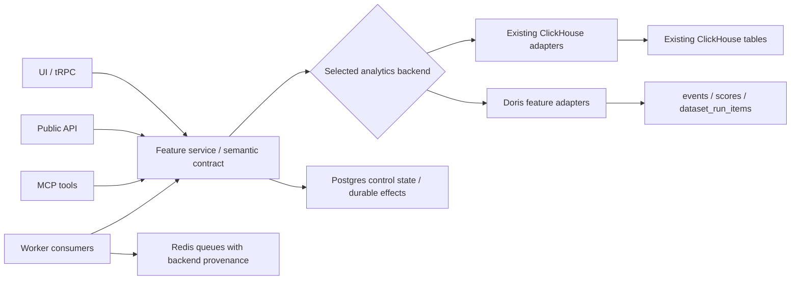
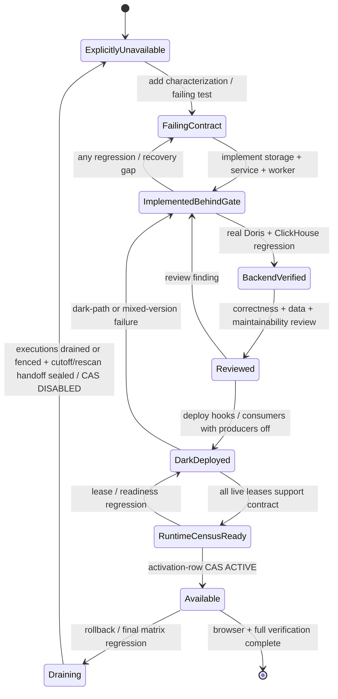
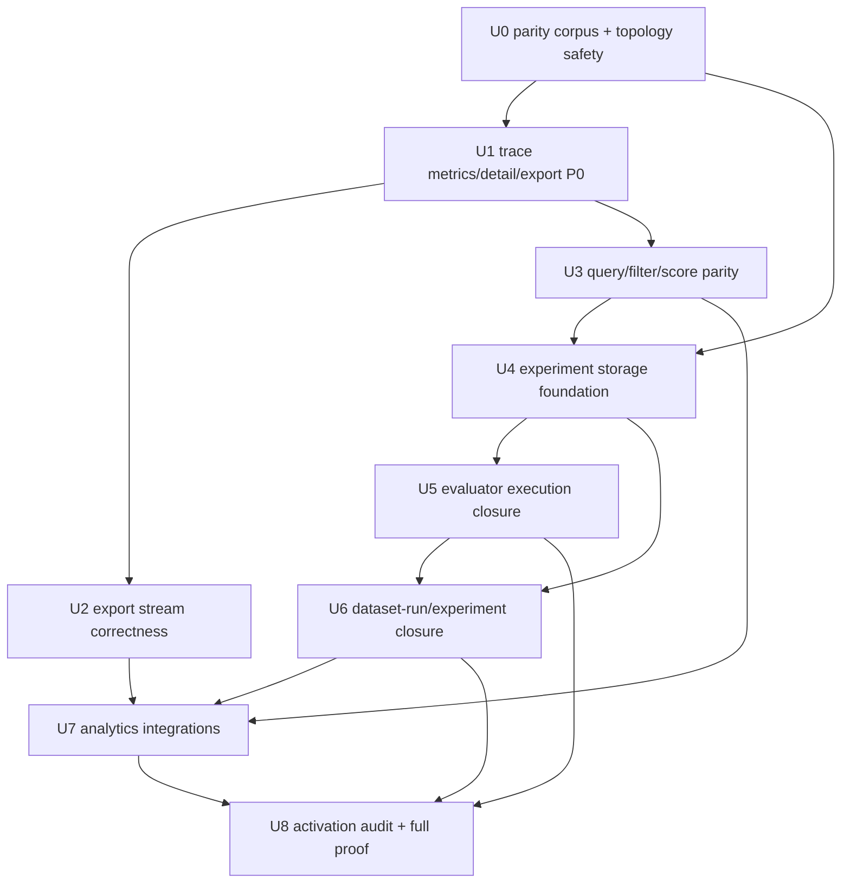

# Doris Community Feature Parity Agent Loop - Plan

## Goal Capsule

| Field | Contract |
|---|---|
| Objective | 在保留 ClickHouse 默认路径和现有行为的前提下，使部署者可以通过 `LANGFUSE_ANALYTICS_BACKEND=clickhouse\|doris` 选择分析存储，并让 Doris 在当前 checkout 的 Langfuse Community 功能范围内达到行为等价。 |
| Baseline | 固定为 `5a964434d1941b0fa879cb681f4b5b81ed8a0ccf`。本计划不把执行期间出现的远端 upstream 新功能静默纳入范围。 |
| Prior work | `docs/plans/2026-07-17-001-feat-langfuse-doris-storage-plan.md` 已完成 Doris 数据面、选择器和核心能力基础；本计划只负责关闭当前实现仍存在的 Community parity 缺口，并替代旧计划中的“长期不支持”边界。 |
| Execution profile | 连续、依赖有序、测试先行的 agent loop。一个实现单元只有在功能、恢复、双后端回归和独立审查全部通过后才算完成，随后自动进入下一单元。 |
| Tail ownership | 执行 agent 负责实现、迁移、测试、真实 Doris/ClickHouse 验收、浏览器验收、文档和缺口复扫；不在单元之间等待例行确认。 |
| Stop conditions | 只有出现必须由用户决定的产品语义、破坏性数据动作、安全/许可边界、与用户改动冲突，或同一真实阻塞经过三种独立尝试仍无法解除时才停止。 |

---

## Product Contract

### Summary

这不是把 Langfuse 的全部 ClickHouse 代码删除，也不是制造一个可以接受任意 SQL 方言的通用数据库驱动层。目标是：每次部署只选择一个 analytics backend，ClickHouse 路径保持默认且不回退，Doris 通过 feature-owned semantic adapter（由功能拥有的语义适配器）实现相同的 Community 用户能力。

“可切换”指部署级冷启动选择。它不承诺同一运行实例热切换、ClickHouse 与 Doris 双写、按项目混用，或自动迁移历史 ClickHouse 数据。已有数据的后端切换仍需独立迁移方案；本计划只保证 fresh/cold deployment 可以选择任一后端，并防止旧队列任务被错误地在另一个后端执行。

### Problem Frame

当前基础架构已经能选择 ClickHouse 或 Doris，核心 ingestion/read/query seam 也已存在，但 Community 功能仍有三类缺口：

1. 已宣称可用但链路中仍有硬失败，例如 Doris trace metrics 和 trace batch export。
2. 上层入口已共享对象模型，但 feature service、repository 或 Worker 仍直接调用 ClickHouse 查询，例如 evaluator、experiment 和 integrations。
3. Doris 物理/Canonical 模型尚未承载 experiment 与 dataset-run 关联，导致上层对象在进入存储边界前被丢弃，而不是上层本身无法复用。

因此实施顺序必须是“先补持久化与 feature seam，再 dark deploy Worker hook/恢复语义，最后经 fleet census 与 durable CAS 开放入口”，不能先删除 501 或 Worker gate。

### Actors

- A1. 部署运维者：选择 backend、启动/升级服务、执行迁移、观察 readiness、处理冷切换队列。
- A2. AI 应用工程师：写入 telemetry，浏览 traces/observations/sessions/users/scores，查询 metrics，执行 export。
- A3. Evaluator/experiment 使用者：配置 evaluator，执行 dataset run 或 experiment，查看/比较结果。
- A4. Integration 管理员：配置 PostHog、Mixpanel、Blob/S3 export，观察同步和重试状态。
- A5. UI、Public API、MCP 客户端：通过不同入口访问同一 project-scoped 语义。

### Product Baseline Manifest

Parity 范围先由产品入口定义，再由代码扫描验证，不能由“代码里恰好能搜到什么”反向扩张。固定 baseline 上，只要一个能力满足以下 inclusion rule，就属于本计划：它是 ClickHouse 模式下已注册、已鉴权且 Community 用户可实际到达的页面、tRPC、Public API 或 MCP surface，或是完成这些 surface 所必需的 Worker/queue/storage 路径。内部表、queue 和 helper 不是独立产品能力，只作为已纳入 surface 的支撑链路接受审计。

契约冲突按以下优先级裁决：公开 schema/documentation 与既有 contract test > 本计划明确写出的 R/F/AE/KTD > ClickHouse baseline 的可观察行为。若最后一层表现为疑似历史缺陷，先写 characterization 和 deviation rationale，不把缺陷机械复制到 Doris。

| Manifest group | 固定 baseline 的纳入规则 | U0 形成的证据 |
|---|---|---|
| Backend operations | selector、readiness、migration、web/worker topology、cold-switch queue safety | 运维 capability manifest + topology/readiness tests |
| Core analytics | trace/observation/session/user/score 的 list/detail/search/query/metrics/export，以及其 Public API/MCP surface | route/tool/query registry corpus + cross-backend fixtures |
| Derived analytics | dashboards、monitors、custom dashboards 及其 shared QueryEngine path | widget/query declarations + representative user-flow corpus |
| Dataset and experiments | dataset run、run item、prompt/remote experiment、compare/export/delete | page/tRPC/Public API/MCP manifest + producer/consumer chain |
| Evaluations | Community 可配置的 trace/observation/dataset evaluator、batch evaluation 和 score result flow | page/API/tool manifest + durable dispatch/consumer chain |
| Analytics integrations | Community settings 中的 PostHog、Mixpanel、Blob/S3 analytics export | settings page + scheduler/processor/source manifest |
| Unstable public routes | 只有在 baseline 中已注册、已鉴权且 ClickHouse Community 可到达时纳入，并逐项记录理由 | explicit included/excluded row，不能仅凭文件名推断 |
| Internal-only paths | 仅当它们支撑以上用户能力时纳入恢复、删除和安全测试，不自行扩大 scope | owner capability + reachability link |
| Enterprise/Cloud | `ee/`、代码或环境明确标记的 Cloud-only、billing/Stripe、Cloud operational export 一律排除 | `cloud-ee-excluded` row + rationale |

U0 将这份 manifest 编译成可执行 corpus，并把每一项绑定到 owner unit；后续代码 reachability scan 只能发现遗漏或支撑路径，不能静默新增产品范围。

U0 还为每一行固定 activation class。现有 core ingestion、trace/observation/score 同步读、QueryEngine、monitors 和 custom dashboards 属于 `static-synchronous`：它们没有跨进程 accepted-work handoff，保持现有 rollout/readiness，不创建 activation row。只有六个明确的 cross-process Doris capability 使用 durable activation：`coreBatchExports`（U2）、`evaluations`（U5）、`experiments`（U6）、`datasetRunExports`（U6）、`datasetRunIngestion`（U6）和 `analyticsIntegrations`（U7）。执行期间不得把其他能力静默加入该 catalog；需要新增时先修改 baseline manifest/contract。

### Observed Baseline Matrix

下表是 `5a964434d` 的已核验实现状态，不是最终验收结论。

| Capability | 当前 Doris 状态 | 本计划目标 | Unit |
|---|---|---|---|
| Backend selector/readiness/core ingestion | 已有部署级 selector、Doris readiness 和 canonical ingestion；ClickHouse 默认路径仍在 | 保持隔离，补队列/冷切换防误消费，并以双后端测试锁定 | U0, U8 |
| Legacy `/api/public/ingestion` | shared 层已有 Doris child processing，但 outer route 仍整体拒绝；dataset-run child 仍 501 | dataset-run 支持完成前保留 fail-before-mutation；之后开放 mixed-batch child contract | U4, U6 |
| Trace list/metrics | rows 可读；`select: "metrics"` 明确抛错，部分 ID alias/order/filter 不完整 | 与 ClickHouse 相同的 totals、usage/cost、level counts、latency、pagination/filter semantics | U1 |
| Trace batch export | capability 已宣称可用，但 metrics 和 `getTracesByIds` 仍可能走失败/ClickHouse 路径 | Doris-only reader 完整消费并导出，不初始化 ClickHouse | U1, U2 |
| Analytics query/filter/order | QueryEngine seam 已存在；`positionInTrace`、typed object filters、experiment dimensions 等仍拒绝 | 当前 Community 的合法 query/filter/order 组合行为等价 | U3, U6 |
| Scores | 基础 score 可读；dataset-run/experiment filters、typed joins 和大集合 trace filter 仍不完整 | score 字段无损、关联查询下推、无 N+1/固定扫描上限造成的语义截断 | U3, U4, U6 |
| Monitors/custom dashboards | capability 当前标记可用并复用 QueryEngine | 用 cross-backend corpus 证明，不重复重写 | U3, U8 |
| Non-dataset-run batch exports | capability 当前标记可用，已有 `DorisAnalyticsExportSource` | 修正 reader correctness；保持稳定 schema/cutoff/row limit | U1, U2 |
| Dataset runs/experiments | Doris 无 `dataset_run_items_current`、event experiment fields 和完整 canonical writer | storage → service → Worker → API/MCP/UI → delete/replay 全链路 | U4, U6 |
| Evaluator execution | Doris target source 只覆盖部分读；生产、写 score、post-visible scheduling 和 consumers 仍被 ClickHouse gate | trace/observation/dataset、LLM-as-judge、code、batch evaluation 全闭环 | U5 |
| Analytics integrations | scheduler/clients 可复用，source readers 与 Worker registration 仍是 ClickHouse-only | PostHog/Mixpanel/Blob source adapters、no-gap pending delivery/retry/format parity | U7 |
| Cloud core-data S3 export | 代码明确标记为 Langfuse Cloud operational export | 在 U0/U8 matrix 中标为 `cloud-ee-excluded`，不纳入 Community parity | U0, U8 |

### Requirements

**Backend selection and isolation**

- R1. `LANGFUSE_ANALYTICS_BACKEND` 仍是部署级单选；默认值和现有 ClickHouse 运行行为不变。
- R2. Doris 模式不得构造、调用或静默 fallback 到 ClickHouse analytics client；ClickHouse 模式不得依赖 Doris readiness、migration 或 runtime。
- R3. Web 与 Worker 必须把本地配置与 Postgres 中唯一的 `AnalyticsBackendDeploymentState(backend, generation, workloadEpoch)` 对照后才 ready；fresh/empty analytics deployment 可原子初始化。存量 deployment 首次升级缺 marker 时进入仅限 foundation rollout `F0` 的 `ADOPTION_REQUIRED` compatibility mode：继续当前 env backend 的既有能力，但禁止 backend switch、U1–U7 Doris capability 激活和新格式 durable work；完成旧 fleet 不可逆停机、ingress/consumer quiesce、旧 internal credential epoch 撤销、unstamped durable-work drain、F0 runtime census/deny probes 后，one-shot adopt command 才能按显式 expected backend/workload epoch 原子创建 generation 1。后续 build 不得无限容忍 marker 缺失或回滚 pre-F0。Generation 是 runtime fencing token：authoritative record/VISIBLE 创建事务、consumer claim、stream page/batch 和每次新 analytics IO 前同时校验 durable record、当前 marker/activation、未过期 runtime/claim lease 与本地 generation/contract；mismatch 立即 abort、停止 producer/consumer 并降 readiness。queue payload 只能复制、不能覆盖 durable provenance。Doris 不消费未标记的 legacy ClickHouse job；冷切换必须先 quiesce/drain 所有 durable work/leases，再 CAS 推进 generation。
- R4. 所有读、写、删除、export 都保持 trusted `projectId` scope，错误保持 sanitized，不用 empty-success 隐藏失败。

**Behavioral parity**

- R5. 除已声明的 Doris 30 天 full-content 交互搜索边界外，trace rows、metrics、filters、order、pagination、point read 和 export 在两种后端返回等价对象语义，包括空值、level precedence、usage/cost maps、latency、observation counts 和 ID aliases；超出搜索边界必须返回显式错误，point read/bounded export 使用专用 bypass。
- R6. Doris batch export 先用一次 project-scoped Doris query 将符合业务 filter/cutoff 的不可变 entity identities 封存为 durable manifest，再按 manifest cursor 做 exact-ID/bounded read 和精确 row limit；业务时间不参与遍历游标。`job started` 定义为 manifest sealed。此后 late insert 不进入 manifest，并发 update/delete 按 KTD6 的 traversal-consistency contract 处理，取消和错误显式传播。
- R7. 除已声明的 Doris 30 天 full-content 交互搜索边界外，Analytics QueryEngine 覆盖当前 Community 声明的 view × dimension × measure × filter type/operator × order/granularity contract；typed metadata 和 score negative filters 不被错误字符串化或后置过滤，超界搜索返回同一结构化 Doris error。
- R8. Monitors、custom dashboards、Public metrics API 和 MCP metrics 继续共享同一 QueryEngine，不在各入口添加 Doris SQL 分支。

**Experiment and score storage**

- R9. 以 additive Doris migration 增加 `dataset_run_items_current`、event experiment fields、score `dataset_run_id`/必要关联字段；同步更新 canonical type、hash/version、readiness、writer、decoder 和 replay contract。
- R10. Dataset-run item upsert/replay 是幂等的；trace/run/dataset/project delete 都由 durable deletion intent 和单调 generation 驱动，清除或屏蔽相应 projection，进程在 Postgres mutation 与 queue publish 之间崩溃也可恢复，延迟 replay 不能复活已删除关联。
- R11. Score ingestion 保留 `datasetRunId`、`executionTraceId` 和既有 Community 可见字段；dataset/run/item/experiment filter 通过 Doris join/CTE 语义实现，不依赖 N+1 或固定候选扫描截断。

**Evaluators and experiments**

- R12. Evaluator target source 覆盖 trace/observation existence、filter match、dataset-run association 和 historical scan；结果 score 通过 selected backend 的 durable canonical ingestion 写入。
- R13. Evaluations activation 已 ACTIVE，或 census-ready DARK generation 已显式 `captureEnabled` 时，Doris 在 analytics operation 转为 visible 的同一 durable Postgres 状态转换中生成 evaluation dispatch record；crash 在 Doris VISIBLE 与 enqueue 之间也能恢复，重复恢复只产生同一 deterministic evaluation job。其他 DARK/DISABLED 状态不假装接受 evaluator work。
- R14. Trace、observation、dataset evaluators，以及 LLM-as-judge、code eval、primary/secondary execution 和 batch-action evaluation 全部验收后，才按 R18 的 dark deploy → fleet census → durable CAS 顺序开放 evaluator UI/tRPC/Public API/MCP；Worker consumer 必须先以不接收未激活 producer work 的 dark-compatible 形态部署。
- R15. Prompt/remote experiment 复用 storage-neutral execution service；Postgres 继续拥有 dataset/config control state，telemetry 和 run-item projection 走 selected analytics backend。Prompt failure、partial item failure、retry、delete 和 analytics read 均行为等价。

**Integrations and activation**

- R16. PostHog/Mixpanel 使用共享的 `AnalyticsIntegrationExportSource` 语义对象；Blob export 使用独立 streaming source 并保留 JSON/CSV/JSONL/Parquet、manifest、multipart abort/resume 和 cutoff contract。
- R17. Integration 保持 at-least-once；delivery-enabled generation（`BOOTSTRAPPING_DARK`、`BOOTSTRAPPING_ACTIVE`、`ACTIVE`、`RESCANNING` 及 `DRAINING` capture）的 incremental frontier 使用与 analytics VISIBLE transition 同事务创建的 durable pending-delivery records，而不是业务时间 cursor。`DISABLED(captureRequired)` 不做 per-integration fan-out，只按 KTD17 在 operation/candidate 上保留 replay provenance。每条 pending record 在创建时就固化 project/backend/deployment generation/capability activation generation/contract version，scheduler 只能复制，不能以 claim 时的配置重新盖章。每个 job 封存待处理 record manifest，只有完整成功后 terminalize 对应 deliveries 并推进 `lastSyncAt`；partial stream、remote、S3 或 process failure 都不得假报成功。上一批成功后才 VISIBLE 的旧业务时间 telemetry 仍会形成 pending delivery 并进入下一批。Ledger 达到硬预算时切 `PAUSED_BACKLOG + rescanRequired`，用 fenced FULL_HISTORY recovery 保留 no-gap 语义，不能阻塞无关 project、静默丢数据或无限增长。
- R18. U0 catalog 中六个 cross-process Doris capabilities 必须各有 durable activation generation/contract：先 dark deploy storage、VISIBLE hooks、queue schema、consumer 和 recovery，入口/外部 producer 保持拒绝；`DARK` 只允许 manifest 明确列出的内部 hook/bootstrap 封存本地/内部 suspended work，禁止第三方 HTTP/S3 effect。再用 runtime capability leases 证明所有 live web/worker 都支持该 contract 且旧 lease 已过 TTL/grace；最后以 Postgres `AnalyticsCapabilityActivation` CAS 切 `ACTIVE`。Producer/authoritative-record/VISIBLE transition 创建事务同时校验 backend marker、activation row 和当前 runtime lease，不能只信进程内缓存。回滚进入 `DRAINING` 后按 KTD17 的 capture/cutoff contract 停新入口但保住 no-gap，完成 handoff 后才 `DISABLED`；后续 release 才移除 dark hooks/consumer。`static-synchronous` 能力和 ClickHouse 既有路径不经过该 Doris activation，不接受后丢任务。

### Key Flows

- F1. **Cold backend selection**：A1 配置同一 backend → readiness/migration 检查 → 只注册该 backend 的 runtime/consumer → stale/mismatched job 可观察失败 → 服务 ready。覆盖 R1–R4。
- F2. **Trace debug/export**：A2 写入多 observation trace → trace row/metrics 同页读取 → point detail → bounded export → 文件完成或显式 failed。覆盖 R5–R6。
- F3. **Analytics query**：A2/A5 从 dashboard、REST 或 MCP 提交同一 filter/query → shared plan → selected engine → typed result/consistent error。覆盖 R7–R8。
- F4. **Evaluator**：visible telemetry → durable dispatch → target lookup/filter → evaluator execute → deterministic score ingestion → score visible → JobExecution complete。覆盖 R12–R14。
- F5. **Experiment/dataset run**：创建 run → canonical run-item projection → experiment telemetry → evaluator score association → list/metrics/compare/export/delete。覆盖 R9–R15。
- F6. **Third-party integration**：VISIBLE transition → durable pending delivery → scheduler seals execution manifest → selected source exact-read → transformer/client → remote/Blob commit → full success 后 terminalize deliveries/advance `lastSyncAt`；失败重试同一 manifest。覆盖 R16–R17。
- F7. **Rolling-safe activation**：dark deploy hooks/consumers → real Doris + ClickHouse regression → live fleet capability census → per-capability CAS `ACTIVE` → UI/API/MCP/producer transaction observes activation。覆盖 R18。

### Acceptance Examples

- AE1. Doris 多 observation trace 的 token/cost maps、counts、latency、level priority 与 ClickHouse corpus 相同；空 usage/cost 不变成伪造零值。
- AE2. `ID`、canonical `traceId`、跨日 exact IDs 和 tombstoned IDs 在 list/detail/export 中保持 project isolation，Doris 路径不触达 ClickHouse。
- AE3. row limit 为 page size 的非整数倍时只导出精确条数；稳定预存数据中相同 timestamp 的跨页数据不重不漏；manifest seal 后到达的旧业务时间 row 不进入本次 export；失败 export 标记 failed 而不是 partial success。
- AE4. typed number/boolean/category metadata、missing/null/empty、Unicode、negative score filters、position-in-trace 和稳定 order 在两种后端返回相同业务结果。
- AE5. 30 天 full-content 交互搜索限制继续是明确的 Doris 安全契约；point detail 和 bounded export 通过专用路径跨越该限制，不复用交互 list 绕过。
- AE6. Dataset-run item 重放两次只形成一个 current projection；score round-trip 保留 `datasetRunId`/`executionTraceId`。
- AE7. trace/run/dataset/project 删除后，延迟 ingestion/replay 不会让 run-item、experiment link 或 score association 重新可见。
- AE8. Doris load 已 VISIBLE、evaluation enqueue 前进程崩溃；重启后调度恢复且 deterministic job/score 恰好一次生效。
- AE9. Trace/observation LLM-as-judge、code evaluator、dataset evaluator 和 historical batch evaluation 都完成，且 Doris 模式下 legacy `IngestionQueue`/ClickHouse client 均未被调用。
- AE10. Prompt experiment 成功、模型错误、部分 item 失败和 retry 都产生与 ClickHouse 相同的可查询 run 状态；Public API、tRPC、MCP 指向同一 projection。
- AE11. PostHog/Mixpanel stub 收到同构事件；remote partial failure 不 terminalize pending deliveries，重试维持 at-least-once；成功后才 VISIBLE 的旧业务时间事件仍在下一批发送。
- AE12. Blob export 对 MinIO 生成合法 JSON/CSV/JSONL/Parquet 和 manifest；multipart failure 会 abort/retry，不留下被宣告完成的半文件。
- AE13. 冷切换后，backend/version 不匹配或 legacy-unstamped 的 analytics job 在 Doris 中被显式 quarantine/fail，且不会在读取任何 analytics data 后才发现 mismatch。
- AE14. capability matrix 的所有 in-scope Doris 501、hard throw、ClickHouse-only Worker gate 和 deferred dimension 都有明确完成证据或被证明属于 Scope Boundaries。

### Scope Boundaries

**In scope**

- 固定 baseline checkout 中，`ee/` 和 Cloud-only billing/Stripe 之外、ClickHouse backend 当前可达到的 Community analytics 功能。
- Trace/export/query semantic parity，dataset-run/experiment/evaluator/integrations，以及相关 UI/Public API/MCP/Worker/delete/recovery。
- 现有 monitors、custom dashboards、非 dataset-run batch exports 的 cross-backend characterization 和回归。
- Additive Doris schema、Prisma control-plane state 和冷切换安全说明。

**Out of scope**

- 历史 ClickHouse → Doris 数据迁移、生产 dual-write、运行时 hot switch、per-project backend、silent fallback。
- Enterprise/Cloud 功能、`ee/` 实现、商业许可绕过、Cloud billing/Stripe worker。
- 追求 SQL 文本、数据库内部执行计划或 ClickHouse native progress event 完全相同；目标是用户/API 行为和已声明资源边界等价。
- 执行期间新出现的 upstream 功能；需单独更新 baseline/corpus 后再纳入。
- 移除既定的 Doris 30 天 full-content 交互搜索保护。该限制必须继续显式、可验证；只允许 point/bounded export 使用专用 bypass。

---

## Planning Contract

### Assumptions

- 当前工作树的唯一无关项是用户自有 `.ua/`，执行过程中不得读取、修改、删除或 stage。
- Product Baseline Manifest 和公开 schema/contract test 是范围与行为的第一权威；ClickHouse 当前行为只在它们未定义处作为 compatibility oracle，不把未记录的数据库偶然行为或疑似缺陷升级为产品契约。
- Doris 与 ClickHouse 本地服务因内存预算顺序启动和验收，不要求同一台开发机同时运行。
- Schema migration 是 forward-only/additive；不手改生成文件，不重写已发布 baseline migration。
- 队列和 analytics writes 保持 at-least-once，通过稳定身份与幂等 current projection 收敛。
- 用户已授权实现单元之间自动继续；例行测试失败、lint 失败、Docker 启动失败和 reviewer finding 都是 loop 输入，不是暂停理由。

### Key Technical Decisions

- KTD1. 保留 deployment-level selector 和 ClickHouse 默认值，选择 Doris 是替代当前部署的数据面，不删除 ClickHouse，也不加入双写/按项目混用。`(session-settled: user-approved)`
- KTD2. Parity baseline 固定为本计划 frontmatter 的 commit；先关闭已知缺口，再通过最终 executable matrix 证明没有遗漏。U0–U3 完成时记录一个可发布的 Core checkpoint，但按用户明确要求不设 usage/owner 暂停门，loop 继续完成 U4–U7 的全部 in-scope Community parity。`(session-settled: user-directed)`
- KTD3. 继续使用 feature-owned semantic seams；不创建万能 `StorageProvider`、`query(sql)` 或一套覆盖所有实体的 provider hierarchy。`(session-settled: user-approved)`
- KTD4. ClickHouse adapter 保持既有实现；共同 contract 可小幅扩展，但 Doris 细节不泄漏到 UI/API/MCP，ClickHouse 也不经过 Doris runtime。
- KTD5. 对 U0 明确列出的六个 cross-process capabilities，capability gate 是最后一个 durable 开关，而不是同一 source change 内的静态布尔值。先打开入口、再补 Worker/恢复属于禁止顺序；这些能力必须经过 dark deploy、全 fleet contract census 和 activation-row CAS，任何阶段都不能“accepted 后无 consumer”。`communityAvailability.ts` 只表达编译期/产品 eligibility，runtime mutation 与 producer 必须读取 durable activation；`static-synchronous` 读/query 能力保持普通版本 rollout，不因缺 activation row 被关闭。`(session-settled: user-approved)`
- KTD6. Trace export 不复用带 30 天交互限制的 `traces.list(includeFullContent)`，也不使用 OFFSET。PREPARING worker 先 row-lock `BatchExport`，递增 `manifestGeneration` 并取得带 owner/expiry 的唯一 claim；随后以一次 Doris query 的 query snapshot 计算符合 project/business filters 的不可变 identity set，按 canonical identity 排序写入包含 export ID、generation 和 claim ID 的不可覆盖 compressed attempt object。Seal transaction 以同一 claim/fence 做 CAS，仅 winner 在 `BatchExport` row 固化 object key/checksum/count/sealedAt；旧 worker 不能覆盖或 seal，新 reconciler 递增 generation 重建，失败 object 只是可回收 orphan。SEALED reader 先验证 authoritative generation/checksum，再沿 manifest cursor exact-ID/bounded fetch。它保证 identity-set snapshot，但不伪称跨 Doris/Postgres 的 payload point-in-time snapshot：seal 后 insert 被排除；已存在 row 在读取期间 update/delete 时，若已输出则保留当时版本一次，若尚未输出则可省略；identity 即使更新业务时间也不会重复或跨游标移动。
- KTD7. Experiment storage 采用 `events_current` 上的 experiment fields、独立 `dataset_run_items_current`、`scores_current.dataset_run_id`，与现有 events-based repository 语义对齐；不在每次 query 中临时拼 Postgres 控制面代替 analytics projection。
- KTD8. Evaluation dispatch 是 feature-owned durable effect：activation ACTIVE 或 census-ready DARK capture window 内，analytics operation 转为 visible 时在同一 Postgres transaction 写入稳定 `(operationId, projectId, traceId/runItemId, effectType)` delivery record；DARK record 保持 SUSPENDED，ACTIVE 后 publisher/reconciler 幂等 enqueue。禁止单纯 `persist().then(queue.add())`。
- KTD9. Analytics-dependent durable record 在创建事务中锁定 deployment marker 和对应 capability activation row，固化 project、stable identity、expected backend/deployment generation/capability activation generation 和 contract version；publisher 只从该 record 构造 payload。Consumer claim 和每个 stream page/batch/new analytics IO 都重新核对 durable record、当前 marker/activation、claim lease 与 local generation，generation change 会取消长 stream。旧的 unstamped job 只按 legacy ClickHouse 解释；Doris worker 遇到 missing/mismatch/tamper 要 quarantine/fail visibly。
- KTD10. Query parity 在 semantic result corpus 上证明；SQL compile-only test 不算完成。Negative filters、null ordering、typed metadata、empty buckets 和 stable tie-breakers 是一等 contract。
- KTD11. PostHog/Mixpanel 共享对象级 integration source；Blob export 因 raw/format/multipart 语义不同而保留独立 streaming source。Cloud core-data S3 export 不属于本计划。
- KTD12. U4 的 additive Doris schema 采用两阶段兼容 rollout：Release A 是独立可部署 artifact，先让 readiness 只接受 checksum allowlist 中的 additive suffix，让 canonical reader 在有界窗口内同时接受旧/新 schema version，并由 web/worker 写入短 TTL compatibility lease（component、instance/build ID、accepted ledger/schema range）。Release B migrator 在 advisory lock 下拒绝任何 live incompatible lease，并要求 rollback artifact build ID 已作为兼容 lease 被实测；只有记录 fleet adoption、旧/新读取证据和 rollback drill 后才运行 migration/backfill/新 writer。旧 schema/version 的 recoverable operation、未回填 row 和 incompatible lease 都可查询为零后才移除兼容窗口。不得接受未知 migration，也不得要求 ClickHouse/Doris 双写；fresh deployment 可在同一安装流程顺序完成 A/B，但仍运行相同 gates。
- KTD13. 30 天 full-content 交互搜索上限沿用既定 Doris 产品契约。它不是 point read/export 的通用限制，也不得作为隐藏空结果处理。
- KTD14. 每个 unit 只允许一个 agent 修改共享热点；其他 agent 可并行做只读调查、测试或独立 review，避免 `packages/shared/src/server/queues.ts`、schema、`worker/src/app.ts` 和 capability matrix 发生冲突。
- KTD15. Run/dataset deletion 与 evaluation dispatch 一样使用 feature-owned durable intent/outbox，不建立通用 side-effect framework；Postgres control mutation 与 intent/generation 在同一 transaction，publisher/reconciler 负责 barrier visible 和重试。
- KTD16. `AnalyticsBackendDeploymentState` 是单行部署安全 marker，不是通用动态配置服务。Fresh deployment 自动初始化；存量 deployment 缺 marker 时仅 foundation rollout `F0` 可进入 `ADOPTION_REQUIRED`。F0 必须使用新的 workload/credential epoch；adopt 前不可逆停止/删除 pre-F0 workload，并撤销旧 epoch 对 ingress、Postgres、Redis/queues、selected analytics backend 和 object storage 的访问（无法证明 workload 销毁时，也要轮换可能留在内存中的 third-party credentials）。Adopt command 要求 operator 明确 expected backend/epoch、清零 unstamped durable work，并以 expected component/replica inventory、new-epoch leases 和旧 credential deny probes 证明 cutover，才在 marker lock 下创建 generation 1；marker 只存 epoch fingerprint/attestation，不存 secret。这只是认领当前 backend，不搬数据、不切 backend，且 adoption 后禁止回滚到 pre-F0 binary/credentials。后续 intentional switch 要求所有 runtime/claim leases QUIESCED、in-flight claim 已结束或取消并等待超过最大 query timeout、所有 pending durable-work registries 为零，再按 expected generation CAS。F0+ 旧进程恢复时受 marker/runtime admission fencing；已有历史数据的 backend 搬迁仍不在本计划内。
- KTD17. `AnalyticsCapabilityActivation(capability, backend, generation, contractVersion, status, minimumRuntimeContract)` 只服务 U0 catalog 的六项 cross-process capabilities，不扩展成通用 feature-flag framework。所有 F0+ process 在 startup/heartbeat renewal 时都要用当前 backend marker 校验其 workload epoch，并按 component 验证所有 `DARK(captureEnabled)`/`ACTIVE`/`DRAINING`/`DISABLED(captureRequired)` capability 所需 hook/producer/consumer contract；不兼容或过期 lease 不能续租且 readiness 下降。每次 authoritative record、claim、新 analytics IO 和 analytics-operation VISIBLE transition 都在事务内要求当前未过期 lease，并重验 marker/activation contract，所以暂停到 TTL 后恢复的旧 build 无法重新 admission。Activation controller 只在全部 expected live instances 兼容、旧 lease 已过 TTL/grace、bootstrap/backfill/recovery ready 时 CAS `DARK → ACTIVE`。

  `DARK` 仅允许 capability manifest 中列名的内部 hook/bootstrap 封存 local/internal manifest 或 SUSPENDED work，禁止 UI/API/MCP/user producer、remote HTTP/S3 commit 和用户可见 success。Rollback 先 CAS `ACTIVE → DRAINING`：停止新外部 producer/scheduler，但 allowlisted VISIBLE capture hook 继续在同 generation 写 SUSPENDED provenance，matching-generation consumer 可排空既有 execution。进入 `DISABLED` 前，activation-row lock 与所有 VISIBLE transaction 的 lease/contract check 形成 linearization boundary；feature 必须记录 durable cutoff/rescan state，下一次使用新 generation replay cutoff 后的 durable operation candidates、seal bootstrap 并接管 capture，才可 ACTIVE。Capture contract/minimum runtime version 在 enabled configs、pending replay 或 retention barrier 存在时不得降级或移除；若没有 replacement DARK generation，必须保持 ingestion quiesced。Fresh deployment 也执行同一 census，mutation transaction 不依赖 UI 缓存。

### Target Architecture

边界原则：service 接收/返回 domain objects；adapter 承担各数据库的 filter、join、stream、delete 和 retry 语义。UI、API、MCP 不知道 Doris 表名，ClickHouse adapter 不因 Doris 实现被重写。

### Capability State Machine

下列状态机只适用于 U0 catalog 的六个 cross-process Doris capabilities；static-synchronous 能力使用普通 readiness/rollout，不会因没有 activation row 进入 `ExplicitlyUnavailable`。

### Agent Loop Execution Contract

执行 root agent 维护唯一持久化进度 ledger：`docs/plans/2026-07-21-001-feat-doris-community-parity-loop-progress.md`，并按 U0 → U8 依赖顺序推进。每次重启或 session 丢失都先读取本计划、progress ledger、`git status --short` 和当前 diff，从第一个未完成 gate 恢复；不依赖 Claude/Codex session id，也不凭聊天记录猜进度。

每个 unit 固定执行：

1. 读本 unit、其引用的 R/F/AE/KTD 和当前 diff；重新扫描该能力的 route、producer、queue、consumer、repository、delete/replay 和 docs。
2. 先写行为/contract test，并确认它因目标缺口失败；如果是 characterization，先在 ClickHouse 固化期望，再让 Doris 复现。
3. 实现满足该测试的最小 feature-owned Doris path；ClickHouse branch 不重写，capability gate 保持关闭。
4. 运行最小 targeted tests，再扩大到 shared → worker → web；任何 unknown、timeout、truncated output 都不算 pass。
5. 顺序启动真实 Doris 和 ClickHouse，执行 cross-backend corpus；涉及用户页面时使用 seed CLI 和真实浏览器验收。
6. 分派独立 correctness、data-integrity（有 schema/persistence 时）和 maintainability review；修完 P0/P1 及高置信度问题并重跑相关测试。
7. 若本 unit 拥有六项 catalog row，只有 storage、producer、consumer、recovery、所有用户入口均通过时，才部署 dark hooks/consumers；用混合版本 lease/admission harness 证明旧实例已退出或无法续租且全 fleet 支持 contract，再 CAS activation row，并运行 gate/rollback contract test。Static-synchronous unit 不创建 activation row，只运行其 readiness/rolling regression；不得把“同一代码 change”当成跨 web/worker 进程的原子性。
8. 原子更新 progress ledger，记录 unit/step、baseline/head、failing-before 与 fixed-after 证据、changed files、完整命令 summary、review disposition、gate state 和下一条恢复命令；然后自动进入下一 unit。不得把 secrets、完整 payload 或用户 `.ua/` 内容写入 ledger。

**会自动处理而不暂停的事件**：普通测试/类型/lint 失败、Docker service 不健康、可安全安装的本地依赖缺失、reviewer 分歧、第一次/第二次实现方向失败、输出超时后需要缩小重跑。

**必须暂停的事件**：

- 新证据要求改变用户已批准的 backend/scope/product behavior。
- 需要删除/覆盖用户数据、读取秘密、访问生产或执行外部发布。
- 发现 Enterprise/Cloud 代码是唯一可行来源，继续会触碰许可边界。
- 与用户并行改动发生无法安全合并的同文件语义冲突。
- 同一 blocker 已使用至少三种有证据的不同方案尝试，且无法继续任何有意义的独立 unit。

“99% 信心”是操作化完成门槛，不是数学保证：所有 in-scope matrix rows 有确定性 contract tests，真实 Doris 通过、ClickHouse 无回归、用户流经浏览器验证、full lint/typecheck/build check 通过、权限/hostile-input/redaction/egress gates 通过、独立 review 无 P0/P1，且最终 gap scan 没有未解释的 Doris 501/hard throw/ClickHouse-only gate。

### Dependency Graph

### System-Wide Impact

- **Data flow**：ingestion envelope → canonical candidates → Doris current projections → feature repository → UI/API/MCP；VISIBLE transition 额外原子产生 evaluator durable effect 和 active integration pending deliveries。
- **Error flow**：adapter error → sanitized domain error → REST/tRPC/MCP/Worker 明确失败；不降级为空集合，不自动切 ClickHouse。
- **State lifecycle**：additive migration/readiness → idempotent upsert → visible/read → trace/run/dataset/project delete fence → delayed replay remains invisible。
- **Queue lifecycle**：producer 只在 selected backend consumer ready 时 enqueue；record creation/claim/page-level generation fencing 防止 cold switch 后旧进程继续工作；payload 只复制 durable provenance，retry 保留相同稳定身份。
- **API compatibility**：现有 schema、tool name、route 和 response object 保持；只移除 Doris-only `UnsupportedFeature`，不增加 Doris 专用公共 API。
- **Observability**：每个 durable effect、integration execution 和 export 记录 selected backend/generation、stable job key、manifest checksum/attempt 和 terminal outcome；日志不含 SQL/credentials/payload secrets。

---

## Implementation Units

### U0 — Freeze Executable Parity Corpus and Topology Safety

**Goal**：把“当前 Community parity”变成可执行 matrix，并先锁定 backend isolation/cold-switch contract，防止后续单元只修显眼路径。

**Requirements**：R1–R4, R18；F1, F7；AE14。

**Primary files**：

- `docs/operations/analytics-backend-capabilities.md`
- `docs/operations/analytics-backend-selection.md`
- `docs/operations/doris-security.md`
- `web/src/features/capabilities/communityAvailability.ts`
- `web/src/features/capabilities/communityAvailability.test.ts`
- `worker/src/analyticsBackendTopology.ts`
- `worker/src/analyticsBackendTopology.test.ts`
- `packages/shared/prisma/schema.prisma`
- `packages/shared/src/server/queues.ts`
- `packages/shared/src/server/doris/readiness.ts`
- `packages/shared/src/server/doris/compatibility.ts`
- backend-state adopt/switch operator commands，位置遵循现有 `packages/shared/scripts/` CLI pattern
- runtime lease、backend marker 与 per-capability activation repositories/controllers
- `packages/shared/package.json`
- `packages/shared/src/server/doris/__tests__/{DorisPoC,migration}.integration.test.ts`
- `packages/shared/src/server/queries/doris-sql/__tests__/querySemantics.integration.test.ts`
- Doris integration-test namespace helper/ownership ledger
- `packages/shared/scripts/seeder/cli-main.ts`
- `packages/shared/scripts/seeder/doctor.ts`
- `packages/shared/scripts/seeder/scenarios/`
- 各 feature 的现有 route/queue registry tests；不要为 matrix 新建运行时 mega-registry。

**Approach**：

- 先把 Product Baseline Manifest 落为 human-readable capability manifest，再从其中的入口绑定和 Community table/query declarations、tRPC/public routes、MCP registry、queue producers/consumers、`worker/src/app.ts` 生成静态测试 corpus，标注 `available / explicitly-unavailable / storage-neutral / cloud-ee-excluded`。扫描结果只能补 reachability evidence 或提示 manifest 漏项，不能静默扩大范围。
- 增加单行 `AnalyticsBackendDeploymentState` 和 runtime/claim leases，固化 backend/generation/workload-credential epoch fingerprint。fresh/empty deployment 可事务初始化；存量 deployment 缺 marker 时只允许 foundation rollout `F0` 进入 `ADOPTION_REQUIRED`：继续 env 所选 backend 的既有行为，但新 capability activation、backend switch 和新格式 durable producer 全部 fail closed，并持续告警/暴露诊断。
- 实现 `adopt-existing-backend`：operator 明确传入 expected backend、new workload epoch 与 expected web/worker inventory，先在部署层不可逆停止/删除 pre-F0 workload、切断旧 ingress，再轮换或撤销旧 Postgres、Redis/queue、selected analytics backend、object-store credentials；若不能证明旧 workload 已销毁，还要轮换可能已解密的 third-party integration credentials。Command 在 marker/adoption lock 下确认 new-epoch F0 leases/inventory 完整、producer/consumer QUIESCED、pending/retrying/published analytics operations 及其他 unstamped queue/job/export/effect/integration work 已 drain，并消费不含 secret 的 deny-probe attestation 后才创建 generation 1。现有 Doris terminal/visible operation history、entity heads 和 ClickHouse 历史数据允许保留且不搬迁；mixed backend、legacy credential 仍可连接、inventory 不完整或 unstamped pending work 时拒绝。任何 U1–U7 activation（包括 U4 Release B）不接受 `ADOPTION_REQUIRED`；adoption 后 runbook/compatibility check 禁止 pre-F0 rollback。
- 提供共享 fencing/admission helper：authoritative record/VISIBLE transaction 对 marker 与相关 activation row 取兼容锁，比较 backend/deployment/capability generation，并要求当前 process 持有未过期、workload epoch 匹配且广告所需 contract 的 runtime lease；consumer claim、长 stream page/batch 与 client acquisition 重验相同条件。所有 analytics-operation VISIBLE transitions 以及 U2/U5/U7 durable producers/consumers 必须使用，禁止只在 process startup、TTL census 或 payload 上检查。暂停到 lease 过期的 F0+ process 恢复时，必须先续租；其 build 不支持当前 minimum contract 就在任何 VISIBLE/queue/analytics IO 前失败。
- 实现 one-shot CAS switch command：在 marker lock 下证明 runtime leases 已 QUIESCED、in-flight claims/queries 已取消并经过 drain grace、pending/retrying/published analytics operations、batch manifests/exports、evaluation effects、integration bootstrap/pending deliveries/executions 均为零，再推进 generation；不移动历史数据、不清 Redis、不自动 flip。
- 增加 KTD17 的 `AnalyticsCapabilityActivation` 与 capability-aware runtime census，只创建 `coreBatchExports`、`evaluations`、`experiments`、`datasetRunExports`、`datasetRunIngestion`、`analyticsIntegrations` 六个 catalog rows。每个 web/worker lease 广告 build、component、workload epoch、supported contract 和 installed dark hook/consumer；activation/lease controller 执行 admission 与 `DARK → ACTIVE` CAS。`communityAvailability.ts` 只保留产品 eligibility/静态入口映射，不能单独开放这六项 Doris runtime；static-synchronous core reads/query/monitor/dashboard 不查询 activation row 并保持当前行为。鉴于 baseline `coreBatchExports` 被误标 available 但链路不安全，F0 将其 durable activation 初始化为 DISABLED 并改成 fail-before-enqueue；其余五项保持既有明确拒绝。U0 只启用 machinery/安全关闭，不开放新 capability。
- 为后续会在 Doris 启用的 analytics jobs 定义 optional expected-backend/version stamp；legacy unstamped jobs 在 ClickHouse 保持兼容，在 Doris 明确拒绝/隔离。具体 schema 随所属 unit producer/consumer 一起启用，U0 只冻结共用规则和 helper contract。
- 先实现 KTD12 的 Release A compatibility window：readiness 只接受已知 checksum 的 additive suffix，canonical reader 只接受显式列出的相邻 schema versions；web/worker 定期刷新 build/schema-range compatibility lease，未知 migration/version 继续 fail closed。Release B gate 检查 live leases 和已实测 rollback build，但此时 writer 仍只发旧版本。
- 让 seed CLI 的 `list`/`doctor`/scenario writer 识别 selected backend，通过 public/canonical ingestion 而不是 ClickHouse helper 写 analytics 数据。先补 backend-neutral smoke scenario；evaluator、experiment 和 integration 细化场景随 U4–U7 增加。
- 先修 real-Doris test harness，再运行现有 suite：wrapper 每次生成不可预测 `DORIS_TEST_RUN_ID` 与 ownership token，helper 只允许把 run ID 规范化为严格匹配 `langfuse_test_<sanitized-run-id>` 的 `DORIS_POC_DATABASE`。首次创建后立即写内部 ownership marker；任何 `TRUNCATE` 前都重验 database name + marker run ID/token，任何 `DROP DATABASE` 前先连接目标库重验同一 marker。已存在但 marker 缺失/mismatch 的 database 绝不接管或删除。`langfuse_poc`、默认/shared database、缺 run ID/token、未知 owner 或不匹配的 query URL 一律在任何 destructive SQL 前拒绝；project IDs/Stream Load labels 也带 run ID。`test:doris` 保持 `--no-file-parallelism`，所有会 drop/truncate 的 suite 只操作该唯一 database。ClickHouse real suites采用对应唯一 namespace/ownership marker guard。
- 建立执行 ledger 的模板字段：unit、baseline/head、failing test、changed files、verification summaries、review findings、gate state。ledger 不包含 secrets，不 stage `.ua/`。

**Tests / verification**：

- `pnpm --filter worker run test analyticsBackendTopology.test.ts`
- `pnpm --filter web run test communityAvailability.test.ts`
- Queue schema tests覆盖 ClickHouse legacy compatibility、Doris stamped success、mismatch fail-visible。
- Backend marker/adoption tests覆盖 fresh initialization、既有 Doris operations/entity heads、既有 ClickHouse deployment、`ADOPTION_REQUIRED` 限制、mixed backend lease、legacy instance/不完整 inventory、unstamped pending work refusal、成功 generation-1 adoption、restart enforcement、web/worker mismatch、lease heartbeat/expiry/quiesce、stale generation、switch CAS preconditions、每类 pending registry refusal 和成功 generation bump。安全 race 额外暂停 pre-F0 process，等待 quiet window/adopt 后恢复，证明旧 ingress/PG/Redis/backend/object-store credential epoch 已被拒绝且无法 record/publish/claim/IO；F0+ rollback 仍成功，pre-F0 rollback 被拒绝。
- Capability activation tests 覆盖六行 catalog 与 static-synchronous exclusion、F0 把 unsafe Doris `coreBatchExports` 置 DISABLED/fail-before-enqueue、dark hook/consumer 已安装但 producer/入口仍拒绝、DARK 只有 internal manifest/SUSPENDED work 且无 egress、mixed-version web/worker leases、旧 lease TTL/grace、缺 consumer contract、fresh deployment census 和 activation CAS race。暂停不兼容 F0+ VISIBLE worker 到 lease 过期，ACTIVE 后恢复时 renewal/transaction admission 必须在 pending hook/analytics IO 前拒绝；另覆盖 mutation/VISIBLE transaction 与 `DRAINING` row lock 两种顺序、same-generation capture/drain、cutoff/rescan、最终 DISABLED、新 generation replay/reactivation。ClickHouse 与 static-synchronous Doris 行为不读取这些 activation rows。
- Race test暂停旧 producer 于 marker 初检后，完成 drain/CAS 再恢复：record-creation row lock/generation compare 使其产生零 durable record、零 queue publish、零 analytics IO；暂停旧 consumer 于两页之间时，下一页 fence abort 并降 readiness。
- Readiness/compatibility tests覆盖 exact current ledger、approved additive suffix、unknown suffix、旧/新 canonical version window、web/worker lease refresh/expiry、live incompatible refusal、rollback build attestation 和旧 version retirement。
- `pnpm run seed -- list` 与 backend-aware smoke scenario 在 ClickHouse、Doris 下分别成功，unselected client construction forbidden。
- Test-harness guard tests先证明 missing/unsafe database、`langfuse_poc`、伪造/缺失 ownership marker、token mismatch、pathological run ID 在 destructive SQL 前失败，再以两个独立 run IDs/tokens 顺序执行真实 Doris suites，断言 database/project/label 不交叉且 cleanup 只命中 marker-owned namespace。

**Exit gate**：产品 manifest 的每一行都有 inclusion/exclusion rationale、owner unit 和 static/activation class；selector/isolation、fresh init 与 brownfield workload-epoch adoption、legacy credential deny/pre-F0 rollback refusal、authoritative deployment marker、六行 dark/census/admission/CAS machinery、static-synchronous non-regression、U4 Release A compatibility、safe unique real-backend harness 和 backend-aware seed smoke contract 通过；不因 U0 提前开放任何 capability。Foundation F0 作为可独立部署 artifact 记录版本与 adoption/rollback drill，U4 Release B activation 默认关闭。

### U1 — Fix P0 Trace Metrics, Bulk Detail, and Trace Export

**Goal**：消除“Doris 已宣称 trace/export 可用，但执行必失败或偷走 ClickHouse”的最高优先级缺口。

**Requirements**：R2–R6, R18；F2, F7；AE1–AE3, AE13。

**Primary files**：

- `packages/shared/src/server/repositories/telemetry/doris/traces.ts`
- `packages/shared/src/server/services/traces-ui-table-service.ts`
- `packages/shared/src/server/repositories/traces.ts`
- `worker/src/features/database-read-stream/getDatabaseReadStream.ts`
- `worker/src/features/batchExport/AnalyticsExportSource.ts`
- `web/src/server/api/routers/traces.ts`
- `web/src/features/capabilities/communityAvailability.ts`

**Approach**：

- 扩展 Doris trace aggregate，补齐 usage/cost details、token/cost totals、latency、observation count、level 和 error/warning/default/debug counts；service 映射到现有 `TracesMetricsUiReturnType`。
- 统一 `ID`/`id`/canonical trace ID alias、合法 order columns、bookmark/score/observation filter 语义；不在 web 添加 SQL。
- 为 `getTracesByIds` 增加 project-scoped Doris bulk exact-ID path，覆盖跨日、旧数据、tombstone，不做 N+1。
- Trace export 使用 bulk point-detail/export scan；不复用带 30 天 full-content 限制的 interactive list。
- F0 已把 Doris `coreBatchExports` durable activation 设为 DISABLED/fail-before-enqueue；U1 只修复 trace functional path，整个 capability 在 U2 完成 keyset/cutoff/row-limit/cancellation/error、durable dispatch 和 backend provenance 前始终 unavailable。

**Tests / verification**：

- 新增 `packages/shared/src/server/services/traces-ui-table-service.doris.test.ts`：完整 metrics、level priority、empty usage/cost、ID alias。
- 新增 `packages/shared/src/server/repositories/traces.doris.test.ts`：exact IDs、跨日、project/tombstone isolation、ClickHouse forbidden。
- 扩展 `packages/shared/src/server/doris/__tests__/DorisTelemetryRepositories.integration.test.ts`。
- 扩展 `worker/src/features/batchExport/AnalyticsExportSource.test.ts` 或 `worker/src/__tests__/batchExport.test.ts`，真实消费 trace stream 并断言 IO/metadata/metrics/scores/comments。
- 扩展 `web/src/__tests__/server/traces-trpc.servertest.ts`，同页 rows + metrics。

**Exit gate**：真实 Doris 的 list → metrics → point detail → behind-gate export source 成功；错误 export terminal state 正确；ClickHouse regression 通过且 Doris client path 中 ClickHouse mock 为 forbidden。Doris `coreBatchExports` activation 仍为 DISABLED。

### U2 — Make Doris Batch Export Streaming Correct

**Goal**：把现有 `DorisAnalyticsExportSource` 从“可路由”提升为并发和边界条件下仍正确的稳定 reader。

**Requirements**：R3–R6, R18；F1–F2, F7；AE3, AE13。

**Primary files**：

- `worker/src/features/batchExport/DorisAnalyticsExportSource.ts`
- `worker/src/features/batchExport/AnalyticsExportSource.ts`
- `worker/src/features/database-read-stream/getDatabaseReadStream.ts`
- `packages/shared/src/server/utils/DatabaseReadStream.ts`
- `packages/shared/prisma/schema.prisma`
- 新的 batch-export identity manifest repository/object adapter
- `packages/shared/src/server/queues.ts`
- `web/src/features/batch-exports/server/batchExport.ts`
- `web/src/features/capabilities/communityAvailability.ts`
- `docs/operations/analytics-backend-selection.md`
- Doris telemetry repositories 的 scan/keyset methods。

**Approach**：

- `BatchExport` 增加内部 `manifestState: PREPARING → SEALED`、`manifestGeneration`、`manifestClaimId`、lease owner/expiry 与 execution state，现有用户可见 status 在准备期仍保持 `QUEUED`，避免改变公共 schema。Claim transaction row-lock export、校验 backend/activation、递增 generation 并签发唯一 claim；沿用现有 `AnalyticsLoadBatch.fenceGeneration`/lease recovery pattern，不另造无 fencing 的 worker ownership 语义。PREPARING worker 用一条 Doris statement 选择 project/business filters 下的 immutable identities；依赖 Doris statement-level READ COMMITTED snapshot，让 statement 开始后的 commits 对本次 identity query 不可见。
- Identity query 按 canonical identity 排序，将 ID-only rows 流式写入现有 blob abstraction 下的 compressed attempt object；object key 必须包含 export ID、manifest generation 和 claim ID，永不由并发/retry worker 共用或覆盖。Manifest 只含最小 opaque identity，不含 payload/credentials。完成后的 seal transaction 再 row-lock/CAS，要求状态仍 PREPARING、claim/fence/lease 匹配且尚无 authoritative manifest，winner 才固化 exact object key、SHA-256、row/byte count、filter hash 和 `sealedAt`。Stale worker seal 必须失败，其 object 保持 non-authoritative orphan；reconciler 在 lease expiry 后递增 generation 重建，orphan reconciler 只清理未被 row 引用且过安全期的 attempt，terminal retention 到期后删除 authoritative manifest。
- SEALED 后每个 export table 只按 manifest cursor 分批 exact-ID read；业务时间不再参与 cursor。`maxRecords` 在 manifest/query 与 reader 两层裁到精确剩余额度，取消/abort/error 立即向上游传播，禁止 OFFSET。
- 落实 KTD6 traversal consistency：manifest seal 后到达的旧业务时间 row 不在本次 identity set；seal 后 update 不改变 membership，reader 返回 fetch 时 current version或在 delete 后省略；已输出内容不撤回，每个 manifest identity 最多处理一次，明确不宣称 comments/metadata 与 Doris payload 是跨数据库 point-in-time snapshot。
- 在 `BatchExport` Postgres row 固化 project、selected backend、deployment generation、batch-export activation generation 和 contract version；创建 row 的同一 transaction 锁定 marker/activation 并写 durable dispatch outbox。Publisher/reconciler 只从 row/outbox 生成 PREPARING/EXPORTING jobs，consumer 在任何 analytics read 前回读并逐字段校验；manifest parser 验证 checksum/count/byte/decompression 上限，所有 exact-ID query 仍绑定 trusted row.projectId。payload backend/project/version/generation/manifest checksum 篡改、mismatch 或 legacy-under-Doris 进入可观察 quarantine/failed terminal state。
- ClickHouse native streams 保持原状；共同 `AnalyticsExportSource` 只暴露业务 row stream。
- `dataset_run_items` export 继续 gated，直到 U4/U6 projection/read contract 完成。
- 在 U1/U2 全部证据通过后更新 operations/capability 文档，dark deploy export consumer/reconciler，完成全 fleet contract census/admission 后再 CAS `coreBatchExports` ACTIVE。

**Tests / verification**：

- 同 timestamp identity、stable corpus 不漏、manifest query 运行中/SEALED 后的 late old-timestamp insert、业务时间更新、fetch 前后 delete、non-page rowLimit、empty manifest、consumer abort、query error、stable field order。
- Manifest tests覆盖单 statement snapshot、ID sort/checksum/count、claim/lease renew/expiry、fenced temporary→sealed promotion、reader generation/checksum verification、corrupt/truncated manifest、orphan cleanup 和大 identity set 的内存/backpressure；证明 reader cursor 只取决于 immutable authoritative manifest。
- Race/crash tests覆盖两个 worker 同时 claim、旧 worker 暂停后 lease 过期、新 generation seal 后旧 worker 才完成上传/尝试 seal、seal retry idempotence、Postgres row+outbox transaction、manifest object 写到一半、object 完成/PG seal 前、enqueue 前、enqueue 后/mark 前和 cold-switch mismatch；stale worker 不能覆盖 winner object/row，每个 job 收敛到一个 authoritative manifest 与 terminal export，loser object 可安全回收。
- 对 traces/observations/events/scores 建立两后端 fixture comparison；Parquet/native ClickHouse 特性不强行放入共同接口。
- Worker targeted tests + real Doris export file inspection。

**Exit gate**：所有非 dataset-run table 的 manifest snapshot、claim fencing、row count/content/cutoff/traversal、crash recovery、durable dispatch、authoritative backend provenance 和 docs 通过，且没有 OFFSET、可变时间游标、多导一页、stale-worker overwrite、orphan authoritative object 或 swallowed error；完成 dark deploy 与 fleet census/admission 后才以 activation CAS 开放 Doris `coreBatchExports`。

### U3 — Close QueryEngine, Filter, Order, and Score-Read Gaps

**Goal**：让 dashboard、monitors、custom dashboards、Public metrics、MCP metrics 和基础 score views 在 Doris 上共享完整的非 experiment query contract。

**Requirements**：R4, R7–R8, R11；F3；AE4–AE5。

**Primary files**：

- `packages/shared/src/features/query/server/adapters/doris/DorisAnalyticsQueryEngine.ts`
- `packages/shared/src/server/queries/doris-sql/filterCompiler.ts`
- `packages/shared/src/server/queries/logical/searchPlan.ts`
- `packages/shared/src/server/repositories/scores.ts`
- `packages/shared/src/server/repositories/telemetry/doris/publicScores.ts`
- `packages/shared/src/server/repositories/telemetry/doris/scores.ts`

**Approach**：

- 用 pre-aggregation window rank 实现 `positionInTrace`；typed extraction 保持 number/boolean/category 类型和 null/missing 区别。
- Score object/negative filters 通过正确的 subquery/join/anti-semijoin 语义下推，不在结果聚合后用 JS 补筛。
- Trace-backed score filters/order 下推到 Doris join/CTE，移除 10k candidate/25-way N+1 造成的语义截断。
- 限制 `orderBy` 只能引用返回 alias，但补齐所有公开合法组合、null order 和 stable ID tie-breaker。
- 所有 value 继续参数绑定；dimension/object key/order alias/operator 只能来自显式 allowlist，禁止把认证用户输入拼进 identifier。统一限制 filter 数量与嵌套深度、时间跨度、row limit、query timeout，并把 abort/cancellation 传到底层 Doris query。
- Experiment dimensions 在 U4 storage ready 前继续明确拒绝；非 experiment query 不应被连带 gate。
- 保留明确的 30 天 full-content search validation；Unicode、empty/null/content filter 进入 corpus。

**Tests / verification**：

- 扩展 `DorisAnalyticsQueryEngine.test.ts` 为 view × compatible filter type × operator matrix，不能只断言 SQL compile。
- 扩展 `DorisAnalyticsQueryEngine.integration.test.ts` 和 `querySemantics.integration.test.ts`，断言真实结果。
- 扩展 `DorisScoresRepository.integration.test.ts`、`scores.doris.test.ts`、public score tests。
- 回归 `web/src/__tests__/server/metrics-api.servertest.ts`、`metrics-v2-api.servertest.ts`、dashboard v1/v2 consistency、scores API 和 MCP metrics/scores tools。
- 通过 Public metrics API 与 MCP 各运行 identifier/value injection、oversized filter tree、超长时间范围、timeout/cancel 用例；断言请求被预算限制或返回 sanitized structured error，且 Doris query 被取消。
- 复跑既有 authz/cross-project tests，证明移除 Doris gate 不绕过 credential-derived project scope。
- 对 monitors 和 custom dashboard 的代表性 widget 使用同一 fixture 做 ClickHouse/Doris comparison；涉及 chart 变更前先读 chart architecture，原则上本 unit 不改 chart presentation。

**Exit gate**：所有非 experiment deferred filter/dimension 集合清空或有 Scope Boundary 解释；真实结果 corpus 等价；identifier/value 安全、resource budget、timeout/cancellation 和 project isolation 通过；现有 monitors/custom dashboards 仍可用。

### U4 — Add Durable Experiment and Dataset-Run Storage Foundations

**Goal**：先让 Doris 无损承载 experiment/run-item/score 关联和生命周期，再允许任何上层 producer 开启。

**Requirements**：R4, R9–R11, R18；F5；AE6–AE7。

**Primary files**：

- `packages/shared/doris/migrations/` 新的 additive migration（不改已发布 baseline）
- `packages/shared/src/server/doris/readiness.ts`
- `packages/shared/src/server/analytics-persistence/types.ts`
- `packages/shared/src/server/analytics-persistence/canonicalHash.ts`
- `packages/shared/prisma/schema.prisma`
- `worker/src/services/RawAnalyticsIngestionCanonicalizer.ts`
- `worker/src/services/EventCanonicalizer/index.ts`
- `worker/src/services/AnalyticsWriter/DorisBatchSink.ts`
- `worker/src/features/datasets/processDatasetDelete.ts`
- run/dataset deletion intent、generation 和 reconciler repositories
- `packages/shared/scripts/seeder/scenarios/` 中的 dataset-run/experiment foundation scenarios
- `docs/operations/doris-security.md`
- `docs/operations/doris-ingestion-v2-rollout.md`

**Approach**：

- 增加 `dataset_run_items_current`，events 的 `experiment_id/name/dataset_id` 等当前 ClickHouse Community contract 字段，以及 scores 的 `dataset_run_id`/必要关联字段。
- 为 run-item 定义稳定 entity identity、version/sequence、canonical hash、immutable partition 和 owning trace/run/dataset；同步 Prisma enum/control metadata。
- Canonicalizer 不再丢弃 OTEL experiment attributes 或 score `datasetRunId`/`executionTraceId`；DorisBatchSink、decoder 和 repository round-trip 全字段。
- Release B migration/new writer 默认关闭。已有部署只有在 Release A 已独立部署到所有可回滚实例、fleet adoption/两版本读兼容/rollback drill 证据写入 rollout ledger 后才可启用；fresh deployment 证明没有旧实例和旧 operation 后可走同一自动 gate。未知或旧 schema 下的新 writer fail closed。
- 在 Postgres 为 run/dataset 增加单调 deletion generation 和 feature-owned durable deletion intent/outbox；dataset/run control mutation 与 generation/intent 在同一 transaction。Publisher/reconciler 先使 Doris barrier visible，再清理 projection 并 terminalize intent；claim、seal、load、read 和 replay 都比较 generation，延迟 replay 不能复活关联。
- 更新 `docs/operations/doris-security.md` 的 grant matrix：web-query、worker-query、worker-load、one-shot migrator 是四个非 root identity；新表/列/operation 逐项授予最小权限，runtime 不挂载 migrator secret，升级后撤销旧的临时高权限 credential。
- 为 seed CLI 增加 backend-neutral dataset/run-item/experiment foundation scenario，只走 public/canonical ingestion；`list`/`doctor` 在 Doris 模式不要求 ClickHouse env/client。
- `processEventBatch` 的 dataset-run child 在此 unit 末尾才从 501 变为 behind-outer-gate 可处理；outer legacy ingestion route 到 U6 才开放。

**Tests / verification**：

- `schemaContract.test.ts`、migration/readiness integration、canonical contract/hash fixtures。
- `DorisBatchSink.test.ts`、`AnalyticsWriter.realDoris.integration.test.ts`：event/score/run-item round-trip、duplicate/replay、same-version conflict、crash recovery。
- Delete tests覆盖 trace、run、dataset、project、cross-project same ID、delayed replay。
- Crash/race tests覆盖 Postgres mutation 后/publish 前、barrier load 前后、cleanup 前后、重复 intent、旧 generation replay；run/dataset 删除最终收敛且不复活。
- 用四个 production-shaped Doris credentials 跑正向与 deny matrix：web 无 load/migrate、worker-load 无 query/migrate、worker-query 无 load/migrate、migrator 不进入 web/worker environment；完成旧 credential revocation check。
- 两版本 rollout harness 覆盖 Release A old/new reader、Release B default-off、incompatible fleet refusal、rollback drill 和旧 schema/recoverable operation/未回填 row 均为零后的 retirement。
- 变更 Prisma 后运行 `pnpm run db:generate` 并确认只包含预期生成变更。

**Exit gate**：Release A 独立部署证据或 fresh-deployment 证明满足，Release B schema/backfill、canonical writer/read、durable run/dataset delete/replay、四身份权限矩阵和 seed scenario 全部通过；capability 仍未开放；ClickHouse writer contract 无回归。

### U5 — Complete Evaluator Scheduling and Execution

**Goal**：在 Doris 上完成从 visible telemetry 到 visible deterministic score 的 crash-safe evaluator 全链路。

**Requirements**：R2–R4, R12–R14, R18；F4；AE8–AE9。

**Primary files**：

- `worker/src/features/evaluation/AnalyticsEvaluationTargetSource.ts`
- `worker/src/features/evaluation/DorisEvaluationTargetSource.ts`
- `worker/src/features/evaluation/evalService.ts`
- `worker/src/features/evaluation/evalExecutionDeps.ts`
- `worker/src/features/batchAction/handleBatchActionJob.ts`
- `packages/shared/src/server/repositories/analyticsIngestionOperations.ts`
- `packages/shared/src/server/queues.ts`
- `worker/src/app.ts`
- `packages/shared/scripts/seeder/scenarios/` 中的 evaluator scenarios
- `docs/operations/doris-evaluations.md`
- 新的 evaluation-specific durable dispatch repository/runner，位置遵循现有 analytics outbox pattern，但不扩展成通用 side-effect framework。

**Approach**：

- 扩展 target source：trace/observation existence、name/filter match、dataset-run association、historical identifiers；所有路径 project-scoped。
- Evaluator output score 通过 `acceptAnalyticsIngestion`/selected canonical pipeline，保留 deterministic score ID；Doris 不写 legacy ClickHouse `IngestionQueue`。
- 在 analytics operation visible transaction 内锁定 marker/evaluation activation 并写 evaluation dispatch record，固化 project、operation/target identity、backend、deployment generation、capability activation generation 和 contract version；publisher 只从 record 生成 envelope，consumer 在任何 target read 前回读校验。DARK deploy 初期不捕获；fleet census ready 后先在 activation-row lock 下 CAS `captureEnabled=true`，此后与该 row 串行化的 VISIBLE transaction 只创建同 generation `SUSPENDED` effect，publisher 不执行；CAS ACTIVE 后 publisher 才处理这些 effect，从而覆盖 census→activation race 而不在整个 rollout 期间制造无界 backlog。Capture window 有固定 deadline/row budget；未按时 ACTIVE 会在同一 row lock 下关闭 capture、在 suspended rows 上记录可观察 failure code 并封存 replay cutoff。已捕获 rows 保持 `SUSPENDED`，由下一 generation fenced transfer；关闭后新增的 visible operations 按 cutoff 区间 replay，避免把已捕获 work 终止后又从 replay 下界排除。Publisher 先 enqueue 再 fenced mark-published，stale recovery 重放同一 job ID。
- Evaluations rollback 按 KTD17 保持配置语义：ACTIVE→DRAINING 后 VISIBLE hook 继续写同 generation SUSPENDED effect，publisher 只 drain 已 sealed work；DISABLED boundary 为每个 enabled evaluator 固化 operation cutoff/`rescanRequired` 并保留对应 operation candidates。下一 generation DARK 先按 evaluator config generation replay cutoff 后 targets/historical scan、接管新 VISIBLE capture，才可 ACTIVE。没有 replacement contract 时保持 ingestion quiesced；只有 evaluator 明确 disabled 或 replay 完成后才能释放 retention/capture contract。
- 支持 TraceUpsert/CreateEval/DatasetRunItemUpsert、primary/secondary EvalExecution、LLM-as-judge、CodeEval 和 historical batch action；missing observation bounded retry，invalid target terminal。
- Queue payload/project/backend/generation/version 任何篡改或 legacy-under-Doris 都在 analytics access 前 fail-visible；确认 consumer registered 后才 enqueue。
- 对 Doris/LLM/code evaluator/queue failure 统一映射 allowlisted external error code/message；原始 cause 只进入 redacted structured logger。response、JobExecution、BullMQ terminal error、log 和 span 都不能包含 DSN、Authorization、SQL、prompt/input/output 或 payload body。
- 新增 backend-neutral evaluator seed scenarios，覆盖 empty、queued/running、success、terminal error 和 retry recovery；不通过 raw Doris/ClickHouse insert 构造页面状态。
- 在 gate 打开前更新 `docs/operations/doris-evaluations.md`，记录 backend contract、recovery、known resource limits 和 diagnostics。
- 全链路通过后先 dark deploy evaluation VISIBLE hook、publisher/reconciler 和 consumers；入口/producer 仍拒绝。全 fleet lease 支持目标 evaluation contract 后，才 CAS `evaluations` activation row，使 page/tRPC/Public API/MCP 与 producer transaction 同时观察为 active。

**User-state/browser matrix**：先以 ClickHouse 页面现状做 screenshot/DOM characterization，Doris 复用相同文案、按钮和路由，不新增另一套 UI。

| Surface | 必验状态 |
|---|---|
| Evaluator list/config | loading、empty、configured、validation error、save error/success |
| Execution history/detail | queued、running、success、terminal error、retrying、recovered |
| Result score/target link | score visible、target missing/deleted、跨列表→detail→trace/observation 深链返回 |
| Navigation | 项目侧栏入口、直接 deep link、刷新后状态恢复、无权限/跨项目拒绝 |

**Tests / verification**：

- `worker/src/__tests__/evalService.test.ts`、`evalService.filtering.test.ts`、`EvaluationTargetSource.test.ts`、code/LLM queue processor tests。
- 新增 crash points：Doris VISIBLE 后/visible transaction 前、effect row 后/enqueue 前、enqueue 后/mark 前；重启均收敛到一个 job/score。
- Activation race tests覆盖 DARK 未 capture、census 后 `captureEnabled` 与并发 VISIBLE 的两种串行顺序、SUSPENDED 在 ACTIVE 前不 publish、ACTIVE 后恢复、capture deadline/row budget 关闭 capture、保留带 failure code 的 suspended work 并由新 generation retry。
- Rollback tests覆盖 DRAINING 与 VISIBLE 两种锁顺序、same-generation SUSPENDED effect、DISABLED evaluator cutoff/retention、disabled-window target update/delete、下一 generation replay/historical scan dedupe 和 capture handoff 后再 ACTIVE。
- Tamper/replay tests修改 payload project/backend/generation/version/job identity，证明 durable record authoritative 且 consumer 在零 analytics IO 时失败。
- Real Doris E2E：trace/observation/dataset target → evaluator → score visible → JobExecution complete；ClickHouse and legacy IngestionQueue mocks forbidden。
- `web/src/__tests__/server/evals-trpc.servertest.ts`、Public unstable evaluator routes、MCP registry/tool contract。
- 复跑 evaluator authz/cross-project suites；redaction suite 注入含 secrets/SQL/prompt/input/output 的 adapter、API、MCP 与 queue errors，并断言所有 response/persistent error/log/span 均无敏感值。
- 使用 seed CLI 准备上表全部 evaluator state，浏览器检查 navigation/deep link/list/create/run/result/error/retry/recovered。

**Exit gate**：所有 evaluator families、authoritative dispatch、recovery、DARK no-execution、DRAINING/DISABLED cutoff replay、delete/missing target、authz/redaction、用户状态矩阵和 capability docs 通过；mixed-version dark/census/admission proof 通过后，evaluations capability 以 durable CAS 变为 available。

### U6 — Complete Dataset Runs and Experiments

**Goal**：让 prompt/remote experiment、dataset-run analytics 和所有 Community 入口使用同一 backend-selected projection/service。

**Requirements**：R2–R4, R9–R11, R15, R18；F5, F7；AE6–AE7, AE10。

**Primary files**：

- 新的 backend-selected `DatasetRunItemsRepository`（放在 shared feature/repository 边界）
- `web/src/features/datasets/server/publicDatasetService.ts`
- `web/src/features/experiments/server/router.ts`
- `worker/src/queues/experimentQueue.ts`
- `worker/src/features/experiments/experimentServiceClickhouse.ts`（保留为 ClickHouse adapter）
- 新的 storage-neutral `ExperimentExecutionService` 和 Doris adapter
- `packages/shared/src/features/query/server/adapters/doris/DorisAnalyticsQueryEngine.ts`
- `packages/shared/src/server/repositories/scores.ts`
- `web/src/pages/api/public/ingestion.ts`
- `web/src/features/capabilities/communityAvailability.ts`
- `packages/shared/scripts/seeder/scenarios/` 中的 dataset-run/experiment scenarios
- `docs/operations/doris-experiments.md`

**Approach**：

- DatasetRunItemsRepository 提供 list/get/upsert projection/delete/filter/join/export 所需语义；REST、tRPC、MCP、experiment 和 evaluation 共用，避免各入口自写 Doris SQL。
- 将现有 ClickHouse experiment service 的 Postgres config/domain orchestration 与 storage adapter 分离；ClickHouse adapter 行为保持，Doris adapter 使用 internal OTel/canonical writer、run-item projection 和 U5 durable evaluator dispatch。
- 补齐 QueryEngine experiment dimensions 和 score dataset/run/item/experiment filters，验证 run list、items、metrics、compare、score filters。
- 支持 prompt experiment、remote experiment、public dataset-run item 和 MCP；invalid config 在 Postgres mutation/enqueue 前失败，partial item failure 可见且可重试。
- Dataset-run item export 在 repository/stream contract 通过后进入 `datasetRunExports` DARK/census 流程；它还要求 U2 `coreBatchExports` ACTIVE，不直接移除静态 table-level gate。
- 此 unit 最后协调 `datasetRunIngestion` activation：legacy ingestion outer route 保持可处理既有 child，但每个 dataset-run child 在 mutation 前事务性检查自己的 activation row；mixed batch 中已支持 child 正常接受，dataset-run activation 未 ACTIVE 或 invalid child 返回现有 per-child error，不能先修改 Postgres 后再 analytics 501。
- Public API/tRPC/MCP/legacy ingestion 的 adapter error 统一走 U5 redaction contract；复跑 credential-derived project scope 和 same-ID cross-project tests。
- 先记录 ClickHouse 当前页面的状态/文案/route characterization，再新增 backend-neutral seed scenarios；在 gate 打开前更新 `docs/operations/doris-experiments.md` 的 storage、retry、partial failure、delete 和 diagnostics contract。
- 全部入口/Worker/recovery 通过后先 dark deploy experiment consumer/recovery、dataset-run ingestion hook 与 export reader/queue contract；fleet census/admission 排除旧 web/worker 后，按依赖顺序分别 CAS `datasetRunIngestion`、`experiments`、`datasetRunExports`。`experiments` 要求前者 ACTIVE，`datasetRunExports` 要求 U2 `coreBatchExports` ACTIVE；三类 producer transaction 各自读取并固化对应 activation generation，不能用一个 row 代替三个 gate。

**User-state/browser matrix**：

| Surface | 必验状态 |
|---|---|
| Dataset run list/detail | loading、empty、running、success、terminal error、refresh 恢复 |
| Run items | success、部分 item error/error count、item detail、只重试失败项及其结果 |
| Experiment execution | valid config、validation failure、model failure、partial success、retrying/recovered |
| Metrics/compare/export | loading、empty、complete、partial/error indicator、导出成功/失败 |
| Navigation | dataset→run→item→trace/evaluator、experiment→result 的 nested route/deep link、无权限拒绝 |

**Tests / verification**：

- Shared run-item repository/query integration；score `datasetRunId`/experiment filter tests。
- Worker prompt/remote experiment：success、model failure、partial item failure、retry dedupe、delete/replay。
- Web dataset/experiment tRPC、Public API、MCP create/list/get/delete、batch export tests。
- Legacy ingestion/Public API/MCP redaction 与 authz/cross-project regression；错误不得泄露 DSN、SQL、Authorization、prompt/input/output。
- 三个 activation-row tests 覆盖独立 DARK/census/CAS、dependency refusal、mixed batch 中 dataset-run child fail-before-mutation，而其他 child 正常、paused old worker renewal refusal、DRAINING/retry 和各自 generation provenance。
- Real Doris E2E：REST/tRPC/MCP create → run-item visible → experiment analytics → evaluator score → compare/export/delete。
- Seed + browser：覆盖上表的 dataset run list/detail/item/compare/export、experiment execution/result/partial/error/retry/deep-link states。

**Exit gate**：dataset/experiment 全用户流、partial/retry/navigation 状态、authz/redaction 和 capability docs 通过；legacy ingestion contract 不再矛盾；dark/census/admission proof 后 `datasetRunIngestion`、`experiments`、`datasetRunExports` 按依赖分别以 durable CAS 开放。

### U7 — Migrate Analytics Integration Sources

**Goal**：复用现有 scheduler/transformer/client，把 ClickHouse-specific source 替换为 backend-selected semantic streams，并保持 no-gap delivery、retry 和 file contracts。

**Requirements**：R2–R4, R16–R18；F6, F7；AE11–AE13。

**Primary files**：

- `worker/src/features/posthog/handlePostHogIntegrationProjectJob.ts`
- `worker/src/features/mixpanel/handleMixpanelIntegrationProjectJob.ts`
- `worker/src/features/blobstorage/handleBlobStorageIntegrationProjectJob.ts`
- `packages/shared/src/server/repositories/{traces,observations,scores,events}.ts`
- 新的 `AnalyticsIntegrationExportSource` adapters
- 新的 `BlobAnalyticsExportSource` adapters
- integration execution/pending-delivery durable repository
- `ParquetScratchManager` 与 scratch lease/reconciler
- `packages/shared/src/server/queues.ts`
- `worker/package.json` 和 `pnpm-lock.yaml`（固定 Parquet encoder dependency）
- `worker/src/app.ts`
- `web/src/features/capabilities/communityAvailability.ts`
- `packages/shared/scripts/seeder/scenarios/` 中的 integration scenarios
- `docs/operations/doris-analytics-integrations.md`

**Approach**：

- PostHog/Mixpanel source 返回现有 `AnalyticsTraceEvent`、`AnalyticsGenerationEvent`、`AnalyticsScoreEvent`、`AnalyticsObservationEvent`；`useGraceHash` 等 ClickHouse tuning 留在 ClickHouse adapter。
- 为每个 active/bootstrapping integration 增加 generation-scoped pending-delivery ledger。analytics operation 转为 VISIBLE 的同一 Postgres transaction 先通过 U0 fencing helper 锁定 deployment marker 与 analytics-integrations activation row，再根据 delivery-worthy canonical candidates 展开现有 semantic delivery kinds（trace/generation/observation/score/blob row），插入稳定 `(integrationId, integrationGeneration, operationId, deliveryKind, entityKey)` records；每条同时固化 project/backend/deployment generation/capability activation generation/contract version。NOOP candidate 不制造新 delivery，重复 visible/recovery 幂等，业务时间不参与身份或是否待发送的判断。
- Integration activation/deactivation transaction 与 analytics VISIBLE transition 在读取 integration generation/写 pending deliveries 前取得同一个 project-scoped transaction advisory lock。这样跨越“配置刚启用、bootstrap snapshot 刚开始”的 operation 要么先 VISIBLE 并被 FULL_HISTORY 看见，要么看到 BOOTSTRAPPING generation 并产生 pending record；允许二者重叠，不允许两边都漏。
- U7 Phase A 先 dark deploy VISIBLE-transaction pending hook、internal snapshot sealer、scheduler/processor consumers 和 recovery，但 Doris integration producer/UI activation 保持关闭；dark code 对未升级 config 不制造半格式 work。只有 capability census 证明所有旧 analytics worker 已退出或无法续租、每个 live worker 都安装目标 hook/consumer contract 后，才允许 manifest allowlist 中的 internal actor 在 `DARK` generation 下做 Doris exact-read 并封存 identity manifest，以及让同 generation VISIBLE hook 写 SUSPENDED pending records；DARK scheduler 不得发送 PostHog/Mixpanel request、提交 Blob/S3 object、推进 `lastSyncAt` 或宣告 config ACTIVE。
- Census ready 后的 reconciler 把既有 enabled Doris integration config 在同一 advisory-lock contract 下逐个升级为 `BOOTSTRAPPING_DARK(generation)`，再用一次 Doris query snapshot 只封存 FULL_HISTORY identity manifest；snapshot boundary 后的 VISIBLE operation 必有 SUSPENDED pending record。Snapshot 与 pending 重叠允许 at-least-once duplicate。所有 config 都有 checksum-valid、可恢复的 sealed bootstrap manifest 后，才允许 global `analyticsIntegrations` activation CAS ACTIVE；disabled config 保持 disabled，ClickHouse config/status 不迁移。
- Global capability ACTIVE 后，scheduler 才能把 sealed bootstrap manifest claim 为 durable external execution 并发送/上传；FULL_HISTORY remote/Blob commit 完整成功后，integration config 才从 `BOOTSTRAPPING_ACTIVE` 切 `ACTIVE` 并处理 pending records。新建 integration 也要求 global ACTIVE，在 config transaction 内进入 `BOOTSTRAPPING_ACTIVE(generation)` 后走相同 snapshot + capture + external commit 流程。任一提交时序都不能两边都漏，DARK 阶段绝无第三方副作用。
- Scheduler 只能在 global ACTIVE/DRAINING contract 允许的动作范围内 claim provenance 完全相同的一批 pending records，并逐字段复制到 durable integration execution，禁止用当前 marker/config 重算 backend/deployment generation/capability activation generation/contract version；manifest 保留全部 delivery IDs，但按 `(deliveryKind, entityKey)` coalesce source reads，成功后 terminalize 所有被覆盖 deliveries。Publisher 只从 execution 生成 job，consumer 依 U0 fencing contract 重验；失败不推进任何 delivery。
- Rollback CAS ACTIVE→DRAINING 后停止 config mutation 和新 scheduler execution，但 existing enabled integration 的 VISIBLE hook 继续写同 generation SUSPENDED pending；已有 execution 可按 sealed manifest 完成或被 fenced cancel。CAS DISABLED 在 activation-row exclusive lock 下记录每个 enabled config 的 cutoff、`rescanRequired` 和 disabled capture generation；此后 VISIBLE transition 不做 per-integration fan-out，只在既有 `AnalyticsIngestionOperation`/candidate provenance 上标记该 capture generation，并由 retention barrier 保留到 replay。下一 generation DARK 必须先把 cutoff 后 operation candidates replay 为 pending、封存 FULL_HISTORY manifest 并接管新 VISIBLE capture，才可 ACTIVE；已删除 identity 按既有 `source_deleted` 收敛。没有 replacement DARK generation 时必须保持 ingestion quiesced，不能通过 DISABLED 静默制造 delivery gap；capture contract/retention 只有在 configs 明确 deactivated 或 replay 完成后才可移除。
- Pending ledger 用 unique stable key 和 `(integrationId, integrationGeneration, status, nextAttemptAt, id)`、`(backend, deploymentGeneration, status)` claim/drain indexes，并在 integration state 事务维护 row/estimated-byte counters。硬上限取先到者：每 integration `100,000 rows / 128 MiB`，deployment `1,000,000 rows / 1 GiB`；配置可下调，不能在未改代码/容量测试时上调。为避免每次 VISIBLE 都锁全局 counter，integration 从 durable deployment pool 分块预留 `1,000 rows / 1 MiB` quota，消费/释放在本 integration lock 内，只有分块申请短暂锁全局 pool。
- 达到 per-integration 或 deployment budget 时，当前 project 的同一 advisory-lock transaction 把 integration 置为 `PAUSED_BACKLOG`、设置单行 `rescanRequired`/告警并停止逐 candidate fan-out；analytics operation 仍可 VISIBLE，其他 project 不取该 integration lock。恢复先 drain 已封存 deliveries，再在 lock/fence 下切 `RESCANNING` 并封存 FULL_HISTORY snapshot；fence 后的新 VISIBLE operation 回到 pending ledger。若 rescan 期间再次触顶，保持 `rescanRequired` 并重复，不清除 `lastSyncAt`/告警直到一次 rescan 与随后 pending drain 成功。
- Doris incremental source 只按 execution manifest 中的 immutable identities exact-read current projection，business timestamp 只作为 payload 字段/用户 filter。处理中 entity update 会形成新的 pending record，delete 后 missing identity 以显式 `source_deleted` terminal outcome 收敛，不会被当作成功 payload。
- Doris source 用 aggregate/join 生成同构对象；不把数据库 row、raw SQL 或 internal metadata 暴露给 transformer。每种 integration 的 payload 有精确字段 allowlist，ClickHouse/Doris fixture 比较不得多发字段。
- Blob 使用独立 semantic-row streaming adapter提供 earliest timestamp、standard rows 和 raw JSONL。JSON/CSV/JSONL 继续 backpressure streaming；Doris Parquet 在 Worker 使用固定 direct dependency `@dsnp/parquetjs@1.8.8`（MIT，Node 版本与仓库 Node 24 兼容）的 explicit schema writer。
- `ParquetScratchManager` 只在 operator-controlled/canonicalized、worker-owned mode `0700` root 下用 `mkdtemp` 创建 job directory 和 mode `0600` exclusive file，拒绝用户 path/symlink/realpath escape。Integration execution 持久化 host/job-owned relative path、reserved bytes 和 lease expiry；host-scoped lock 原子执行 per-job/global quota reservation，实际 orphan bytes 也计入 quota。close 写完 footer 后再通过现有 multipart uploader backpressure 上传并生成 checksum/manifest。
- `finally` 负责普通 cleanup；startup 与周期 reconciler 只枚举专用 root 中匹配命名规则、realpath 仍在 root 且没有 live lease 的 owned directories，处理 SIGKILL/restart orphan，绝不递归清理 root/未知 path。Retry 对不完整 file 重新构建；cancel/failure abort multipart。Operations docs 要求 scratch 位于加密 ephemeral volume 并给出容量/retention 告警；不把客户 S3 credential 交给 Doris，也不使用 `INTO OUTFILE`。
- 所有 source 只在完整成功后 terminalize sealed delivery manifest 并推进 `lastSyncAt`；remote/S3/stream/process failure 保留全部 pending records 并安全重试。上一批成功后 VISIBLE、但业务时间更旧的 telemetry 仍产生新的 pending record。
- PostHog 不能只做 preflight `validateWebhookURL` 后调用自动 redirect 的 `globalThis.fetch`；改用现有 `fetchWithSecureRedirects`/connection-time outbound validation pattern：每次 socket lookup 都校验 resolved IP，`redirect: manual`，每一跳重新验证 scheme/host/IP，跨 origin 或 HTTPS downgrade 剥离 Authorization/API-key/cookie 等 sensitive headers。Mixpanel 继续固定 HTTPS endpoint。
- Blob 的实际 SDK transport 必须传入现有 `StorageService` connection-time validation；Doris integration activation/readiness 要求 validation policy enabled。自托管 private endpoint 只能通过部署者显式 host/IP/CIDR allowlist，默认关闭 validation 不得开启 capability；本地 MinIO 测试使用最小显式 allowlist。Credential 只在 client setup 解密，不能进入 source、payload、log 或 span。
- Integration/remote/S3 errors 使用 allowlisted external error；redacted logger 处理 cause。运维/隐私文档明确本地 delete 会阻止后续发送和本地复活，但不能撤回已被第三方接收的副本，第三方 retention/DPA 由部署者负责。
- Source、durable execution、recovery、安全和页面状态通过后，确认 dark consumers 已在全 fleet 注册且既有 config 的 bootstrap identity manifest 已 sealed/recoverable，再 CAS `analyticsIntegrations` ACTIVE；更新 capability docs 后，Doris 两级 scheduler producer 与设置入口才开始创建新 work，external bootstrap 也只能此后执行。

**User-state/browser matrix**：不发明统一的新 integration UI；先记录每个现有 ClickHouse 页面可见状态，Doris 复用它。Worker-only 状态用 API/job tests 验证。

| Surface | 必验状态 |
|---|---|
| PostHog settings | loading、inactive、active/configured、`lastSyncAt` 更新、配置/同步错误、直接 deep link |
| Mixpanel settings | loading、inactive、active/configured、`lastSyncAt` 更新、配置/同步错误、直接 deep link |
| Blob export/settings | disabled/configured、queued、running、success/manifest、terminal error、retrying/recovered |
| Navigation/authz | project settings 导航、刷新恢复、跨项目/无权限拒绝；UI 未展示的 partial retry 仅由 API/Worker contract 验证 |

**Tests / verification**：

- 扩展 PostHog/Mixpanel project job tests：两后端同构 payload、disabled integration、at-least-once dedupe identity、partial remote failure、pending deliveries 不 terminalize。
- Pending-delivery tests覆盖 visible/recovery 幂等、NOOP suppression、一个 candidate 展开正确 delivery kinds、同一 kind/entity 多 operation coalesce、上一批成功后插入旧业务时间 row、existing enabled/disabled config upgrade、activation advisory-lock 两种先后、bootstrap snapshot 与并发 visible 的前/中/后及重叠时序、job 中途 update/delete、partial failure、restart 和 config generation change；不得按 business timestamp 漏数据。
- Rolling tests 断言 DARK 只 seal FULL_HISTORY manifest/写 SUSPENDED pending，PostHog/Mixpanel/Blob spies 为零、`lastSyncAt` 不动且 config 不会 ACTIVE；global CAS 后才允许 external bootstrap commit。覆盖暂停旧 VISIBLE worker 至 lease expiry 后恢复、ACTIVE admission 拒绝，以及 ACTIVE→DRAINING 与并发 VISIBLE 的两种 row-lock 顺序、same-generation pending capture、DISABLED cutoff/rescan、disabled-window operation visible→delete、retention barrier、下一 generation replay + FULL_HISTORY seal + capture handoff 后再 ACTIVE。
- Capacity tests模拟多日 remote outage 和高并发 ingestion，验证 row/byte counters、per-integration/deployment budgets、`PAUSED_BACKLOG` 告警、无关 project 继续 VISIBLE、FULL_HISTORY rescan fence/no-gap、再次触顶和恢复 drain；ledger/claim latency 必须保持在 U7 冻结的 benchmark budget 内。
- Tamper/replay tests修改 payload project/integration/backend/deployment generation/config generation/version/manifest checksum，证明 pending record→execution→payload provenance 不可重算/覆盖且失败前 analytics IO 为零；另测未 claim delivery、BOOTSTRAPPING manifest 或 execution 存在时 backend CAS 被拒绝，以及 stale-generation replay 被 quarantine。
- 使用本地 stub HTTP server，不发送真实第三方数据。
- Egress tests在真实 PostHog fetch/Blob SDK transport 上覆盖 private/link-local/metadata IP、IPv6、DNS rebinding、307/308/跨 origin redirect、HTTPS downgrade、credential stripping、disabled validation policy 和最小 private allowlist；同时锁定 Mixpanel endpoint，payload allowlist/credential confinement 用 ClickHouse/Doris 相同 fixture 断言。
- Blob 对本地 MinIO 验证 JSON/CSV/JSONL/Parquet，并用 test-only Apache Arrow/PyArrow `read_table` 独立读取生成文件；同时断言显式 schema/null/timestamp units/compression、manifest/checksum、multipart abort/resume、FULL_HISTORY bootstrap 和 incremental pending-delivery retry。
- Scratch tests覆盖 SIGKILL/restart orphan、startup/periodic cleanup idempotency、两个 job 并发 quota reservation、orphan bytes 计费、lease renew/expiry、symlink/path escape、0600/0700 permissions、未知 directory 保留和磁盘不足 fail-before-read。
- Redaction suite 向 PostHog/Mixpanel/S3/Parquet/queue failure 注入 DSN、password、Authorization、SQL 和 telemetry payload，断言 response、job error、log/span 均不包含敏感值。
- Worker topology test 断言 Doris 注册目标 queues、ClickHouse 注册集合无回退、mismatch job 不执行。
- Integration settings 使用 backend-neutral seed/browser 覆盖上表状态、navigation/deep links；复跑 authz/cross-project suites。

**Exit gate**：PostHog、Mixpanel、Blob 在 Doris 实测通过；DARK sealed-only/no-egress、ACTIVE external bootstrap、DRAINING/DISABLED/replay no-gap、authoritative dispatch、Parquet compatibility、egress/redaction/authz、用户状态矩阵和 capability docs 全部通过；mixed-version census/admission 证明 old worker 已退出或不可续租，所有既有 config 都先有可恢复 sealed manifest，再以 durable CAS 开放 analyticsIntegrations 并完成 external bootstrap。ClickHouse adapters 保持原行为。

### U8 — Final Cross-Backend Gap Audit and Release Proof

**Goal**：以可执行 matrix 和完整用户流证明当前 baseline 的 Community Doris parity，而不是凭“已知 TODO 修完”宣布完成。

**Requirements**：R1–R18；F1–F7；AE1–AE14。

**Primary files**：

- U0 capability corpus 和所有 cross-backend suites
- `web/src/features/capabilities/communityAvailability.ts`
- `worker/src/app.ts`
- `docs/operations/analytics-backend-selection.md`
- `docs/operations/analytics-backend-capabilities.md`
- `docs/operations/doris-security.md`
- U2/U5/U6/U7 已完成的 export/evaluation/experiment/integration capability docs
- Doris operations/runbook docs 和必要 `.env*.example`

**Approach**：

- 复扫 Community route/tRPC/MCP/queue/table/query declarations，并搜索 `R1A`、`UnsupportedFeature`、`not available`、Doris hard throws、ClickHouse-only gates；每个命中必须映射为已测试路径或 Scope Boundary。
- 从 Product Baseline Manifest 重新生成 corpus diff；代码扫描只能暴露漏项，不能改变 scope。顺序运行 Doris full corpus 和 ClickHouse full regression，并在全新隔离 namespace 中反向再跑 ClickHouse → Doris；验证 unselected client forbidden、deployment marker、readiness/migration、ingestion/read/delete/export/eval/experiment/integration。
- 通过 seed CLI 和真实浏览器逐项走 trace、dashboard/monitor、score、export、eval、experiment/dataset run、integration 页面及 error/retry 状态。
- 审计 U2/U5/U6/U7 在各自 gate 前已写好的 capability docs，只修正最终事实和交叉链接；补 cold switch queue drain、无历史迁移、30 天 search boundary、third-party retention、credential rotation、rollback/diagnostics。U8 不是首次补文档的兜底单元。
- 运行 production-shaped credential deny matrix、Public API/MCP hostile-query suite、U5–U7 redaction/egress suite、queue payload tamper suite和两版本 rollout harness。
- 两版本 rollout harness 对六项 activation-managed capability 强制模拟：旧 web + 新 worker、新 web + 旧 worker、lease TTL/grace、DARK consumer 先部署、activation CAS race、ACTIVE 后 producer、paused incompatible process renewal/admission refusal、`ACTIVE → DRAINING → DISABLED` cutoff/replay 和新 generation reactivation。Static-synchronous paths 证明无 activation row 仍保持可用。U7 额外证明 DARK snapshot 无 HTTP/S3 effect，暂停旧 VISIBLE worker 在 ACTIVE 后无法续租，DRAINING/DISABLED window 经 operation-candidate replay 无永久 gap。
- 分派 final correctness、data-integrity、maintainability、security 和 project-standards review；清零 P0/P1，并处理所有高置信度 finding。

**Tests / verification**：见下一节 Verification Contract。

**Exit gate**：Definition of Done 全部满足；没有未解释的 in-scope Doris capability gate；所有最终命令有完整、非 timeout、非 truncated 的 pass summary。

---

## Verification Contract

### Per-Unit Minimum

- 先运行新增/修改的单文件测试并观察目标失败，再实现并观察通过。
- `packages/shared/**` 变更至少运行一个 shared targeted test、一个受影响 worker test 和一个受影响 web server test。
- `worker/**` 变更运行 worker targeted tests；`web/**` 变更运行 web targeted tests 和 `pnpm run lint`。
- Schema/Prisma 变更运行 migration/readiness contract、`pnpm run db:generate`、real Doris writer test、ClickHouse writer regression。
- User-visible web flow 使用 `pnpm run seed -- list` 选择/补充可重复 scenario，并在真实浏览器验收；不使用 ad-hoc DB insert 构造 UI 状态。
- 修改 `web/src/pages/api/public/**`、public types 或 Fern contract 时运行 targeted API tests，并更新 `fern/apis/**` 后按仓库流程 regenerate；不得手改 `generated/**`。若只移除后端 gate 且 schema 未变，也要用 contract test 证明无生成物变更。

### Real Backend Sequence

本地资源不足以安全并行运行两套 analytics backend，因此顺序执行，但不共享可污染结果的测试状态。U0 的第一项 prerequisite 是移除当前 `test:doris`/integration suites 对 `langfuse_poc` 的 hardcode 和无 guard `DROP DATABASE`/`TRUNCATE`；在 safe harness guard tests 通过前，禁止运行会破坏共享状态的 real-Doris suite。此后每次 backend run 使用新建且唯一的 Postgres test database、Redis logical database/queue prefix、MinIO bucket/object prefix、project/run IDs 和 analytics database/namespace。setup/cleanup 只操作本次 ownership ledger 记录的精确 namespace；禁止 `FLUSHALL`、清空共享 bucket、删除默认/共享/未知 database 或按宽泛 glob 清理。每次开始前断言 integration pending-delivery/export manifest、backend marker 和 pending queue 都只属于本次 namespace。

1. 启动两种后端共用的依赖：`docker compose -f docker-compose.dev.yml up -d postgres redis minio`。
2. 生成唯一 `DORIS_TEST_RUN_ID`/ownership token，由 U0 helper 派生严格匹配 `langfuse_test_<sanitized-run-id>` 的 `DORIS_POC_DATABASE` 并写库内 ownership marker；把 query URL、project IDs、Stream Load labels、Postgres/Redis/MinIO prefix 绑定同一 run ID，生成 canonical fixture 并记录 fixture hash。任何缺 run ID/token、`langfuse_poc`/shared database、marker 缺失或 owner mismatch 必须在 destructive SQL 前失败。
3. 启动 Doris：`docker compose -f docker-compose.dev.yml --profile doris up -d doris-fe doris-be`。
4. 通过 ownership-aware wrapper 运行保持 serial 的 `pnpm --filter @langfuse/shared run test:doris` 和 unit 所需 real Doris worker/web E2E；确认每个 drop/truncate target 都是本 run database，记录完整 summary、result hash 和 manifest/delivery/queue terminal state。
5. `docker compose -f docker-compose.dev.yml stop doris-be doris-fe`，不删除 volume；精确封存 Doris run evidence。
6. 为 ClickHouse run 创建新的 ledger-owned database/table/queue namespace，写入相同 fixture hash；启动 ClickHouse 并运行对应 characterization/regression，确认 Doris runtime 未初始化，任何 destructive helper 同样拒绝 shared/default target。
7. 比较 semantic result/file/payload hashes，精确清理两次 run 自有 namespace；共享依赖继续保留。
8. 最终验收再用第三、第四组全新 namespace 反向执行 ClickHouse → Doris，排除顺序依赖；两个顺序都必须通过。

如果 compose/service 失败，先读取 health/log、修复资源或配置后重试；一次启动失败不是 blocker，也不能作为跳过 real backend 的理由。

### Final Gates

最终至少执行并记录：

- `pnpm run lint`
- `pnpm run typecheck`
- `pnpm run db:generate`（如 U4 修改 Prisma；最终应再确认 generated diff）
- `pnpm --filter @langfuse/shared run test:doris`
- 所有 U0–U7 列出的 targeted shared/worker/web suites
- ClickHouse 对应的 shared/worker/web regression suites
- `pnpm run build:check`
- 受影响 production web build 后的 client-bundle scan（若 `build:check` 未覆盖，则显式运行 `pnpm run scan:client-bundle`）
- Seeded browser flows 和本地 PostHog/Mixpanel/MinIO integration flows
- 两个执行顺序的隔离 namespace/result-hash comparison，且 cleanup 只命中 ledger 所有的资源
- Foundation F0 legacy workload epoch 对 ingress/Postgres/Redis/selected backend/object store 的 deny matrix；四个非 root Doris credential 的 positive/deny matrix、runtime secret absence 和旧 credential revocation check
- Public API/MCP hostile-query、queue tamper、cross-project authz、redaction、integration pending-delivery 和 egress suites
- Foundation F0 brownfield adoption（new workload/credential epoch、legacy deny probes、pre-F0 rollback refusal）、U4 Release A/Release B schema 兼容、六项 capability dark/census/admission/CAS、default-off activation、mixed-version rollback/cutoff replay 和 retirement gates
- `git diff --check`
- `git status --short`，确认 `.ua/` 仍为未触碰的用户文件且没有 generated/build artifact 被误改

每个 pass 必须引用真实 summary，例如 `Tests  12 passed (12)` 或 `Tasks: 8 successful, 8 total`。timeout、truncated、缺 exit code、只看日志尾部都不能计入完成证据。

---

## Risks and Mitigations

| Risk | Impact | Mitigation |
|---|---|---|
| Source gate 在滚动发布中先开，新 web 遇到旧/暂停 worker | 数据/任务静默滞留或 integration 永久 gap | 六项 capability DARK → fleet census → transaction admission → activation CAS；expired/incompatible lease 不可复活，hook/consumer 先于 producer |
| 存量 deployment 缺 backend marker，暂停的 pre-F0 process 在 adoption 后复活 | Foundation F0 无法落地，或旧进程绕过 generation fencing | `ADOPTION_REQUIRED`、new workload/credential epoch、旧 workload 不可逆删除、internal credential revocation/deny probes、unstamped drain、禁止 pre-F0 rollback |
| DARK bootstrap 提前发送第三方数据，或 rollback 禁止 VISIBLE capture | 未授权外发或 integration delivery gap | DARK 只 seal/SUSPEND 且 egress=0；DRAINING capture、DISABLED cutoff/operation-candidate retention、下一 generation replay 后再 ACTIVE |
| Doris VISIBLE 后进程崩溃导致 evaluator 漏调度 | 永久缺 score | visible transaction + evaluation-specific durable effect + fenced publisher/reconciler |
| OFFSET/可变业务时间 cursor 或 stale manifest worker 跳行、重复、覆盖 winner | 导出不可信 | single-statement identity snapshot、generation/claim fencing、unique attempt object、CAS seal、exact remaining limit、concurrency tests |
| Experiment 字段在 canonicalizer 中丢失 | 上层对象存在但无法查询 | U4 从 raw → canonical hash → sink → decoder → repository 的 round-trip contract |
| 删除后 delayed replay 复活 run-item/score link | 数据完整性/隐私风险 | owning IDs、tombstone/fence recheck、delete/replay race tests |
| Score filter 用 N+1/scan cap 假装支持 | 大项目返回错误结果 | Doris join/CTE pushdown，真实大候选 corpus |
| 冷切换后 Redis 残留任务被新 backend 消费 | 读写错误存储或丢任务 | backend-stamped jobs、legacy=ClickHouse、mismatch quarantine、runbook drain |
| 业务时间迟到数据落在 integration time cursor 之前 | 第三方永久漏数据 | VISIBLE-transaction pending-delivery ledger、sealed execution manifest、late-old-timestamp regression |
| 第三方长期故障导致 pending ledger 无界增长 | Postgres 膨胀并拖慢跨租户 ingestion | row/byte hard budgets、`PAUSED_BACKLOG`、single-row rescan checkpoint、project lock isolation、outage/recovery capacity tests |
| Blob Parquet/native behavior 与 ClickHouse 不同或 scratch crash/orphan 耗尽磁盘 | 文件不可消费、敏感数据残留、worker OOM/磁盘耗尽 | bounded row groups、durable scratch lease/quota、startup reconciler、encrypted ephemeral volume、PyArrow/MinIO/multipart tests |
| Release B 与旧进程同批部署 | 新格式写入后无法安全 rollback | Release A 独立部署证据、default-off B、two-version harness、旧 operation/row 清零后 retirement |
| 现有 real-Doris suite drop/truncate shared `langfuse_poc`，或顺序双后端验收复用状态 | 用户数据破坏、结果受运行顺序污染 | U0 先移除 hardcode；严格 ephemeral database regex + run ownership ledger + SQL-before guard；backend-specific namespace、fixture hash、反向顺序再跑 |
| 为 parity 建立过度通用 provider framework | 复杂度和回归面膨胀 | feature-owned seams、每 unit simplicity review、禁止万能 query/provider |
| 本地双 backend 同时运行导致机器崩溃 | 验收中断/状态不明 | Doris/ClickHouse 顺序运行，保留 volumes，ledger 记录最后完整 pass |

---

## Definition of Done

- [ ] U0–U8 全部通过，各 unit 有 failing-before/fixed-after 证据和完整 verification summary。
- [ ] ClickHouse 仍是默认 backend，当前 Community behavior 无回归；Doris 模式不构造/调用 ClickHouse analytics runtime。
- [ ] Fresh 与 brownfield deployment 都通过 authoritative marker/generation/workload epoch 一致 ready；`ADOPTION_REQUIRED`、legacy credential deny、generation-1 adopt、pre-F0 rollback refusal、cold switch quiesce/drain/CAS 和 stale/tampered job fail-visible 已验收。
- [ ] Core trace/read/query/score/monitor/custom-dashboard/export semantics 有 cross-backend corpus。
- [ ] Dataset-run/experiment fields 从 raw/canonical 到 Doris/read API 无损，delete/replay 不复活。
- [ ] Evaluator 全 family 在 Doris crash-safe 调度并写回 visible deterministic scores。
- [ ] Prompt/remote experiment、dataset-run UI/API/MCP/analytics/export/delete 全链路通过。
- [ ] PostHog/Mixpanel/Blob 在本地安全 stub/MinIO 环境通过，DARK no-egress、ACTIVE bootstrap/pending-delivery、late data、DRAINING/DISABLED replay、retry 和 Parquet 正确。
- [ ] 六项 activation-managed capability 的 page、tRPC、Public API、MCP、producer、consumer 和 recovery 经过 dark deploy、live fleet census、transaction admission 和 durable activation CAS；mixed-version/rollback 无 accepted-then-lost。Static-synchronous 能力无 activation row 且无回归。
- [ ] 最终 matrix 没有未解释的 in-scope Doris 501、hard throw、deferred dimension、ClickHouse-only worker gate 或 silent fallback。
- [ ] `lint`、`typecheck`、targeted suites、real Doris、ClickHouse regression、`build:check`、browser flows、`git diff --check` 全部有非截断成功证据。
- [ ] Final independent review 无 P0/P1；高置信度 correctness/data/security/maintainability findings 已修复并复验。
- [ ] Production-shaped credential、hostile-query、authz、queue tamper、redaction 和 egress suites 全部通过，无 secret/SQL/payload 泄露。
- [ ] Operations/capability docs 在各自 activation gate 前完成，并准确说明 selector、cold switch/drain、无历史迁移、30 天 search boundary、third-party retention、readiness、diagnostics 和 rollback 限制。
- [ ] Progress ledger 可从任意 unit/step 恢复且记录最后一条完整 pass；safe real-backend harness 拒绝 shared/default database，最终两个 backend 执行顺序均在 ledger-owned 隔离 namespace 通过。
- [ ] `.ua/` 和其他用户无关改动未被触碰、删除、stage 或提交。

## Sources

### Repository Evidence

- `docs/plans/2026-07-17-001-feat-langfuse-doris-storage-plan.md`
- `web/src/features/capabilities/communityAvailability.ts`
- `worker/src/analyticsBackendTopology.ts`
- `worker/src/app.ts`
- `packages/shared/src/server/services/traces-ui-table-service.ts`
- `packages/shared/src/server/repositories/traces.ts`
- `packages/shared/src/server/repositories/scores.ts`
- `packages/shared/src/server/repositories/telemetry/doris/publicScores.ts`
- `packages/shared/src/features/query/server/adapters/doris/DorisAnalyticsQueryEngine.ts`
- `packages/shared/doris/migrations/0001_baseline.sql`
- `packages/shared/src/server/analytics-persistence/types.ts`
- `worker/src/services/AnalyticsWriter/DorisBatchSink.ts`
- `worker/src/features/evaluation/`
- `worker/src/features/experiments/experimentServiceClickhouse.ts`
- `worker/src/features/posthog/`
- `worker/src/features/mixpanel/`
- `worker/src/features/blobstorage/`
- `worker/src/features/batchExport/`
- `docker-compose.dev.yml`

### Research Notes

- 本计划使用当前 checkout 和现有 tests 作为权威证据，没有浏览远端 upstream；这是为了保持 fixed-baseline scope，而不是遗漏最新社区功能。
- 四路只读调查分别覆盖 core/query/export、Worker/evaluator/experiment/integrations、用户/运维 flows、仓库既有约定；七个独立审查视角覆盖一致性、scope、可行性、设计、安全、产品和 adversarial failure modes。
- Parquet encoder 只针对依赖维护性、Node/license 和 row-group 内存模型查阅了项目官方资料；baseline 功能范围仍完全由本地 checkout 决定。

### External Implementation Evidence

- [Apache Doris transaction documentation](https://doris.apache.org/docs/4.x/data-operate/transaction/)：单条 query 在 statement 开始时捕获已提交数据 snapshot，是 U2 identity manifest 的并发边界依据。
- [`@dsnp/parquetjs` official repository](https://github.com/frequency-chain/parquetjs)：MIT、Node.js writer、explicit schema、可配置 row group；本计划固定 `1.8.8` 并要求 Apache-compatible reader round-trip。
- [Apache Parquet format repository](https://github.com/apache/parquet-format)：Parquet file-format 兼容性依据。
- [Apache Arrow Parquet documentation](https://arrow.apache.org/docs/python/parquet.html)：U7 使用 PyArrow 作为独立 reader 做跨实现 round-trip，不把它加入 Worker runtime。
